# XunLong 🐉

<div align="center">

**AI-Powered Multi-Modal Content Generation System**

[](https://opensource.org/licenses/MIT)
[](https://www.python.org/downloads/)
[](https://github.com/langchain-ai/langgraph)
[](https://jaguarliuu.github.io/xunlong/ )

English | [简体中文](./README_CN.md) | [📚 Documentation](https://jaguarliuu.github.io/xunlong/ )
</div>

---

## 📖 Introduction

**XunLong** is an intelligent content generation system powered by Large Language Models, capable of automatically generating high-quality **Research Reports**, **Novels**, and **Presentations (PPT)** through natural language commands.

The system employs a multi-agent collaborative architecture, orchestrating agent workflows via LangGraph to achieve end-to-end automation from requirement analysis, information retrieval, content generation, to format export.

### ✨ Key Features

- 🤖 **Multi-Agent Collaboration**: Agent orchestration based on LangGraph with task decomposition and parallel execution
- 📊 **Multi-Modal Generation**: Supports Report, Fiction, and PPT generation modes
- 📂 **Document-Aware Input**: Ingest `.txt`, `.pdf`, `.docx` as structured context for any workflow (images not yet supported)
- 🔍 **Intelligent Search**: Automated web search, content extraction, and knowledge integration
- 🎨 **Professional Export**: Supports Markdown, HTML, PDF, DOCX, PPTX formats
- 🔄 **Iterative Refinement**: Local or global modifications to generated content
- 🎯 **Style Customization**: Multiple writing and presentation styles
- 📈 **Observability**: Integrated with LangFuse for full-process tracking and monitoring

---

## 🏗️ Architecture

### System Architecture Diagram


### Content Generation Workflow

```mermaid
sequenceDiagram
    autonumber
    participant User as 👤 User
    participant CLI as 💻 CLI
    participant Coord as 🎯 Coordinator
    participant Search as 🔍 Search Agent
    participant Gen as 📊 Generation Agent
    participant HTML as 📄 HTML Converter
    participant Export as 📁 Export Manager
    participant Storage as 💾 Storage Manager

    User->>CLI: Input generation command
    CLI->>Coord: Start workflow

    Coord->>Coord: Requirement analysis & task decomposition
    Note over Coord: Identify content type<br/>Break down subtasks

    Coord->>Search: Execute parallel search tasks
    activate Search
    Search->>Search: Web search
    Search->>Search: Content extraction
    Search->>Search: Quality assessment
    Search-->>Coord: Return search results
    deactivate Search

    Coord->>Gen: Generate content
    activate Gen

    alt Report Mode
        Gen->>Gen: Generate outline
        Gen->>Gen: Chapter generation
        Gen->>Gen: Quality review
    else Fiction Mode
        Gen->>Gen: Plot design
        Gen->>Gen: Chapter writing
        Gen->>Gen: Character consistency check
    else PPT Mode
        Gen->>Gen: Outline design
        Gen->>Gen: Slide content generation
        Gen->>Gen: Color scheme & layout
    end

    Gen-->>Coord: Return Markdown content
    deactivate Gen

    Coord->>HTML: Convert to HTML
    HTML-->>Coord: Return HTML

    Coord->>Storage: Save project files
    Storage-->>Storage: Save metadata.json<br/>intermediate results<br/>final report

    opt User requests export
        User->>CLI: export command
        CLI->>Export: Execute export
        Export->>Export: Generate PDF/DOCX/PPTX
        Export->>Storage: Save to exports/
        Export-->>User: Export complete
    end

    opt User requests iteration
        User->>CLI: iterate command
        CLI->>Coord: Start iteration workflow
        Coord->>Storage: Create version backup
        Coord->>Gen: Modify content based on requirements
        Gen-->>Storage: Save new version
        Storage-->>User: Iteration complete
    end
```



---

## 🚀 Quick Start

### Prerequisites

- Python 3.10+
- OpenAI API Key or Anthropic API Key or DeepSeek API Key
- (Optional) Perplexity API Key for advanced search

### Installation

1. **Clone the Repository**
\`\`\`bash
git clone https://github.com/jaguarliuu/xunlong.git
cd XunLong
\`\`\`

2. **Create Virtual Environment**
\`\`\`bash
python -m venv venv
source venv/bin/activate  # Windows: venv\\Scripts\\activate
\`\`\`

3. **Install Dependencies**
\`\`\`bash
pip install -r requirements.txt
\`\`\`

4. **Install System Dependencies (For PDF Export)**

macOS:
\`\`\`bash
brew install pango gdk-pixbuf libffi
\`\`\`

Ubuntu/Debian:
\`\`\`bash
sudo apt-get install libpango-1.0-0 libpangoft2-1.0-0 gdk-pixbuf2.0
\`\`\`

5. **Install Browser (For Web Search)**
\`\`\`bash
playwright install chromium
\`\`\`

6. **Configure Environment Variables**

Copy \`.env.example\` to \`.env\` and fill in your API keys:
\`\`\`bash
cp .env.example .env
\`\`\`

Edit \`.env\` file:
\`\`\`env
# Primary LLM Provider (choose one)
OPENAI_API_KEY=your_openai_api_key
OPENAI_BASE_URL=https://api.openai.com/v1
OPENAI_MODEL=gpt-4o

# Or use Anthropic
ANTHROPIC_API_KEY=your_anthropic_api_key
ANTHROPIC_MODEL=claude-3-5-sonnet-20251022

# Or use DeepSeek
DEEPSEEK_API_KEY=your_deepseek_api_key
DEEPSEEK_BASE_URL=https://api.deepseek.com/v1
DEEPSEEK_MODEL=deepseek-chat

# Search (Optional)
PERPLEXITY_API_KEY=your_perplexity_api_key

# Observability (Optional)
LANGFUSE_PUBLIC_KEY=your_langfuse_public_key
LANGFUSE_SECRET_KEY=your_langfuse_secret_key
LANGFUSE_HOST=https://cloud.langfuse.com
\`\`\`

---

## 💡 Usage Guide

### Use Existing Documents as Context

All generation commands accept `--input-file` to preload `.txt`, `.pdf`, or `.docx` files. The document is parsed, summarised, and injected as high-priority context (images are not supported yet).

```bash
# Generate a report from an existing brief
python xunlong.py report "AI Startup Business Plan" --input-file ./docs/company_overview.pdf

# Novel creation seeded with world-building notes
python xunlong.py fiction "Interstellar odyssey" --genre scifi --input-file ./docs/worldbuilding.txt

# Build a deck from meeting notes
python xunlong.py ppt "Board strategy update" --style business --input-file ./docs/board_meeting.docx
```

### Basic Commands

XunLong provides a clean command-line interface:

\`\`\`bash
python xunlong.py [command] [arguments] [options]
\`\`\`

### 1. Generate Research Report

\`\`\`bash
# Basic usage
python xunlong.py report "2025 AI Industry Trends Analysis"

# With style and depth options
python xunlong.py report "Blockchain Technology Research" \\
  --style academic \\
  --depth comprehensive \\
  --verbose
\`\`\`

**Style Options**:
- \`business\`: Business report (default)
- \`academic\`: Academic paper
- \`technical\`: Technical documentation
- \`consulting\`: Consulting report

**Depth Options**:
- \`overview\`: Overview (fast)
- \`standard\`: Standard (default)
- \`comprehensive\`: In-depth

### 2. Generate Novel

\`\`\`bash
# Basic usage
python xunlong.py fiction "A sci-fi story about time travel"

# With style and chapter options
python xunlong.py fiction "Urban mystery thriller" \\
  --style mystery \\
  --chapters 10 \\
  --verbose
\`\`\`

**Style Options**:
- \`romance\`: Romance
- \`scifi\`: Science Fiction
- \`fantasy\`: Fantasy
- \`mystery\`: Mystery
- \`urban\`: Urban Fiction

### 3. Generate Presentation

\`\`\`bash
# Basic usage
python xunlong.py ppt "2025 AI Product Launch" --slides 15

# Full example with options
python xunlong.py ppt "Annual Company Review" \\
  --style business \\
  --slides 20 \\
  --speech-notes "Presentation for all employees" \\
  --verbose
\`\`\`

**Style Options**:
- \`business\`: Business style (default)
- \`creative\`: Creative style
- \`minimal\`: Minimalist style
- \`academic\`: Academic style

**Speaker Notes**: Use \`--speech-notes\` to generate speaker notes for each slide

### 4. Iterate and Refine Content

Modify previously generated content:

\`\`\`bash
# Modify report
python xunlong.py iterate <project_id> "Add more case studies in Chapter 2"

# Modify PPT
python xunlong.py iterate <project_id> "Change chart on slide 5 to pie chart"

# Modify novel
python xunlong.py iterate <project_id> "Rewrite Chapter 3 with more suspense"
\`\`\`

**Project ID**: The folder name in \`storage/\` directory, e.g., \`20251004_220823\`

### 5. Export Functions

\`\`\`bash
# Export to PDF
python xunlong.py export <project_id> pdf

# Export to DOCX
python xunlong.py export <project_id> docx

# Export to PPTX (PPT projects)
python xunlong.py export <project_id> pptx

# Custom output path
python xunlong.py export <project_id> pdf --output /path/to/output.pdf
\`\`\`

---

## 📂 Project Structure

\`\`\`
XunLong/
├── src/
│   ├── agents/              # Agent modules
│   │   ├── coordinator.py   # Main coordinator
│   │   ├── iteration_agent.py  # Iteration agent
│   │   ├── report/          # Report generation agents
│   │   ├── fiction/         # Fiction generation agents
│   │   ├── ppt/             # PPT generation agents
│   │   └── html/            # HTML conversion agents
│   ├── llm/                 # LLM management
│   │   ├── manager.py       # LLM manager
│   │   ├── client.py        # LLM client
│   │   └── prompts.py       # Prompt management
│   ├── search/              # Search module
│   │   ├── web_search.py    # Web search
│   │   └── content_extractor.py  # Content extraction
│   ├── export/              # Export module
│   │   ├── pdf_exporter.py  # PDF export
│   │   ├── docx_exporter.py # DOCX export
│   │   └── pptx_exporter.py # PPTX export
│   └── storage/             # Storage management
│       └── manager.py
├── config/                  # Configuration files
├── templates/               # HTML templates
├── storage/                 # Project storage directory
├── xunlong.py              # CLI entry point
├── requirements.txt        # Dependencies
└── README.md               # English documentation
\`\`\`

---

## 🎯 How It Works

### Multi-Agent Workflow

XunLong uses LangGraph-based state machine workflow:


### Core Agents

```mermaid
graph TD
    subgraph "Coordination Layer"
        Coordinator["🎯 Coordinator<br/>━━━━━━━━━━━<br/>• Task Decomposition<br/>• Workflow Orchestration<br/>• State Management"]
    end

    subgraph "Execution Layer"
        SearchAgent["🔍 Search Agent<br/>━━━━━━━━━━━<br/>• Web Search<br/>• Content Extraction<br/>• Information Integration"]

        GenerationAgent["📝 Generation Agent<br/>━━━━━━━━━━━<br/>• Content Creation<br/>• Structure Organization<br/>• Style Control"]

        ReviewAgent["✅ Review Agent<br/>━━━━━━━━━━━<br/>• Quality Check<br/>• Content Optimization<br/>• Consistency Verification"]

        IterationAgent["🔄 Iteration Agent<br/>━━━━━━━━━━━<br/>• Requirement Analysis<br/>• Local Modification<br/>• Version Management"]
    end

    Coordinator --> SearchAgent
    Coordinator --> GenerationAgent
    Coordinator --> ReviewAgent
    Coordinator --> IterationAgent

    SearchAgent -.provide materials.-> GenerationAgent
    GenerationAgent -.submit review.-> ReviewAgent
    ReviewAgent -.feedback.-> GenerationAgent

    style Coordinator fill:#ff6b6b,stroke:#c92a2a,color:#fff
    style SearchAgent fill:#4c6ef5,stroke:#364fc7,color:#fff
    style GenerationAgent fill:#51cf66,stroke:#2b8a3e,color:#fff
    style ReviewAgent fill:#ffd43b,stroke:#f59f00,color:#333
    style IterationAgent fill:#ae3ec9,stroke:#862e9c,color:#fff
```



### Data Flow

Each project creates an independent folder in \`storage/\`:

\`\`\`
storage/20251004_220823_ProjectName/
├── metadata.json           # Project metadata
├── intermediate/           # Intermediate results
│   ├── 01_task_decomposition.json
│   ├── 02_search_results.json
│   └── 03_content_outline.json
├── reports/                # Final outputs
│   ├── FINAL_REPORT.md
│   ├── FINAL_REPORT.html
│   └── PPT_DATA.json       # PPT projects only
├── versions/               # Iteration versions
│   └── 20251005_101435/
└── exports/                # Exported files
    ├── report.pdf
    └── report.docx
\`\`\`

---

## 🔧 Advanced Configuration

### LLM Provider Configuration

Configure multiple LLM providers in \`config/llm_config.yaml\`:

\`\`\`yaml
providers:
  default:
    provider: "openai"
    model: "gpt-4o"
    temperature: 0.7

  creative:
    provider: "anthropic"
    model: "claude-3-5-sonnet-20251022"
    temperature: 0.9

  search:
    provider: "perplexity"
    model: "sonar"
\`\`\`

### Search Engine Configuration

Configure search behavior in \`config/search_config.yaml\`:

\`\`\`yaml
search:
  max_results: 10
  timeout: 30
  engines:
    - perplexity  # Primary: Perplexity
    - playwright  # Fallback: Browser search
\`\`\`

### Custom Export Templates

HTML templates in \`templates/\` directory support customization:

- \`templates/report_template.html\`: Report template
- \`templates/fiction_template.html\`: Fiction template
- \`templates/ppt_slide_template.html\`: PPT slide template

---

## 📊 Roadmap

### ✅ Completed Features (MVP)

- [x] Report generation (Markdown/HTML/PDF/DOCX)
- [x] Fiction generation (multi-chapter, multi-style)
- [x] PPT generation (structured, styled, layouted)
- [x] Speaker notes generation
- [x] Content iteration and refinement
- [x] Multi-format export
- [x] LangFuse observability integration

### 🚧 Next Phase Development

#### 1. Document Enhancement
- [ ] Support image insertion in documents
- [ ] Custom template support
- [ ] Richer styling options

#### 2. Intelligent Document Parsing
- [ ] Parse uploaded documents (PDF, Word, PPT)
- [ ] Continue writing based on existing content
- [ ] Multi-document fusion generation

#### 3. Data Analysis Mode
- [ ] Excel data intelligent analysis
- [ ] Database query and analysis
- [ ] Auto-generate data reports with visualizations

#### 4. Complete PPT Export
- [ ] Full chart support (bar, line, pie charts, etc.)
- [ ] Image and icon library integration
- [ ] Animation effects and transitions
- [ ] More professional layout templates

#### 5. Other Features
- [ ] Multi-language support
- [ ] Web interface
- [ ] Collaborative editing
- [ ] Template marketplace

---

## 🐛 Known Issues

1. **PDF export on macOS requires system libraries**: Need to install \`pango\` and other libraries via Homebrew
2. **First-time Playwright use requires browser download**: Run \`playwright install chromium\`
3. **Large PPT export may be slow**: Complex layouts and charts take time to generate
4. **Limited iteration support for PPT projects**: PPT iteration currently regenerates the entire presentation

---

## 🤝 Contributing

We welcome all forms of contributions!

### How to Contribute

1. Fork the repository
2. Create a feature branch (\`git checkout -b feature/AmazingFeature\`)
3. Commit your changes (\`git commit -m 'Add some AmazingFeature'\`)
4. Push to the branch (\`git push origin feature/AmazingFeature\`)
5. Open a Pull Request

### Report Bugs

Please report issues via [GitHub Issues](https://github.com/jaguarliuu/xunlong/issues) with:

- Detailed problem description
- Steps to reproduce
- System environment information
- Relevant log output

---

## 📝 FAQ

### Q: Which LLM models are supported?
A: Currently supports OpenAI (GPT-4/GPT-3.5), Anthropic (Claude series), DeepSeek, etc. Through LangChain integration, theoretically supports all OpenAI API-compatible models.

### Q: How long does it take to generate a report?
A: Depends on report depth and search scope. Standard reports take 5-10 minutes, in-depth reports may take 15-20 minutes.

### Q: Can it be used offline?
A: No. The system requires LLM API calls and web searches, so internet connection is necessary.

### Q: Can generated content be used commercially?
A: Generated content follows MIT license, but note: 1) Comply with LLM provider's terms of service 2) Take responsibility for content accuracy and legality.

### Q: How to improve generation quality?
A: Suggestions: 1) Use more powerful models (e.g., GPT-4) 2) Provide more detailed requirements 3) Use iteration feature for refinement 4) Configure Perplexity API for better search results.

---

## 📄 License

This project is licensed under the [MIT License](LICENSE).

---

## 🙏 Acknowledgments

Thanks to these open-source projects:

- [LangChain](https://github.com/langchain-ai/langchain) - LLM application framework
- [LangGraph](https://github.com/langchain-ai/langgraph) - Graph-based state machine workflow
- [LangFuse](https://langfuse.com/) - LLM observability platform
- [Playwright](https://playwright.dev/) - Browser automation
- [WeasyPrint](https://weasyprint.org/) - HTML to PDF conversion
- [python-pptx](https://python-pptx.readthedocs.io/) - PowerPoint generation

---

## 📧 Contact

- Project Home: [https://github.com/jaguarliuu/xunlong](https://github.com/jaguarliuu/xunlong)
- Issue Tracker: [GitHub Issues](https://github.com/jaguarliuu/xunlong/issues)

---

<div align="center">

**If this project helps you, please give us a ⭐️**

Made with ❤️ by XunLong Team

</div>
