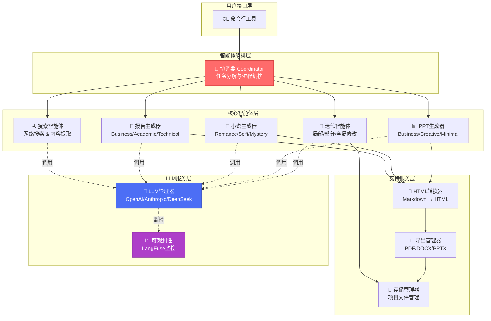
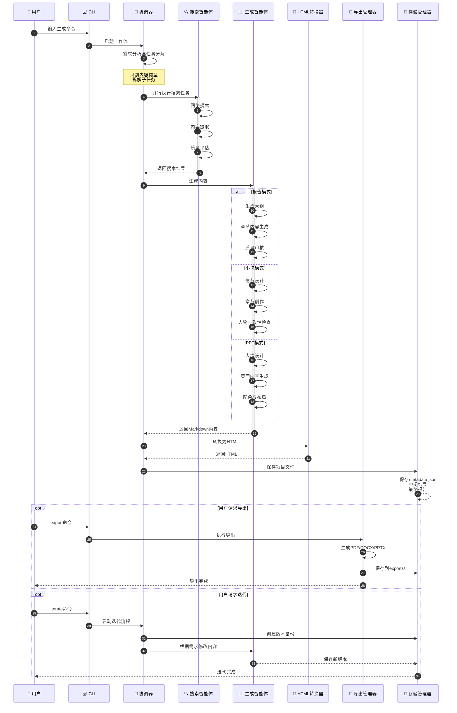
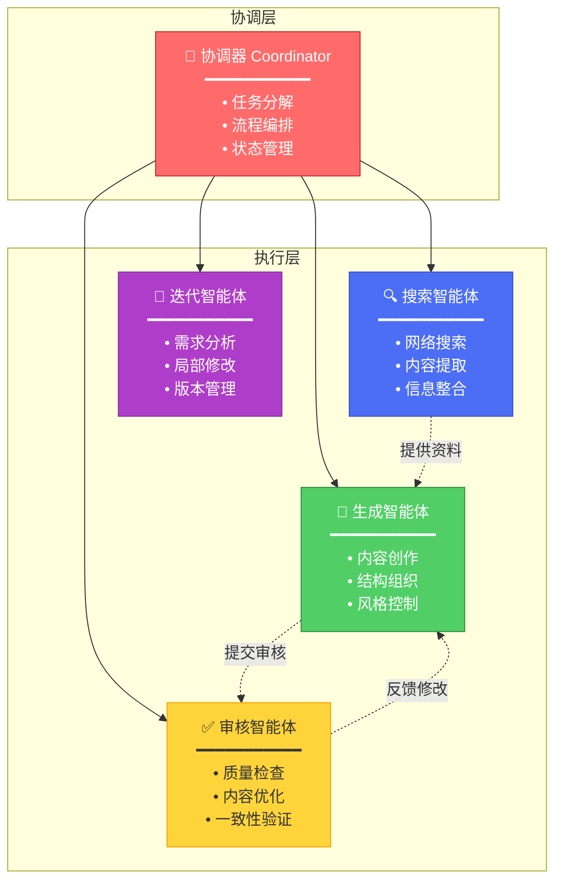

# XunLong (寻龙) 🐉

**AI驱动的多模态内容生成系统**

[English](./README.md) | 简体中文 | [📚 在线文档](https://yourusername.github.io/XunLong/zh/)

---

## 📖 项目简介

**XunLong (寻龙)** 是一个基于大语言模型的智能内容生成系统，能够通过自然语言指令自动生成高质量的**研究报告**、**小说**和**演示文稿（PPT）**。

系统采用多智能体协作架构，通过LangGraph编排智能体工作流，实现从需求分析、资料搜索、内容生成到格式导出的全流程自动化。

### ✨ 核心特性

- 🤖 **多智能体协作**: 基于LangGraph的智能体编排，任务分解与并行执行
- 📊 **多模态生成**: 支持报告(Report)、小说(Fiction)、PPT三种内容模式
- 🔍 **智能搜索**: 自动网络搜索、内容提取、知识整合
- 🎨 **专业导出**: 支持Markdown、HTML、PDF、DOCX、PPTX多种格式
- 🔄 **迭代优化**: 对已生成内容进行局部或全局修改
- 🎯 **风格定制**: 支持多种写作风格和演示风格
- 📈 **可观测性**: 集成LangFuse，全流程追踪和监控

---

## 🏗️ 系统架构

### 架构组件图

### 内容生成流程

---

## 🚀 快速开始

### 环境要求

- Python 3.10+
- OpenAI API Key 或 Anthropic API Key 或 DeepSeek API Key
- （可选）Perplexity API Key 用于高级搜索

### 安装步骤

1. **克隆项目**
\`\`\`bash
git clone https://github.com/jaguarliuu/xunlong.git
cd XunLong
\`\`\`

2. **创建虚拟环境**
\`\`\`bash
python -m venv venv
source venv/bin/activate  # Windows: venv\\Scripts\\activate
\`\`\`

3. **安装依赖**
\`\`\`bash
pip install -r requirements.txt
\`\`\`

4. **安装系统依赖（PDF导出功能）**

macOS:
\`\`\`bash
brew install pango gdk-pixbuf libffi
\`\`\`

Ubuntu/Debian:
\`\`\`bash
sudo apt-get install libpango-1.0-0 libpangoft2-1.0-0 gdk-pixbuf2.0
\`\`\`

5. **安装浏览器（网页搜索功能）**
\`\`\`bash
playwright install chromium
\`\`\`

6. **配置环境变量**

复制\`.env.example\`为\`.env\`并填入你的API密钥:
\`\`\`bash
cp .env.example .env
\`\`\`

编辑\`.env\`文件:
\`\`\`env
# 主要LLM提供商（必选其一）
OPENAI_API_KEY=your_openai_api_key
OPENAI_BASE_URL=https://api.openai.com/v1
OPENAI_MODEL=gpt-4o

# 或使用Anthropic
ANTHROPIC_API_KEY=your_anthropic_api_key
ANTHROPIC_MODEL=claude-3-5-sonnet-20251022

# 或使用DeepSeek
DEEPSEEK_API_KEY=your_deepseek_api_key
DEEPSEEK_BASE_URL=https://api.deepseek.com/v1
DEEPSEEK_MODEL=deepseek-chat

# 搜索功能（可选）
PERPLEXITY_API_KEY=your_perplexity_api_key

# 可观测性（可选）
LANGFUSE_PUBLIC_KEY=your_langfuse_public_key
LANGFUSE_SECRET_KEY=your_langfuse_secret_key
LANGFUSE_HOST=https://cloud.langfuse.com
\`\`\`

---

## 💡 使用指南

### 基本命令

XunLong提供简洁的命令行界面：

\`\`\`bash
python xunlong.py [命令] [参数] [选项]
\`\`\`

### 1. 生成研究报告

\`\`\`bash
# 基础用法
python xunlong.py report "2025年人工智能行业趋势分析"

# 指定风格和深度
python xunlong.py report "区块链技术应用研究" \\
  --style academic \\
  --depth comprehensive \\
  --verbose
\`\`\`

**风格选项**:
- \`business\`: 商业报告（默认）
- \`academic\`: 学术论文
- \`technical\`: 技术文档
- \`consulting\`: 咨询报告

**深度选项**:
- \`overview\`: 概览（快速）
- \`standard\`: 标准（默认）
- \`comprehensive\`: 深度

### 2. 生成小说

\`\`\`bash
# 基础用法
python xunlong.py fiction "一个关于时间旅行的科幻故事"

# 指定风格和章节数
python xunlong.py fiction "都市悬疑推理小说" \\
  --style mystery \\
  --chapters 10 \\
  --verbose
\`\`\`

**风格选项**:
- \`romance\`: 言情
- \`scifi\`: 科幻
- \`fantasy\`: 玄幻
- \`mystery\`: 悬疑
- \`urban\`: 都市

### 3. 生成PPT演示

\`\`\`bash
# 基础用法
python xunlong.py ppt "2025年AI产品发布会" --slides 15

# 完整参数示例
python xunlong.py ppt "公司年度总结报告" \\
  --style business \\
  --slides 20 \\
  --speech-notes "面向全体员工的年度总结" \\
  --verbose
\`\`\`

**风格选项**:
- \`business\`: 商务风格（默认）
- \`creative\`: 创意风格
- \`minimal\`: 极简风格
- \`academic\`: 学术风格

**演说稿功能**: 使用\`--speech-notes\`参数可生成每页幻灯片的演讲稿

### 4. 内容迭代优化

对已生成的内容进行修改：

\`\`\`bash
# 修改报告
python xunlong.py iterate <项目ID> "在第二章添加更多案例分析"

# 修改PPT
python xunlong.py iterate <项目ID> "将第5页的图表改为饼图"

# 修改小说
python xunlong.py iterate <项目ID> "重写第三章，增加更多悬念"
\`\`\`

**项目ID**: 在\`storage/\`目录下的项目文件夹名，格式如\`20251004_220823\`

### 5. 导出功能

\`\`\`bash
# 导出为PDF
python xunlong.py export <项目ID> pdf

# 导出为DOCX
python xunlong.py export <项目ID> docx

# 导出为PPTX（PPT项目）
python xunlong.py export <项目ID> pptx

# 自定义输出路径
python xunlong.py export <项目ID> pdf --output /path/to/output.pdf
\`\`\`

---

## 📂 项目结构

\`\`\`
XunLong/
├── src/
│   ├── agents/              # 智能体模块
│   │   ├── coordinator.py   # 主协调器
│   │   ├── iteration_agent.py  # 迭代优化智能体
│   │   ├── report/          # 报告生成智能体
│   │   ├── fiction/         # 小说生成智能体
│   │   ├── ppt/             # PPT生成智能体
│   │   └── html/            # HTML转换智能体
│   ├── llm/                 # LLM管理
│   │   ├── manager.py       # LLM管理器
│   │   ├── client.py        # LLM客户端
│   │   └── prompts.py       # 提示词管理
│   ├── search/              # 搜索模块
│   │   ├── web_search.py    # 网页搜索
│   │   └── content_extractor.py  # 内容提取
│   ├── export/              # 导出模块
│   │   ├── pdf_exporter.py  # PDF导出
│   │   ├── docx_exporter.py # DOCX导出
│   │   └── pptx_exporter.py # PPTX导出
│   └── storage/             # 存储管理
│       └── manager.py
├── config/                  # 配置文件
├── templates/               # HTML模板
├── storage/                 # 项目存储目录
├── xunlong.py              # CLI入口
├── requirements.txt        # 依赖清单
└── README_CN.md           # 中文文档
\`\`\`

---

## 🎯 工作原理

### 多智能体协作流程

XunLong采用基于LangGraph的状态机工作流：

### 核心智能体

### 数据流转

每个项目在\`storage/\`目录下创建独立文件夹：

\`\`\`
storage/20251004_220823_项目名称/
├── metadata.json           # 项目元数据
├── intermediate/           # 中间结果
│   ├── 01_task_decomposition.json
│   ├── 02_search_results.json
│   └── 03_content_outline.json
├── reports/                # 最终输出
│   ├── FINAL_REPORT.md
│   ├── FINAL_REPORT.html
│   └── PPT_DATA.json       # PPT项目专用
├── versions/               # 迭代版本
│   └── 20251005_101435/
└── exports/                # 导出文件
    ├── report.pdf
    └── report.docx
\`\`\`

---

## 🔧 高级配置

### LLM提供商配置

在\`config/llm_config.yaml\`中配置多个LLM提供商：

\`\`\`yaml
providers:
  default:
    provider: "openai"
    model: "gpt-4o"
    temperature: 0.7

  creative:
    provider: "anthropic"
    model: "claude-3-5-sonnet-20251022"
    temperature: 0.9

  search:
    provider: "perplexity"
    model: "sonar"
\`\`\`

### 搜索引擎配置

在\`config/search_config.yaml\`中配置搜索行为：

\`\`\`yaml
search:
  max_results: 10
  timeout: 30
  engines:
    - perplexity  # 优先使用Perplexity
    - playwright  # 备用浏览器搜索
\`\`\`

### 导出模板自定义

HTML模板位于\`templates/\`目录，支持自定义：

- \`templates/report_template.html\`: 报告模板
- \`templates/fiction_template.html\`: 小说模板
- \`templates/ppt_slide_template.html\`: PPT幻灯片模板

---

## 📊 功能路线图

### ✅ 已完成功能（MVP版本）

- [x] 报告生成（Markdown/HTML/PDF/DOCX）
- [x] 小说生成（多章节、多风格）
- [x] PPT生成（结构化、配色、布局）
- [x] 演说稿生成
- [x] 内容迭代优化
- [x] 多格式导出
- [x] LangFuse可观测性集成

### 🚧 下一阶段开发计划

#### 1. 文档增强
- [ ] 支持在文档中插入图片
- [ ] 支持自定义模板
- [ ] 更丰富的样式选项

#### 2. 智能文档解析
- [ ] 解析用户上传的文档（PDF、Word、PPT）
- [ ] 基于已有内容进行续写或改写
- [ ] 多文档融合生成

#### 3. 数据分析模式
- [ ] Excel数据智能分析
- [ ] 数据库查询和分析
- [ ] 自动生成数据报告和可视化图表

#### 4. PPT完整导出能力
- [ ] 完整的图表支持（柱状图、折线图、饼图等）
- [ ] 图片和图标库集成
- [ ] 动画效果和过渡效果
- [ ] 更多专业布局模板

#### 5. 其他功能
- [ ] 多语言支持
- [ ] Web界面
- [ ] 协作编辑
- [ ] 模板市场

---

## 🐛 已知问题

1. **PDF导出在macOS上需要系统库**: 需要通过Homebrew安装\`pango\`等库
2. **首次使用Playwright需要下载浏览器**: 运行\`playwright install chromium\`
3. **大型PPT导出可能较慢**: 复杂布局和图表生成需要时间
4. **迭代功能对PPT项目的支持有限**: PPT迭代目前会重新生成整个文稿

---

## 🤝 贡献指南

我们欢迎各种形式的贡献！

### 如何贡献

1. Fork本仓库
2. 创建特性分支 (\`git checkout -b feature/AmazingFeature\`)
3. 提交更改 (\`git commit -m 'Add some AmazingFeature'\`)
4. 推送到分支 (\`git push origin feature/AmazingFeature\`)
5. 开启Pull Request

### 报告Bug

请通过[GitHub Issues](https://github.com/jaguarliuu/xunlong/issues)报告问题，并提供：

- 详细的问题描述
- 复现步骤
- 系统环境信息
- 相关日志输出

---

## 📝 常见问题

### Q: 支持哪些大语言模型？
A: 目前支持OpenAI（GPT-4/GPT-3.5）、Anthropic（Claude系列）、DeepSeek等，通过LangChain集成，理论上支持所有兼容OpenAI API的模型。

### Q: 生成一份报告需要多长时间？
A: 取决于报告深度和搜索范围，标准报告约5-10分钟，深度报告可能需要15-20分钟。

### Q: 可以离线使用吗？
A: 不可以。系统需要调用LLM API和执行网络搜索，必须联网使用。

### Q: 生成的内容可以商用吗？
A: 生成的内容遵循MIT许可证，但需注意：1) 遵守LLM服务商的使用条款 2) 对内容的准确性和合法性自行负责。

### Q: 如何提高生成质量？
A: 建议：1) 使用更强大的模型（如GPT-4） 2) 提供更详细的需求描述 3) 使用迭代功能多次优化 4) 配置Perplexity API以获得更好的搜索结果。

---

## 📄 许可证

本项目采用[MIT许可证](LICENSE)。

---

## 🙏 致谢

感谢以下开源项目：

- [LangChain](https://github.com/langchain-ai/langchain) - LLM应用框架
- [LangGraph](https://github.com/langchain-ai/langgraph) - 图状态机工作流
- [LangFuse](https://langfuse.com/) - LLM可观测性平台
- [Playwright](https://playwright.dev/) - 浏览器自动化
- [WeasyPrint](https://weasyprint.org/) - HTML转PDF
- [python-pptx](https://python-pptx.readthedocs.io/) - PowerPoint生成

---

## 📧 联系方式

- 项目主页: [https://github.com/jaguarliuu/xunlong](https://github.com/jaguarliuu/xunlong)
- 问题反馈: [GitHub Issues](https://github.com/jaguarliuu/xunlong/issues)

---

**如果这个项目对你有帮助，请给我们一个⭐️**

Made with ❤️ by XunLong Team

