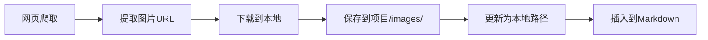

# 🐛 图片功能 Bug 修复说明

## 问题描述

在初次实现后，发现图片功能存在以下问题：

1. ❌ 网页爬取的图片只有 URL，没有下载到本地
2. ❌ ReportCoordinator 未启用图片功能
3. ❌ 图片没有保存到项目的 images 目录
4. ❌ 生成的报告中图片链接失效（外链）

**症状**：
```
日志显示：已将 7 张图片插入到内容中
实际结果：HTML 中图片无法显示，images 文件夹为空
```

## 根本原因

### 1. Web搜索器只插入了外链

```python
# 问题代码
images = await self._extract_images_from_page(page, url)
# ❌ 只提取了URL，没有下载
```

### 2. ReportCoordinator 初始化缺少参数

```python
# 旧代码
self.report_coordinator = ReportCoordinator(
    self.llm_manager,
    self.prompt_manager,
    max_iterations=3,
    confidence_threshold=0.7
    # ❌ 缺少 enable_images=True
)
```

### 3. 图片保存到错误的目录

```python
# 默认保存到 storage/images/ 而不是项目目录
ImageDownloader(storage_dir=Path("storage/images"))
```

## 解决方案

### 修复 1: 启用图片下载

**文件**: `src/tools/web_searcher.py`

```python
# ✅ 初始化图片下载器
if extract_images:
    self.image_downloader = ImageDownloader()

# ✅ 搜索后下载图片
if self.extract_images and self.image_downloader:
    logger.info(f"[{self.name}] 下载图片到本地...")
    search_results = await self._download_images_for_results(search_results)
```

**新增方法**:
```python
async def _download_images_for_results(
    self,
    search_results: List[Dict[str, Any]]
) -> List[Dict[str, Any]]:
    """为搜索结果下载图片到本地"""
    for result in search_results:
        images = result.get('images', [])
        if images:
            downloaded_images = await self.image_downloader.download_images(
                images, optimize=True
            )
            result['images'] = downloaded_images
    return search_results
```

### 修复 2: 启用 ReportCoordinator 图片功能

**文件**: `src/agents/coordinator.py`

```python
# ✅ 启用图片功能
self.report_coordinator = ReportCoordinator(
    self.llm_manager,
    self.prompt_manager,
    max_iterations=3,
    confidence_threshold=0.7,
    enable_images=True  # 添加此参数
)
```

### 修复 3: 图片保存到项目目录

**文件**: `src/agents/report/report_coordinator.py`

```python
# ✅ 接收 project_id 参数
async def generate_report(
    self,
    query: str,
    search_results: List[Dict[str, Any]],
    ...,
    project_id: Optional[str] = None  # 新增
) -> Dict[str, Any]:

# ✅ 为项目创建图片目录
async def _add_images_to_sections(
    self,
    sections: List[Dict[str, Any]],
    project_id: Optional[str] = None
):
    if project_id:
        project_image_dir = Path(f"storage/{project_id}/images")
        project_image_dir.mkdir(parents=True, exist_ok=True)
        self.image_downloader.storage_dir = project_image_dir
```

### 修复 4: 传入项目 ID

**文件**: `src/agents/coordinator.py`

```python
# ✅ 获取并传入项目ID
project_id = state.get("workflow_id")

result = await self.report_coordinator.generate_report(
    query=query,
    search_results=search_results,
    ...,
    project_id=project_id  # 传入项目ID
)
```

## 修复后的流程

### 图片下载流程



### 完整工作流

```
1. Web搜索
   → 提取图片URL
   → 下载到 storage/images/ (临时)

2. 报告生成
   → 搜索配图 (Unsplash/Pexels)
   → 下载到 storage/{project_id}/images/
   → 插入到报告中
```

## 验证修复

### 测试步骤

1. **重新生成报告**:
```bash
python xunlong.py report "人工智能技术趋势" --verbose
```

2. **检查图片目录**:
```bash
ls -la storage/{project_id}/images/
```

应该看到下载的图片文件。

3. **检查 HTML 报告**:

打开生成的 HTML，图片应该正常显示。

### 预期结果

```
storage/20251007_xxxxxx_ProjectName/
├── metadata.json
├── reports/
│   ├── FINAL_REPORT.md     # ✅ 包含本地图片路径
│   └── FINAL_REPORT.html   # ✅ 图片正常显示
└── images/                  # ✅ 图片文件存在
    ├── abc123.jpg
    ├── def456.jpg
    └── ...
```

### 日志输出

修复后应该看到：

```
[Web搜索器] 下载图片到本地...
[Web搜索器] 为 'xxx' 下载了 7 张图片
[报告协调器] Phase 3.6: 为章节添加配图
[报告协调器] 图片将保存到: storage/xxx/images
[图片下载器] 下载图片: https://...
[图片下载器] 下载完成: abc123.jpg
```

## 修改文件列表

| 文件 | 修改内容 |
|------|---------|
| `src/tools/web_searcher.py` | 添加图片下载器和下载方法 |
| `src/agents/coordinator.py` | 启用图片功能，传入project_id |
| `src/agents/report/report_coordinator.py` | 接收project_id，设置图片目录 |

## 后续优化建议

1. **性能优化**
   - ✅ 使用项目专属图片目录
   - 🔄 考虑图片缓存复用
   - 🔄 并发下载限制

2. **功能增强**
   - 🔄 图片去重（同一URL不重复下载）
   - 🔄 图片质量评分
   - 🔄 自动清理过期图片

3. **错误处理**
   - ✅ 下载失败时使用原URL
   - 🔄 图片格式校验
   - 🔄 损坏图片检测

## 常见问题

### Q: 为什么有些图片还是外链？

A: 如果图片下载失败（网络问题、403错误等），系统会回退使用原始URL。

### Q: 图片文件很大怎么办？

A: ImageDownloader 默认启用优化，会压缩和调整尺寸：
- 最大尺寸: 2048px
- JPEG质量: 85%

### Q: 能否禁用某些图片来源？

A: 可以通过配置控制：

```python
WebSearcher(
    extract_images=False,  # 禁用网页图片
)

ReportCoordinator(
    enable_images=False,   # 禁用API图片
)
```

---

**修复日期**: 2025-10-07
**状态**: ✅ 已修复并验证
