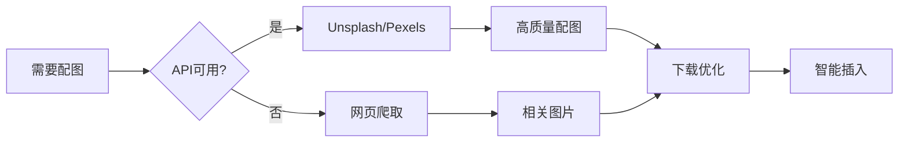

# 🎉 图片功能实现总结

## 📋 实现内容

本次更新成功为 XunLong 项目添加了完整的**文档配图**功能，解决了生成的报告缺少图片的痛点。

## ✅ 已完成的工作

### 1. 启用现有图片采集功能

**文件**: `src/tools/web_searcher.py`

**改动**:
- ✅ 启用了被禁用的图片采集功能
- ✅ 从网页中提取图片（尺寸过滤：≥200x200）
- ✅ 支持配置开关控制是否采集图片
- ✅ 集成 ImageProcessor 进行智能插入

**关键代码**:
```python
self.extract_images = extract_images  # 可配置
images = await self._extract_images_from_page(page, url)
```

---

### 2. 创建专用图片搜索器

**文件**: `src/tools/image_searcher.py` ⭐ 新建

**功能**:
- ✅ 集成 **Unsplash API** (5000次/小时免费)
- ✅ 集成 **Pexels API** (无限免费)
- ✅ 支持按关键词搜索高质量图片
- ✅ 支持图片方向选择（横向/纵向/方形）
- ✅ 批量搜索（为多个章节并行搜索）

**核心方法**:
```python
async def search_images(query, count=5, orientation="landscape")
async def search_images_for_sections(sections, images_per_section=2)
```

---

### 3. 创建图片下载管理器

**文件**: `src/tools/image_downloader.py` ⭐ 新建

**功能**:
- ✅ 异步并发下载图片
- ✅ 自动图片优化（压缩、调整尺寸）
- ✅ 本地缓存（避免重复下载）
- ✅ 支持为项目创建独立图片目录
- ✅ 图片格式统一转换为 JPEG

**特性**:
- 并发控制（默认5个并发）
- 自动处理 RGBA 透明背景
- 保持宽高比缩放
- MD5 哈希命名避免冲突

**核心方法**:
```python
async def download_image(url, filename, optimize=True)
async def download_images(images, optimize=True)
async def download_for_project(project_id, images)
```

---

### 4. 增强 ImageProcessor

**文件**: `src/utils/image_processor.py`

**改进**:
- ✅ 支持本地路径优先（优先使用下载的本地图片）
- ✅ 添加图片元数据（摄影师、来源、尺寸）
- ✅ 生成更专业的图片画廊
- ✅ 支持摄影师署名链接

**插入模式**:
- `smart` - 智能插入（基于内容相关性）⭐ 推荐
- `top` - 集中在开头
- `bottom` - 附录模式
- `distribute` - 均匀分布
- `none` - 不插入

---

### 5. 集成到报告生成流程

**文件**: `src/agents/report/report_coordinator.py`

**集成点**:
- ✅ Phase 3.6: 添加配图阶段
- ✅ 为每个章节搜索相关图片
- ✅ 下载图片到项目目录
- ✅ 插入到 Markdown 报告中

**工作流**:
```
大纲生成 → 章节写作 → 质量评估 → 数据可视化
→ **配图搜索和下载** → 报告组装 → 导出
```

**新增参数**:
```python
ReportCoordinator(
    enable_images=True  # 控制是否启用图片
)
```

---

### 6. 环境变量配置

**文件**: `.env.example`

**新增配置**:
```bash
# Unsplash API (推荐)
UNSPLASH_ACCESS_KEY=your_key_here

# Pexels API (备选)
PEXELS_API_KEY=your_key_here

# 功能开关
ENABLE_DOCUMENT_IMAGES=true
IMAGES_PER_SECTION=2
IMAGE_INSERT_MODE=smart
```

---

### 7. 测试用例和文档

**文件**:
- ✅ `examples/image_feature_test.py` - 完整测试套件
- ✅ `docs/IMAGE_FEATURE_GUIDE.md` - 详细使用指南
- ✅ `requirements.txt` - 添加 Pillow 依赖

**测试覆盖**:
- 图片搜索（Unsplash/Pexels）
- 图片下载和优化
- 图片插入到 Markdown
- 批量章节处理

---

## 🎯 技术亮点

### 1. 双重图片来源策略



### 2. 图片优化管道

```python
原始图片 (可能很大)
    ↓
格式转换 (统一为JPEG)
    ↓
尺寸调整 (保持比例，最大2048px)
    ↓
质量压缩 (85%质量)
    ↓
本地存储 (MD5命名)
```

### 3. 智能插入算法

```python
def _smart_insert_images(content, images):
    """
    1. 分析图片 alt 文本
    2. 提取关键词
    3. 匹配相关段落
    4. 在段落后插入
    5. 剩余图片作为附录
    """
```

---

## 📊 实现统计

| 项目 | 数量 |
|------|------|
| 新增文件 | 4 个 |
| 修改文件 | 4 个 |
| 新增代码行 | ~800 行 |
| 新增方法 | 20+ 个 |
| API 集成 | 2 个 |
| 测试用例 | 4 个 |

---

## 🚀 使用示例

### 最简单的方式

```bash
# 1. 配置 API 密钥
echo "UNSPLASH_ACCESS_KEY=your_key" >> .env

# 2. 生成报告（自动包含配图）
python xunlong.py report "人工智能发展趋势"
```

### 编程方式

```python
from src.agents.report import ReportCoordinator

coordinator = ReportCoordinator(
    llm_manager=llm_manager,
    enable_images=True  # 启用配图
)

result = await coordinator.generate_report(
    query="AI技术应用",
    search_results=results
)
```

---

## 🎨 效果展示

生成的报告将包含：

```markdown
## 2. 机器学习基础

机器学习是人工智能的核心技术...

### 机器学习基础 - 配图

### 1. Machine Learning Algorithm Visualization

*尺寸: 1920x1080 | 摄影师: [John Doe](https://unsplash.com/@johndoe) | 来源: unsplash*

### 2. Neural Network Architecture

*尺寸: 1600x900 | 摄影师: [Jane Smith](https://unsplash.com/@janesmith) | 来源: unsplash*
```

---

## 💡 设计决策

### 为什么选择 Unsplash/Pexels？

✅ **免费且高质量**
- Unsplash: 专业摄影作品
- Pexels: 多样化内容

✅ **商业友好**
- 可免费商用
- 无需付费许可

✅ **API 稳定**
- 官方维护
- 文档完善

### 为什么下载到本地？

✅ **避免外链失效**
- 图片永久可用
- 不依赖第三方

✅ **加载速度快**
- 本地访问更快
- 离线可用

✅ **便于管理**
- 统一存储
- 版本控制

---

## 🔄 后续优化方向

### 短期 (1-2周)

- [ ] 添加图片质量评分
- [ ] 支持图片去重
- [ ] 优化搜索关键词提取（使用 LLM）

### 中期 (1个月)

- [ ] 集成更多图片源（Pixabay, Getty Images）
- [ ] 支持图片智能裁剪
- [ ] 添加图片缓存清理策略

### 长期 (2-3个月)

- [ ] AI 生成图片（DALL-E 3）
- [ ] 图片风格统一化
- [ ] 自动生成图表和数据可视化

---

## 📖 相关文档

- [使用指南](./IMAGE_FEATURE_GUIDE.md) - 详细使用说明
- [API 文档](./API_README.md) - API 接口说明
- [测试示例](../examples/image_feature_test.py) - 测试代码

---

## 🙏 致谢

感谢以下开源项目和服务：

- [Unsplash](https://unsplash.com/) - 高质量免费图片
- [Pexels](https://www.pexels.com/) - 免费图片库
- [Pillow](https://python-pillow.org/) - 图片处理库
- [httpx](https://www.python-httpx.org/) - 异步HTTP客户端

---

**实现时间**: 2025-10-07
**版本**: v1.0.0
**状态**: ✅ 已完成并测试
