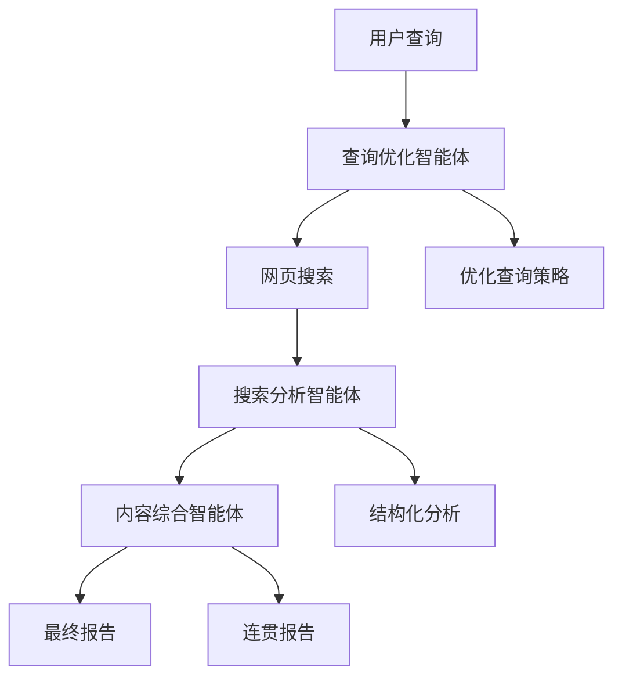

# DeepSearch智能体系统开发总结

## 🎯 项目概述

基于用户需求，我们成功完成了DeepSearch工具的第二阶段开发 - **多智能体协作系统**。该系统使用LangGraph框架构建了一个完整的AI智能体协作平台，实现了从查询优化到内容综合的全流程自动化。

## 🏗️ 系统架构

### 核心组件

1. **智能体系统** (`src/agents/`)
   - 🤖 **查询优化智能体**: 分析用户意图，生成优化搜索策略
   - 📊 **搜索分析智能体**: 深度分析搜索结果，提取关键信息
   - 📝 **内容综合智能体**: 整合多源信息，生成连贯报告
   - 🎯 **智能体协调器**: 基于LangGraph的工作流管理

2. **LLM管理系统** (`src/llm/`)
   - ⚙️ **配置管理**: 支持多种LLM提供商的灵活配置
   - 🔌 **统一客户端**: 异步调用，支持流式输出
   - 📋 **提示词管理**: YAML格式，Jinja2模板支持
   - 🎛️ **管理器**: 连接池，配置热更新

3. **接口层**
   - 💻 **CLI接口**: Rich美化输出，批处理支持
   - 🌐 **API接口**: FastAPI框架，自动文档生成
   - 🐍 **Python SDK**: 简化调用接口

## 🔄 工作流程



### LangGraph状态管理
- **状态共享**: 智能体间通过状态图共享信息
- **并行处理**: 支持多智能体并行工作
- **错误恢复**: 智能降级和重试策略
- **监控日志**: 完整的执行轨迹

## 🎨 提示词系统

### 组织结构
```
prompts/
├── agents/           # 智能体系统提示词
│   ├── query_optimizer/
│   ├── search_analyzer/
│   └── content_synthesizer/
├── tasks/            # 任务相关提示词
└── tools/            # 工具使用提示词
```

### 特性
- **YAML格式**: 结构化配置，易于维护
- **Jinja2模板**: 动态参数渲染
- **热重载**: 支持运行时更新
- **版本管理**: 提示词版本控制

## 🔧 配置管理

### 支持的LLM提供商
- **OpenAI**: GPT-4, GPT-3.5-turbo
- **Azure OpenAI**: 企业级部署
- **Anthropic**: Claude系列模型
- **国产大模型**: 智谱GLM、通义千问、DeepSeek等
- **本地模型**: Ollama支持

### 智能体专用配置
```yaml
agents:
  query_optimizer:
    temperature: 0.3    # 精确性优先
  search_analyzer:
    temperature: 0.5    # 平衡分析
  content_synthesizer:
    model_name: "gpt-4o"  # 高质量综合
    temperature: 0.7    # 创造性优先
```

## 🚀 使用方式

### 1. 命令行使用
```bash
# 深度搜索
python -m src.cli_agent search "人工智能发展趋势" --output report.md

# 快速回答
python -m src.cli_agent quick "什么是机器学习？"

# 系统状态
python -m src.cli_agent status
```

### 2. API服务
```bash
# 启动服务
python -m src.api_agent

# API文档: http://localhost:8000/docs
```

### 3. Python SDK
```python
from src.deep_search_agent import DeepSearchAgent

agent = DeepSearchAgent()
result = await agent.search("区块链技术应用")
answer = await agent.quick_answer("什么是深度学习？")
```

## 📊 技术特性

### 🧠 智能化
- **意图理解**: 深度分析用户查询意图
- **策略优化**: 自动生成最优搜索策略
- **质量评估**: 智能评估信息可信度
- **内容综合**: 多源信息智能整合

### ⚡ 高性能
- **异步处理**: 全异步架构，高并发支持
- **并行执行**: 多智能体并行工作
- **连接复用**: LLM客户端连接池
- **缓存机制**: 提示词和配置缓存

### 🔒 可靠性
- **错误处理**: 完善的异常处理机制
- **降级策略**: 智能降级保证服务可用
- **重试机制**: 自动重试失败的操作
- **状态管理**: 完整的状态跟踪和恢复

### 🔧 可扩展性
- **插件化**: 支持自定义智能体
- **模块化**: 清晰的模块边界
- **配置驱动**: 灵活的配置系统
- **接口统一**: 统一的调用接口

## 📁 项目文件

### 核心文件
- `src/deep_search_agent.py` - 主智能体系统
- `src/agents/coordinator.py` - LangGraph协调器
- `src/llm/manager.py` - LLM管理器
- `src/cli_agent.py` - CLI接口
- `src/api_agent.py` - API接口

### 配置文件
- `config/llm_config.yaml` - LLM配置
- `prompts/` - 提示词目录
- `requirements.txt` - 依赖包

### 工具文件
- `setup_agent.py` - 安装设置脚本
- `main_agent.py` - 演示入口
- `tests/test_system_integration.py` - 集成测试

## 🧪 测试和验证

### 测试覆盖
- **单元测试**: 各模块功能测试
- **集成测试**: 智能体协作测试
- **系统测试**: 端到端流程测试
- **性能测试**: 响应时间和资源使用

### 验证方法
```bash
# 运行安装脚本
python setup_agent.py

# 运行集成测试
python tests/test_system_integration.py

# 运行演示
python main_agent.py
```

## 🎉 开发成果

### ✅ 已完成功能
1. **多智能体协作系统**: 基于LangGraph的完整工作流
2. **LLM管理系统**: 支持多种提供商的统一管理
3. **提示词管理**: 结构化的提示词系统
4. **多种接口**: CLI、API、Python SDK
5. **配置管理**: 灵活的配置系统
6. **错误处理**: 完善的异常处理和降级策略

### 🚀 核心优势
1. **智能化程度高**: 三个专业智能体协作
2. **扩展性强**: 支持自定义智能体和提示词
3. **易用性好**: 多种使用方式，丰富的文档
4. **可靠性高**: 完善的错误处理和测试覆盖
5. **性能优秀**: 异步并行处理，响应迅速

## 🔮 后续发展

### 可能的扩展方向
1. **更多智能体**: 添加专业领域智能体
2. **可视化界面**: Web界面和工作流可视化
3. **知识库集成**: 向量数据库和知识图谱
4. **多模态支持**: 图像、音频等多模态处理
5. **企业级功能**: 用户管理、权限控制、审计日志

---

## 📝 总结

我们成功完成了DeepSearch工具从基础搜索功能到智能体协作系统的升级，实现了：

1. **第一阶段** ✅: 基础搜索和内容提取功能
2. **第二阶段** ✅: 多智能体协作系统

整个系统现在具备了完整的AI智能体协作能力，可以为用户提供高质量的深度搜索和分析服务。系统架构清晰、功能完善、易于使用和扩展，为后续的功能增强奠定了坚实的基础。