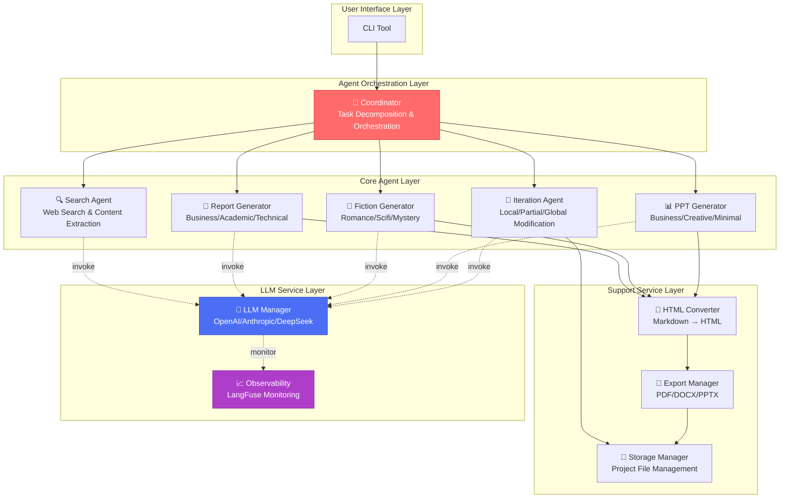

# System Architecture

XunLong employs a sophisticated multi-agent architecture orchestrated by LangGraph to deliver high-quality content generation.

## Architecture Overview

## Layer Breakdown

### 1. User Interface Layer

**CLI Tool** - Command-line interface providing:
- Simple, intuitive commands
- Real-time progress indicators
- Verbose mode for detailed logs
- Error handling and recovery

### 2. Agent Orchestration Layer

**Coordinator** - The master orchestrator that:
- Analyzes user requirements
- Decomposes complex tasks into subtasks
- Manages agent state and workflow
- Coordinates parallel execution
- Aggregates results

### 3. Core Agent Layer

Multiple specialized agents working in parallel:

- **Search Agent** - Executes web searches, extracts content, evaluates relevance
- **Report Generator** - Creates structured research reports with citations
- **Fiction Generator** - Writes creative stories with consistent characters and plot
- **PPT Generator** - Designs professional presentations with layouts and color schemes
- **Iteration Agent** - Handles content refinement requests

### 4. Support Service Layer

Supporting services for content processing:

- **HTML Converter** - Transforms Markdown to styled HTML
- **Export Manager** - Generates PDF, DOCX, PPTX files
- **Storage Manager** - Manages project files and versions

### 5. LLM Service Layer

Foundation layer powering all intelligence:

- **LLM Manager** - Manages multiple LLM providers, handles API calls
- **Observability** - Tracks all LLM interactions via LangFuse

## Key Design Principles

### Separation of Concerns

Each agent has a single, well-defined responsibility:
- Search agents only search
- Generation agents only generate
- Export managers only export

This modularity makes the system:
- **Maintainable** - Easy to update individual components
- **Testable** - Each agent can be tested in isolation
- **Scalable** - New agents can be added without affecting existing ones

### State Machine Workflow

Built on LangGraph's state machine paradigm:
- **Deterministic** - Predictable execution flow
- **Resumable** - Can recover from failures
- **Observable** - Every state transition is tracked

### Parallel Execution

XunLong maximizes throughput through parallelization:
- Multiple search queries execute simultaneously
- Independent content sections generate in parallel
- Export operations don't block generation

## Technology Stack

| Layer | Technology |
|-------|-----------|
| Workflow Orchestration | LangGraph |
| LLM Integration | LangChain |
| LLM Providers | OpenAI, Anthropic, DeepSeek |
| Web Automation | Playwright |
| PDF Generation | WeasyPrint |
| Office Export | python-pptx, python-docx |
| Observability | LangFuse |

## Next Steps

- Dive deeper into the [Multi-Agent System](/guide/multi-agent)
- Understand the [Workflow](/guide/workflow)
- Explore [LLM Integration](/guide/llm-integration)
