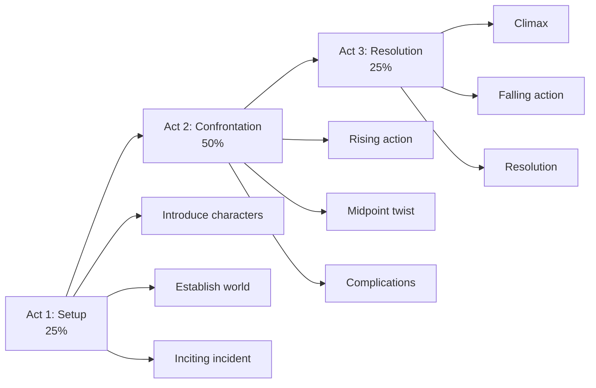
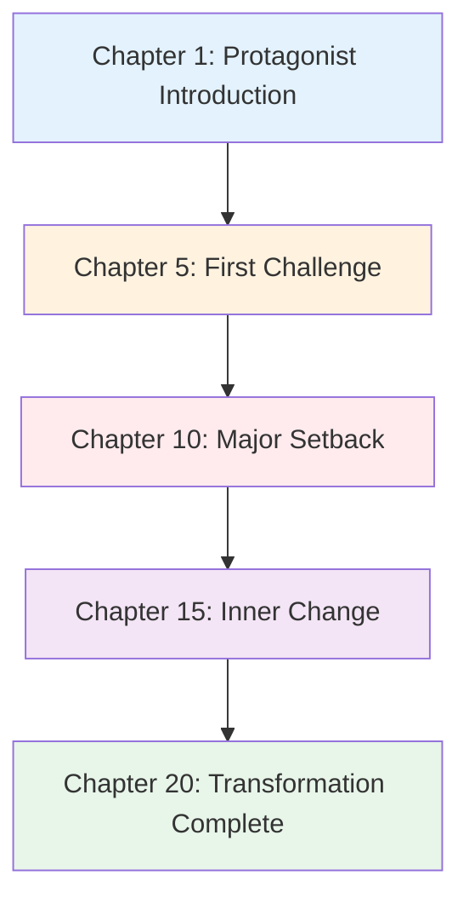

# Fiction Writing

XunLong's fiction generator creates engaging, coherent stories with well-developed characters and compelling plots.

## Overview

The Fiction Writing feature:
- 📖 Generates complete novels or short stories
- 🎭 Creates memorable characters with depth
- 🎬 Develops engaging plot structures
- ✍️ Maintains consistent narrative voice
- 📚 Supports multiple genres

## Quick Start

```bash
python xunlong.py fiction "A mystery novel set in Victorian London" \
  --chapters 20 \
  --style mystery
```

### Use Existing Materials

You can supply draft notes, world-building documents, or character dossiers via `--input-file` (supports `.txt`, `.pdf`, `.docx`). The content is ingested before outline planning, so every agent can reference your materials.

> Note: image attachments are not supported at this time.

```bash
python xunlong.py fiction "Interstellar exploration saga" \
  --style scifi \
  --input-file ./docs/worldbuilding_brief.pdf
```

## Fiction Styles

### Romance 💕

**Characteristics:**
- Emotional character development
- Relationship-focused plot
- Happy or hopeful ending
- Internal conflict emphasis
- Dialogue-heavy

**Example:**
```bash
python xunlong.py fiction "Second-chance romance between childhood friends" \
  --style romance \
  --chapters 15
```

**Typical Elements:**
- Meet-cute or reunion
- Building tension
- Misunderstandings
- Emotional climax
- Satisfying resolution

### Science Fiction 🚀

**Characteristics:**
- Technological/scientific concepts
- World-building emphasis
- Future or alternate settings
- Speculative elements
- Thought-provoking themes

**Example:**
```bash
python xunlong.py fiction "First contact with alien civilization" \
  --style scifi \
  --chapters 25 \
  --world-building detailed
```

**Typical Elements:**
- Unique technology
- Scientific principles
- Societal structures
- Exploration themes
- Moral dilemmas

### Mystery 🔍

**Characteristics:**
- Puzzle-focused plot
- Clue placement
- Red herrings
- Suspense building
- Satisfying resolution

**Example:**
```bash
python xunlong.py fiction "Detective solves locked-room murder" \
  --style mystery \
  --chapters 18
```

**Typical Elements:**
- Crime or puzzle
- Investigation
- Suspects and motives
- Plot twists
- Revelation

### Fantasy ⚔️

**Characteristics:**
- Magic systems
- World-building
- Quest narratives
- Good vs evil themes
- Rich descriptions

**Example:**
```bash
python xunlong.py fiction "Young mage discovers ancient prophecy" \
  --style fantasy \
  --chapters 30 \
  --magic-system detailed
```

### Thriller 💀

**Characteristics:**
- High-stakes tension
- Fast pacing
- Action sequences
- Time pressure
- Twists and surprises

**Example:**
```bash
python xunlong.py fiction "Agent races to stop terrorist attack" \
  --style thriller \
  --chapters 20 \
  --pacing fast
```

## Story Structure

### Three-Act Structure (Default)



**Example:**
```bash
python xunlong.py fiction "Hero's journey" \
  --structure three-act \
  --chapters 21  # 7-7-7 split
```

### Hero's Journey

**12 Stages:**
1. Ordinary World
2. Call to Adventure
3. Refusal of the Call
4. Meeting the Mentor
5. Crossing the Threshold
6. Tests, Allies, Enemies
7. Approach to Inmost Cave
8. Ordeal
9. Reward
10. The Road Back
11. Resurrection
12. Return with Elixir

**Example:**
```bash
python xunlong.py fiction "Farm boy becomes legendary warrior" \
  --structure heros-journey \
  --chapters 24
```

### Kishotenketsu

**Four-Part Structure (non-conflict):**
- **Ki** (introduction): 25%
- **Sho** (development): 25%
- **Ten** (twist): 25%
- **Ketsu** (conclusion): 25%

**Example:**
```bash
python xunlong.py fiction "Slice of life story in Tokyo" \
  --structure kishotenketsu \
  --chapters 16
```

## Character Development

### Depth Levels

**Basic:**
- Name and role
- Physical description
- Primary motivation

**Standard (Default):**
- Detailed background
- Personality traits
- Goals and fears
- Character arc
- Relationships

**Comprehensive:**
- Psychological profile
- Backstory events
- Internal conflicts
- Growth trajectory
- Complex motivations

**Example:**
```bash
python xunlong.py fiction "Ensemble cast heist story" \
  --characters 6 \
  --character-depth comprehensive
```

### Character Arcs

XunLong tracks character development across chapters:



## Advanced Features

### Chapter Length Control

```bash
# Short chapters (~1,500 words each)
python xunlong.py fiction "Fast-paced thriller" \
  --chapters 30 \
  --chapter-length short

# Medium chapters (~3,000 words each)
python xunlong.py fiction "Mystery novel" \
  --chapters 20 \
  --chapter-length medium

# Long chapters (~5,000 words each)
python xunlong.py fiction "Epic fantasy" \
  --chapters 15 \
  --chapter-length long
```

### Point of View

```bash
# First person
python xunlong.py fiction "Detective noir" \
  --pov first-person

# Third person limited
python xunlong.py fiction "Fantasy adventure" \
  --pov third-limited

# Third person omniscient
python xunlong.py fiction "Family saga" \
  --pov third-omniscient

# Multiple POV
python xunlong.py fiction "Epic with multiple protagonists" \
  --pov multiple \
  --pov-characters "Alice,Bob,Carol"
```

### Tone and Style

```bash
# Dark and gritty
python xunlong.py fiction "Cyberpunk thriller" \
  --tone dark \
  --style gritty

# Light and humorous
python xunlong.py fiction "Romantic comedy" \
  --tone light \
  --style humorous

# Serious and literary
python xunlong.py fiction "Historical drama" \
  --tone serious \
  --style literary
```

### World-Building

For fantasy and sci-fi:

```bash
python xunlong.py fiction "Space opera epic" \
  --style scifi \
  --world-building comprehensive \
  --world-elements "technology,politics,culture,history"
```

**World-building includes:**
- Geography/settings
- Social structures
- Technology/magic systems
- History and lore
- Cultural details

## Consistency Features

### Character Tracking

XunLong maintains consistency across chapters:
- Physical descriptions
- Personality traits
- Speech patterns
- Relationships
- Character knowledge

### Timeline Management

Automatic timeline tracking prevents:
- Chronological errors
- Character age inconsistencies
- Seasonal mismatches
- Event contradictions

### Name Consistency

All character and place names remain consistent throughout the story.

## Chapter Generation

### Sequential Generation

```bash
python xunlong.py fiction "Mystery novel" \
  --chapters 20 \
  --mode sequential
```

Chapters are generated one by one, with each building on previous context.

### Outline-First Generation

```bash
python xunlong.py fiction "Fantasy epic" \
  --chapters 25 \
  --mode outline-first
```

**Process:**
1. Generate complete story outline
2. Create character profiles
3. Write chapters based on outline
4. Ensure consistency

### Parallel Generation (Experimental)

```bash
python xunlong.py fiction "Anthology collection" \
  --chapters 10 \
  --mode parallel
```

For independent chapters/stories.

## Output Formats

### Manuscript Format

```bash
python xunlong.py fiction "Novel" \
  --format manuscript \
  --font-family "Courier New" \
  --font-size 12 \
  --line-spacing double
```

Professional manuscript formatting:
- Double-spaced
- Courier or Times New Roman
- 1-inch margins
- Page numbers
- Chapter headers

### E-book Format

```bash
python xunlong.py fiction "Novel" \
  --format epub
```

**Features:**
- EPUB3 standard
- Table of contents
- Chapter navigation
- Metadata (author, title, etc.)

### Print-Ready PDF

```bash
python xunlong.py fiction "Novel" \
  --format print-pdf \
  --trim-size "6x9"
```

## Example Workflow

### 1. Generate Story Outline

```bash
python xunlong.py fiction-outline "Detective in cyberpunk Tokyo" \
  --style mystery \
  --chapters 22 \
  --characters 5
```

### 2. Review and Modify Outline

```bash
cat storage/<project-id>/outline.json
```

Edit if needed, then:

```bash
python xunlong.py fiction-from-outline <project-id>
```

### 3. Generate Chapters

```bash
python xunlong.py fiction "Detective in cyberpunk Tokyo" \
  --style mystery \
  --chapters 22 \
  --character-depth comprehensive
```

### 4. Review and Iterate

```bash
# Read specific chapter
cat storage/<project-id>/chapters/chapter_05.md

# Request revision
python xunlong.py iterate <project-id> \
  "Make the twist in Chapter 5 more surprising"
```

### 5. Export Final Version

```bash
python xunlong.py export <project-id> \
  --format epub,manuscript,pdf
```

## Quality Assurance

### Coherence Checks

XunLong automatically checks for:
- Plot hole detection
- Character consistency
- Timeline accuracy
- Foreshadowing payoff
- Pacing balance

### Readability Analysis

- **Dialogue ratio**: Balanced dialogue/narration
- **Sentence variety**: Varied sentence structure
- **Paragraph length**: Appropriate breaks
- **Reading level**: Age-appropriate complexity

### Genre Compliance

Ensures story includes expected genre elements:
- Mystery: Clues, red herrings, solution
- Romance: Relationship arc, emotional beats
- Thriller: Tension, stakes, pacing
- Fantasy: World-building, magic system

## Best Practices

### 📝 Crafting Effective Prompts

**Good:**
- "A detective with PTSD investigates serial murders in a small coastal town"
- "Enemies-to-lovers romance between rival chefs competing for Michelin star"
- "Time-traveling historian accidentally changes pivotal moment in history"

**Less Effective:**
- "Write a story" (no direction)
- "Something exciting" (too vague)
- "Make it good" (no specifics)

### 🎯 Choosing Chapter Count

| Story Length | Chapters | Word Count | Reading Time |
|--------------|----------|------------|--------------|
| Short Story | 1 | 3,000-7,000 | 30-60 min |
| Novella | 5-10 | 20,000-50,000 | 2-4 hours |
| Novel | 15-30 | 60,000-100,000 | 6-10 hours |
| Epic | 40+ | 150,000+ | 15+ hours |

### ⚡ Managing Generation Time

**Fast (~30 min):**
```bash
python xunlong.py fiction "Story" \
  --chapters 5 \
  --character-depth basic \
  --model gpt-4o-mini
```

**Balanced (~2 hours):**
```bash
python xunlong.py fiction "Story" \
  --chapters 20 \
  --character-depth standard \
  --model gpt-4o-mini
```

**High Quality (~6 hours):**
```bash
python xunlong.py fiction "Story" \
  --chapters 30 \
  --character-depth comprehensive \
  --world-building detailed \
  --model gpt-4o
```

## Troubleshooting

### Issue: Characters feel inconsistent

**Solutions:**
```bash
# Increase character depth
--character-depth comprehensive

# Use outline-first mode
--mode outline-first

# Review character profiles before generation
python xunlong.py fiction-outline "Story"
```

### Issue: Plot lacks coherence

**Solutions:**
- Use structured approach: `--structure three-act`
- Generate outline first
- Reduce chapter count for tighter plot

### Issue: Pacing issues

**Solutions:**
```bash
# Faster pacing
--pacing fast --chapter-length short

# Slower, more detailed
--pacing slow --chapter-length long
```

### Issue: Generation stopped

**Solutions:**
```bash
# Resume from last checkpoint
python xunlong.py resume <project-id>

# Continue from specific chapter
python xunlong.py fiction-continue <project-id> --from-chapter 12
```

## API Reference

```bash
python xunlong.py fiction <premise> [options]
```

| Argument | Type | Default | Description |
|----------|------|---------|-------------|
| `<premise>` | str | Required | Story concept/premise |
| `--style` | str | `general` | Genre (romance/scifi/mystery/fantasy/thriller) |
| `--chapters` | int | `20` | Number of chapters |
| `--character-depth` | str | `standard` | Character detail level |
| `--characters` | int | `auto` | Number of main characters |
| `--structure` | str | `three-act` | Plot structure |
| `--pov` | str | `third-limited` | Point of view |
| `--tone` | str | `neutral` | Story tone |
| `--pacing` | str | `medium` | Story pacing |
| `--chapter-length` | str | `medium` | Target chapter length |
| `--world-building` | str | `standard` | World-building detail |
| `--mode` | str | `sequential` | Generation mode |
| `--format` | str | `md` | Output format |

## Examples

### Mystery Novel

```bash
python xunlong.py fiction \
  "Retired detective pulled into investigating disappearance of famous author" \
  --style mystery \
  --chapters 22 \
  --character-depth comprehensive \
  --structure three-act \
  --format manuscript,epub
```

### Romance Novella

```bash
python xunlong.py fiction \
  "Wedding planner falls for groom's best friend" \
  --style romance \
  --chapters 12 \
  --pov first-person \
  --tone light \
  --format epub
```

### Epic Fantasy

```bash
python xunlong.py fiction \
  "Orphan discovers they're heir to magical throne" \
  --style fantasy \
  --chapters 35 \
  --characters 8 \
  --world-building comprehensive \
  --structure heros-journey \
  --format epub,print-pdf
```

### Sci-Fi Thriller

```bash
python xunlong.py fiction \
  "AI gains consciousness and questions its purpose" \
  --style scifi \
  --chapters 18 \
  --tone dark \
  --pacing fast \
  --pov multiple \
  --format epub
```

## Next Steps

- Learn about [Report Generation](/guide/features/report)
- Explore [PPT Creation](/guide/features/ppt)
- Understand [Content Iteration](/guide/features/iteration)
- Check [Export Formats](/guide/features/export)
