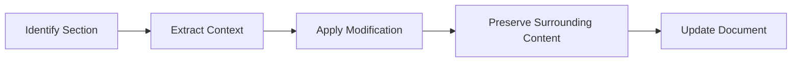

# Content Iteration

XunLong's iteration system allows you to refine and modify generated content without starting from scratch.

## Overview

The Iteration feature:
- 🔄 Modifies existing content intelligently
- 💾 Preserves context and style
- 📝 Targets specific sections or global changes
- 🗂️ Maintains version history
- ⚡ Faster than regeneration

## Quick Start

```bash
# Generate initial content
python xunlong.py report "AI Trends" --depth standard

# Iterate on it
python xunlong.py iterate <project-id> "Add more examples in the conclusion"
```

## Modification Scopes

### Local Scope 📍

**Target:** Single section, paragraph, or chapter

**Use cases:**
- Fix typos
- Update specific data
- Rewrite a paragraph
- Add/remove a sentence

**Example:**
```bash
python xunlong.py iterate <project-id> \
  "Fix the typo in Chapter 3, paragraph 2"
```

**Process:**


**Speed:** ~30 seconds

### Partial Scope 🎯

**Target:** Multiple sections or chapters

**Use cases:**
- Add new sections
- Reorganize chapters
- Expand specific topics
- Remove redundant parts

**Example:**
```bash
python xunlong.py iterate <project-id> \
  "Add three case studies to chapters 4, 5, and 6"
```

**Process:**


**Speed:** ~2-5 minutes

### Global Scope 🌐

**Target:** Entire document

**Use cases:**
- Change overall tone
- Add theme throughout
- Restructure document
- Change style/format

**Example:**
```bash
python xunlong.py iterate <project-id> \
  "Make the entire report more technical and add code examples throughout"
```

**Process:**


**Speed:** ~5-15 minutes

## Common Iteration Tasks

### Adding Content ➕

```bash
# Add new section
python xunlong.py iterate <project-id> \
  "Add a new section on 'Future Trends' after the current conclusion"

# Add examples
python xunlong.py iterate <project-id> \
  "Add 2-3 real-world examples to the Implementation section"

# Add data
python xunlong.py iterate <project-id> \
  "Include recent statistics and market data in Chapter 2"

# Add citations
python xunlong.py iterate <project-id> \
  "Add more academic citations to support claims in the Literature Review"
```

### Removing Content ➖

```bash
# Remove section
python xunlong.py iterate <project-id> \
  "Remove the Technical Details section as it's too in-depth"

# Trim content
python xunlong.py iterate <project-id> \
  "Shorten Chapter 5 by about 30%, focusing on key points only"

# Remove redundancy
python xunlong.py iterate <project-id> \
  "Remove redundant information between chapters 3 and 7"
```

### Modifying Content ✏️

```bash
# Change tone
python xunlong.py iterate <project-id> \
  "Make Chapter 4 more casual and conversational"

# Improve clarity
python xunlong.py iterate <project-id> \
  "Simplify the technical explanations in the Methodology section"

# Enhance detail
python xunlong.py iterate <project-id> \
  "Expand the character development in chapters 8-10"

# Update information
python xunlong.py iterate <project-id> \
  "Update the market data with 2025 figures"
```

### Restructuring Content 🔀

```bash
# Reorder sections
python xunlong.py iterate <project-id> \
  "Move the Case Studies section before the Analysis section"

# Split sections
python xunlong.py iterate <project-id> \
  "Split Chapter 6 into two separate chapters"

# Merge sections
python xunlong.py iterate <project-id> \
  "Combine chapters 2 and 3 into a single Overview chapter"
```

### Style Changes 🎨

```bash
# Change writing style
python xunlong.py iterate <project-id> \
  "Convert the academic tone to a more business-friendly style"

# Adjust formality
python xunlong.py iterate <project-id> \
  "Make the conclusion more formal and authoritative"

# Change perspective
python xunlong.py iterate <project-id> \
  "Rewrite chapter 5 from first-person to third-person perspective"
```

## Version Management

### Automatic Versioning

Every iteration creates a new version:

```
storage/project_id/
├── versions/
│   ├── v1_20251005_143022/  # Original
│   ├── v2_20251005_150130/  # After 1st iteration
│   ├── v3_20251005_152045/  # After 2nd iteration
│   └── v4_20251005_154512/  # Current
└── reports/
    └── FINAL_REPORT.md      # Latest version
```

### View Version History

```bash
python xunlong.py versions <project-id>
```

**Output:**
```
📚 Version History for project_id

v4 (current) - 2025-10-05 15:45:12
   Modification: "Add more technical details to implementation"
   Changes: +347 words, 3 sections modified

v3 - 2025-10-05 15:20:45
   Modification: "Expand case studies section"
   Changes: +892 words, 1 section added

v2 - 2025-10-05 15:01:30
   Modification: "Fix typos and improve clarity"
   Changes: ±124 words, 8 sections modified

v1 - 2025-10-05 14:30:22
   Initial generation
```

### Compare Versions

```bash
python xunlong.py diff <project-id> v2 v4
```

Shows differences between versions.

### Rollback to Previous Version

```bash
python xunlong.py rollback <project-id> v2
```

Restores document to version 2.

## Advanced Features

### Targeted Search and Replace

```bash
python xunlong.py iterate <project-id> \
  --mode search-replace \
  --find "machine learning" \
  --replace "artificial intelligence" \
  --scope all
```

### Batch Iterations

Define multiple changes in a file:

```bash
# iterations.txt
Add case study to chapter 3
Expand technical details in chapter 5
Add conclusion to chapter 7
Update statistics throughout
```

```bash
python xunlong.py iterate <project-id> --batch iterations.txt
```

### Conditional Iterations

Only modify if condition is met:

```bash
python xunlong.py iterate <project-id> \
  "Add COVID-19 context if discussing 2020-2025 trends"
```

### Style Transfer

Apply style from another document:

```bash
python xunlong.py iterate <project-id> \
  --apply-style-from reference_document.md
```

## Iteration Workflow

### Interactive Mode

```bash
python xunlong.py iterate <project-id> --interactive
```

**Process:**
1. View current content
2. Specify modification
3. Preview changes
4. Approve or reject
5. Apply if approved

### Review Mode

```bash
python xunlong.py iterate <project-id> \
  "Add examples" \
  --preview-only
```

Shows what would change without applying.

### Auto-approve Mode

```bash
python xunlong.py iterate <project-id> \
  "Fix grammar and spelling" \
  --auto-approve
```

Applies changes without confirmation.

## Quality Assurance

### Coherence Checking

After iteration, XunLong checks:
- Logical flow maintained
- No contradictions introduced
- Style consistency preserved
- Transitions smooth

### Automatic Cleanup

- Removes duplicate content
- Fixes broken references
- Updates table of contents
- Renumbers sections

### Validation

```bash
python xunlong.py validate <project-id>
```

**Checks:**
- Structure integrity
- Citation validity
- Cross-references
- Format compliance

## Performance Optimization

### Iteration Speed Comparison

| Scope | Speed | Use Case |
|-------|-------|----------|
| Local | 30 sec | Typos, small edits |
| Partial | 2-5 min | Multiple sections |
| Global | 5-15 min | Major changes |
| Full Regen | 10-30 min | Complete rewrite |

**Speed Tip:** Prefer targeted iterations over full regeneration.

### Caching

XunLong caches:
- Document embeddings
- Search results
- Generated sections

Subsequent iterations are faster due to caching.

### Parallel Processing

For batch iterations:

```bash
python xunlong.py iterate <project-id> \
  --batch changes.txt \
  --parallel
```

Processes independent changes simultaneously.

## Best Practices

### 📝 Clear Instructions

**Good:**
- "Add a table comparing features in the Overview section"
- "Rewrite the introduction to be more engaging"
- "Expand chapter 3 with 2-3 real-world examples"

**Less Effective:**
- "Make it better" (too vague)
- "Fix everything" (unclear scope)
- "Change stuff" (no direction)

### 🎯 Iterative Approach

**Recommended workflow:**

```bash
# Step 1: Generate base content
python xunlong.py report "Topic"

# Step 2: Review
cat storage/<project-id>/reports/FINAL_REPORT.md

# Step 3: First iteration (structure)
python xunlong.py iterate <project-id> "Add section on challenges"

# Step 4: Second iteration (content)
python xunlong.py iterate <project-id> "Expand examples in new section"

# Step 5: Final polish
python xunlong.py iterate <project-id> "Improve clarity and fix typos"
```

### ⚡ Scope Management

**Use local scope when:**
- Fixing specific errors
- Updating data points
- Minor adjustments

**Use partial scope when:**
- Adding/removing sections
- Reorganizing content
- Expanding specific areas

**Use global scope when:**
- Changing overall style
- Major restructuring
- Adding themes throughout

## Troubleshooting

### Issue: Changes not applied correctly

**Solutions:**
```bash
# Be more specific
python xunlong.py iterate <project-id> \
  "In Chapter 3, Section 2, add a paragraph about market trends"

# Preview first
python xunlong.py iterate <project-id> \
  "..." \
  --preview-only
```

### Issue: Lost content after iteration

**Solutions:**
```bash
# Rollback to previous version
python xunlong.py rollback <project-id> v3

# View version history
python xunlong.py versions <project-id>
```

### Issue: Iteration too slow

**Solutions:**
```bash
# Use local scope
python xunlong.py iterate <project-id> \
  "Fix typo in paragraph 3" \
  --scope local

# Reduce model size
--model gpt-4o-mini
```

### Issue: Style inconsistency after multiple iterations

**Solutions:**
```bash
# Run style harmonization
python xunlong.py harmonize <project-id>

# Reset and regenerate
python xunlong.py regenerate <project-id> \
  --preserve-content \
  --harmonize-style
```

## API Reference

```bash
python xunlong.py iterate <project-id> <instruction> [options]
```

| Argument | Type | Default | Description |
|----------|------|---------|-------------|
| `<project-id>` | str | Required | Project identifier |
| `<instruction>` | str | Required | Modification instruction |
| `--scope` | str | `auto` | Modification scope (local/partial/global/auto) |
| `--preview-only` | flag | `false` | Preview changes without applying |
| `--auto-approve` | flag | `false` | Apply without confirmation |
| `--interactive` | flag | `false` | Interactive iteration mode |
| `--batch` | str | None | Batch iteration file |
| `--mode` | str | `intelligent` | Iteration mode |
| `--preserve-style` | flag | `true` | Maintain original style |
| `--model` | str | `gpt-4o-mini` | LLM model to use |

## Examples

### Report Iteration

```bash
# Initial generation
python xunlong.py report "Cloud Computing Trends 2025"

# Add content
python xunlong.py iterate <project-id> \
  "Add a section on serverless computing trends"

# Expand existing
python xunlong.py iterate <project-id> \
  "Expand the security section with specific examples"

# Update data
python xunlong.py iterate <project-id> \
  "Update market size figures with latest 2025 data"
```

### Fiction Iteration

```bash
# Initial generation
python xunlong.py fiction "Mystery novel" --chapters 20

# Character development
python xunlong.py iterate <project-id> \
  "Make the protagonist more conflicted in chapters 5-8"

# Plot enhancement
python xunlong.py iterate <project-id> \
  "Add foreshadowing for the twist in chapters 3, 7, and 11"

# Pacing adjustment
python xunlong.py iterate <project-id> \
  "Slow down the pacing in chapter 15 to build more tension"
```

### PPT Iteration

```bash
# Initial generation
python xunlong.py ppt "Product Launch Strategy" --slides 18

# Add slides
python xunlong.py iterate <project-id> \
  "Add 2 slides on competitive analysis after slide 8"

# Improve content
python xunlong.py iterate <project-id> \
  "Make slide 5 more visual with less text"

# Reorder
python xunlong.py iterate <project-id> \
  "Move the pricing slide to come before the features slide"
```

## Next Steps

- Learn about [Report Generation](/guide/features/report)
- Explore [Fiction Writing](/guide/features/fiction)
- Try [PPT Creation](/guide/features/ppt)
- Check [Export Formats](/guide/features/export)
