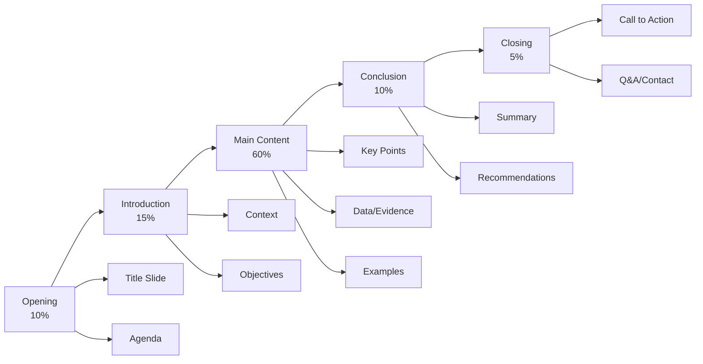

# PPT Creation

XunLong automatically generates professional PowerPoint presentations from your topic or content.

## Overview

The PPT Creation feature:
- 🎨 Designs professional slide layouts
- 📊 Creates data visualizations
- ✍️ Writes concise slide content
- 🎭 Applies consistent themes
- 📤 Exports to PPTX format

## Quick Start

```bash
python xunlong.py ppt "Product Launch Strategy" --slides 15
```

XunLong will create a complete, ready-to-present deck.

## Presentation Styles

### Business Professional 💼

**Best for:** Corporate presentations, investor pitches, board meetings

**Characteristics:**
- Clean, minimal design
- Professional color schemes
- Data-driven slides
- Conservative layouts
- Corporate-friendly

**Example:**
```bash
python xunlong.py ppt "Q4 Sales Performance Review" \
  --style business \
  --slides 20 \
  --theme corporate
```

**Typical Slide Types:**
- Title slide
- Agenda
- Executive summary
- Data charts
- Key metrics
- Recommendations
- Next steps

### Creative 🎨

**Best for:** Marketing pitches, creative presentations, design showcases

**Characteristics:**
- Bold colors
- Visual emphasis
- Image-heavy slides
- Modern typography
- Dynamic layouts

**Example:**
```bash
python xunlong.py ppt "New Brand Identity Proposal" \
  --style creative \
  --slides 18 \
  --theme vibrant
```

**Typical Slide Types:**
- Visual title
- Mood boards
- Before/after
- Portfolio samples
- Concept reveals
- Brand guidelines

### Minimal ⚪

**Best for:** Tech talks, academic presentations, focused content

**Characteristics:**
- Lots of white space
- Simple typography
- Minimal graphics
- Focus on content
- Clean aesthetics

**Example:**
```bash
python xunlong.py ppt "Introduction to Machine Learning" \
  --style minimal \
  --slides 25 \
  --theme clean
```

**Typical Slide Types:**
- Text slides
- Simple diagrams
- Code snippets
- Key quotes
- Summary points

### Educational 📚

**Best for:** Training, workshops, tutorials, lectures

**Characteristics:**
- Clear hierarchy
- Step-by-step layouts
- Learning objectives
- Summary slides
- Practice exercises

**Example:**
```bash
python xunlong.py ppt "Python Programming Basics" \
  --style educational \
  --slides 30 \
  --include-exercises
```

## Slide Structure

### Standard Structure



### Custom Structure

Define your own slide sequence:

```bash
python xunlong.py ppt "Marketing Plan 2025" \
  --structure "Title,Agenda,Situation Analysis,Target Audience,Strategy,Tactics,Budget,Timeline,Metrics,Q&A"
```

## Advanced Features

### Data Integration

Include charts and graphs:

```bash
python xunlong.py ppt "Sales Performance Q3" \
  --data sales_data.csv \
  --charts "line,bar,pie"
```

**Supported Chart Types:**
- Line charts (trends)
- Bar charts (comparisons)
- Pie charts (proportions)
- Scatter plots (correlations)
- Area charts (cumulative)

### Speaker Notes

Generate detailed speaker notes:

```bash
python xunlong.py ppt "Product Demo" \
  --slides 12 \
  --speaker-notes detailed
```

**Speaker notes include:**
- Key talking points
- Timing suggestions
- Transition cues
- Additional details
- Potential questions

### Image Suggestions

Get AI-suggested images for each slide:

```bash
python xunlong.py ppt "Travel Destination Marketing" \
  --slides 15 \
  --suggest-images \
  --image-style photography
```

**Image styles:**
- Photography
- Illustrations
- Icons
- Abstract
- Data visualizations

### Animations and Transitions

```bash
python xunlong.py ppt "Product Launch" \
  --animations subtle \
  --transitions fade
```

**Animation levels:**
- `none` - No animations
- `subtle` - Gentle entrance effects
- `moderate` - Standard transitions
- `dynamic` - Bold movements

## Themes and Colors

### Built-in Themes

```bash
# Professional blue
python xunlong.py ppt "Topic" --theme corporate-blue

# Modern gradient
python xunlong.py ppt "Topic" --theme modern-gradient

# Minimalist monochrome
python xunlong.py ppt "Topic" --theme minimal-mono

# Vibrant creative
python xunlong.py ppt "Topic" --theme vibrant-creative

# Nature-inspired
python xunlong.py ppt "Topic" --theme nature-green
```

### Custom Colors

```bash
python xunlong.py ppt "Brand Presentation" \
  --primary-color "#2E86AB" \
  --secondary-color "#A23B72" \
  --accent-color "#F18F01"
```

### Font Selection

```bash
python xunlong.py ppt "Tech Conference Talk" \
  --heading-font "Montserrat" \
  --body-font "Open Sans"
```

## Content Sources

### From Scratch

```bash
python xunlong.py ppt "Climate Change Solutions" \
  --slides 18 \
  --research true
```

XunLong researches and generates content automatically.

### From Existing Report

```bash
python xunlong.py ppt-from-report <report-project-id> \
  --slides 15
```

Converts your XunLong report into a presentation.

### From Markdown

```bash
python xunlong.py ppt-from-markdown content.md \
  --style business
```

### From Outline

```bash
python xunlong.py ppt-from-outline outline.txt \
  --slides 20 \
  --expand-content
```

## Slide Types

### Title Slide

```
┌─────────────────────────────┐
│                             │
│      [MAIN TITLE]          │
│                             │
│      [Subtitle]            │
│                             │
│      [Author/Date]         │
│                             │
└─────────────────────────────┘
```

### Agenda/Table of Contents

```
┌─────────────────────────────┐
│  Agenda                     │
│                             │
│  1. Introduction           │
│  2. Market Analysis        │
│  3. Our Solution           │
│  4. Implementation         │
│  5. Conclusion             │
│                             │
└─────────────────────────────┘
```

### Content Slide (Bullet Points)

```
┌─────────────────────────────┐
│  Key Benefits              │
│                             │
│  • Increased efficiency    │
│  • Cost reduction          │
│  • Better user experience  │
│  • Scalability             │
│                             │
└─────────────────────────────┘
```

### Two-Column Layout

```
┌─────────────────────────────┐
│  Before vs After           │
│                             │
│  Before:      │  After:     │
│  • Issue 1    │  • Solved   │
│  • Issue 2    │  • Fixed    │
│  • Issue 3    │  • Improved │
│                             │
└─────────────────────────────┘
```

### Image + Text

```
┌─────────────────────────────┐
│  ┌──────────┐  Key Points:  │
│  │          │               │
│  │  Image   │  • Point 1    │
│  │          │  • Point 2    │
│  └──────────┘  • Point 3    │
│                             │
└─────────────────────────────┘
```

### Chart Slide

```
┌─────────────────────────────┐
│  Sales Growth              │
│                             │
│    ┌─────────────────┐     │
│    │   Chart/Graph   │     │
│    │                 │     │
│    └─────────────────┘     │
│                             │
└─────────────────────────────┘
```

## Example Workflow

### 1. Generate Presentation

```bash
python xunlong.py ppt "Digital Transformation Strategy" \
  --style business \
  --slides 18 \
  --theme corporate-blue \
  --speaker-notes detailed
```

**Output:**
```
✅ Presentation generated!

📊 Statistics:
   - Duration: 5m 23s
   - Slides: 18
   - Speaker notes: Yes
   - Charts: 4

📁 Files:
   - storage/20251005_143022_digital_transformation/presentation.pptx

🔗 Project ID: 20251005_143022
```

### 2. Review Presentation

Open in PowerPoint, Keynote, or Google Slides.

### 3. Request Modifications

```bash
python xunlong.py iterate 20251005_143022 \
  "Add a slide about implementation timeline and expand the budget section"
```

### 4. Regenerate Specific Slides

```bash
python xunlong.py ppt-regenerate 20251005_143022 \
  --slides 5,6,7 \
  --reason "Need more detailed data"
```

## Presentation Lengths

| Duration | Slides | Best For |
|----------|--------|----------|
| 5 min | 5-7 | Quick pitch, elevator pitch |
| 10 min | 10-12 | Product demo, brief update |
| 15 min | 12-15 | Team presentation, proposal |
| 20 min | 15-18 | Conference talk, training |
| 30 min | 20-25 | Workshop, detailed presentation |
| 45 min | 30-35 | Lecture, comprehensive training |
| 60 min | 40-50 | Full course module, keynote |

**Rule of thumb:** ~1-2 minutes per slide

## Best Practices

### 📝 Content Guidelines

**Do:**
- One main idea per slide
- Use bullet points (3-5 max)
- Include visuals
- Keep text minimal
- Use consistent formatting

**Don't:**
- Overcrowd slides
- Use full sentences
- Mix too many fonts
- Overuse animations
- Include unnecessary info

### 🎨 Design Principles

**Contrast:**
```bash
--theme high-contrast  # Better readability
```

**Hierarchy:**
- Large heading
- Medium subheading
- Small body text

**Alignment:**
- Consistent margins
- Grid-based layouts
- Visual balance

**White Space:**
```bash
--style minimal  # Emphasizes white space
```

### ⚡ Performance Tips

**Fast Generation (~3 min):**
```bash
python xunlong.py ppt "Topic" \
  --slides 10 \
  --style minimal \
  --no-research
```

**Balanced (~7 min):**
```bash
python xunlong.py ppt "Topic" \
  --slides 18 \
  --style business \
  --research true
```

**High Quality (~15 min):**
```bash
python xunlong.py ppt "Topic" \
  --slides 30 \
  --style business \
  --speaker-notes detailed \
  --suggest-images \
  --research comprehensive
```

## Troubleshooting

### Issue: Slides too text-heavy

**Solutions:**
```bash
--content-density low
--max-bullets 3
--use-visuals true
```

### Issue: Inconsistent design

**Solutions:**
- Use a single theme: `--theme corporate-blue`
- Avoid mixing styles
- Regenerate with `--strict-theme`

### Issue: Missing speaker notes

**Solutions:**
```bash
# Generate notes separately
python xunlong.py ppt-add-notes <project-id> \
  --detail-level comprehensive
```

### Issue: Charts not displaying

**Solutions:**
- Verify data file format
- Check chart type compatibility
- Regenerate charts: `--regenerate-charts`

## API Reference

```bash
python xunlong.py ppt <topic> [options]
```

| Argument | Type | Default | Description |
|----------|------|---------|-------------|
| `<topic>` | str | Required | Presentation topic |
| `--slides` | int | `15` | Number of slides |
| `--style` | str | `business` | Presentation style |
| `--theme` | str | `corporate-blue` | Visual theme |
| `--structure` | str | `standard` | Slide structure |
| `--speaker-notes` | str | `basic` | Speaker notes detail |
| `--animations` | str | `subtle` | Animation level |
| `--research` | bool | `true` | Research content |
| `--suggest-images` | bool | `false` | Suggest images |
| `--data` | str | None | Data file for charts |
| `--charts` | str | None | Chart types to include |
| `--content-density` | str | `medium` | Text density per slide |

## Examples

### Investor Pitch

```bash
python xunlong.py ppt "Startup Seed Round Pitch" \
  --style business \
  --slides 12 \
  --structure "Problem,Solution,Market,Product,Traction,Team,Financials,Ask" \
  --theme corporate-blue \
  --speaker-notes detailed
```

### Conference Talk

```bash
python xunlong.py ppt "Building Scalable Microservices" \
  --style minimal \
  --slides 25 \
  --theme clean \
  --animations subtle \
  --suggest-images
```

### Training Workshop

```bash
python xunlong.py ppt "Excel Advanced Techniques" \
  --style educational \
  --slides 40 \
  --include-exercises \
  --speaker-notes comprehensive
```

### Marketing Presentation

```bash
python xunlong.py ppt "New Product Launch Campaign" \
  --style creative \
  --slides 20 \
  --theme vibrant-creative \
  --suggest-images \
  --animations dynamic
```

### Convert Report to PPT

```bash
python xunlong.py ppt-from-report <report-project-id> \
  --slides 18 \
  --style business \
  --highlight-key-findings
```

## Next Steps

- Learn about [Report Generation](/guide/features/report)
- Explore [Fiction Writing](/guide/features/fiction)
- Understand [Content Iteration](/guide/features/iteration)
- Check [Export Formats](/guide/features/export)
