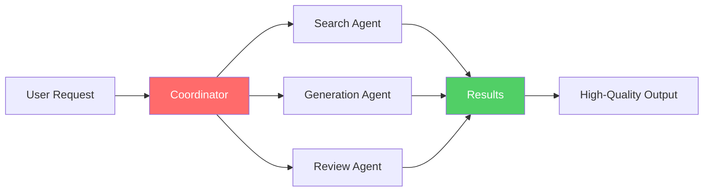
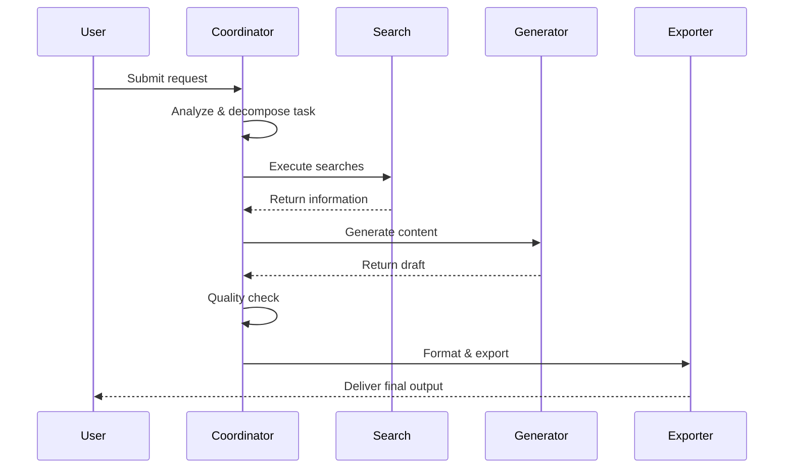

# What is XunLong?

**XunLong** (寻龙, meaning "Dragon Seeker") is an AI-powered multi-modal content generation system that automates the creation of research reports, creative fiction, and professional presentations.

## The Vision

In today's information age, content creation is both crucial and time-consuming. Whether you're a researcher compiling findings, a writer crafting stories, or a professional preparing presentations, the process often involves:

- 🔍 **Hours of research** - Searching, reading, and extracting relevant information
- ✍️ **Manual writing** - Organizing thoughts and crafting coherent narratives  
- 🎨 **Formatting** - Designing layouts and ensuring visual appeal
- 🔄 **Iterations** - Revising and refining until satisfactory

**XunLong automates this entire workflow**, allowing you to generate professional-quality content in minutes instead of hours.

## What Makes XunLong Different?

### 1. Multi-Modal Generation

Unlike single-purpose AI tools, XunLong supports **three distinct content types**:

| Mode | Purpose | Output Formats |
|------|---------|----------------|
| **Report** | Research reports, analysis documents, white papers | MD, HTML, PDF, DOCX |
| **Fiction** | Novels, short stories, creative writing | MD, HTML, PDF, DOCX |
| **PPT** | Business presentations, pitch decks, slides | JSON, HTML, PPTX |

### 2. Intelligence Through Multi-Agent Architecture

XunLong doesn't rely on a single AI prompt. Instead, it orchestrates **multiple specialized agents** that collaborate:



- **Coordinator** - Breaks down complex tasks
- **Search Agent** - Gathers relevant information
- **Generation Agent** - Creates content
- **Review Agent** - Ensures quality
- **Iteration Agent** - Refines based on feedback

### 3. Real Web Search

XunLong doesn't hallucinate facts. It performs **actual web searches** using Playwright and Perplexity to gather current, factual information before generating content.

### 4. Iterative Refinement

Not satisfied with the initial output? XunLong supports **intelligent iterations**:

```bash
# Initial generation
python xunlong.py report "AI Industry 2025"

# Iterate and refine
python xunlong.py iterate <project_id> "Add more case studies in chapter 3"
```

The system understands context and makes targeted modifications without regenerating everything.

### 5. Full Observability

Every LLM call, search query, and generation step is tracked via **LangFuse integration**, giving you complete transparency into how content is created.

## Use Cases

### 📊 For Researchers & Analysts

Generate comprehensive research reports:
- Industry analysis
- Market research
- Technical documentation
- Literature reviews

**Example:**
```bash
python xunlong.py report "Quantum Computing Applications in Finance" \
  --style academic \
  --depth comprehensive
```

### ✍️ For Writers & Content Creators

Create engaging fiction:
- Novels and novellas
- Short stories
- Creative narratives
- Character-driven plots

**Example:**
```bash
python xunlong.py fiction "A detective story set in cyberpunk Tokyo" \
  --style mystery \
  --chapters 15
```

### 📈 For Business Professionals

Build professional presentations:
- Business pitches
- Product launches
- Quarterly reviews
- Training materials

**Example:**
```bash
python xunlong.py ppt "Q4 2025 Sales Review" \
  --slides 20 \
  --style business \
  --speech-notes "Executive presentation"
```

## How It Works

### Simple 3-Step Process

1. **Input Your Request**
   ```bash
   python xunlong.py report "Your Topic Here"
   ```

2. **Let XunLong Work**
   - Analyzes your request
   - Searches for information
   - Generates structured content
   - Creates formatted output

3. **Review & Iterate**
   - Check the generated content
   - Request modifications if needed
   - Export to desired format

### Behind the Scenes



## Technology Stack

XunLong is built on proven, industry-standard technologies:

- **LangGraph** - Workflow orchestration
- **LangChain** - LLM integration framework
- **OpenAI / Anthropic / DeepSeek** - Language models
- **Playwright** - Web automation
- **WeasyPrint** - PDF generation
- **python-pptx** - PowerPoint creation
- **LangFuse** - Observability and monitoring

## Key Features

### 🔍 Intelligent Search
- Real-time web search
- Content extraction and summarization
- Source citation and verification

### ✨ Smart Generation
- Context-aware writing
- Style adaptation
- Consistent formatting
- Proper structure

### 🎨 Professional Export
- Multiple format support
- Template customization
- High-quality PDF rendering
- PPTX with layouts and styling

### 🔄 Iterative Improvement
- Targeted modifications
- Version management
- Context preservation
- Incremental refinement

### 📈 Full Transparency
- LLM call tracking
- Token usage monitoring
- Performance metrics
- Error logging

## Comparison

| Feature | XunLong | ChatGPT | Traditional Tools |
|---------|---------|---------|-------------------|
| Multi-modal | ✅ Reports, Fiction, PPT | ❌ Text only | ❌ Specialized |
| Real search | ✅ Live web search | ⚠️ Limited | ❌ Manual |
| Export | ✅ PDF, DOCX, PPTX | ❌ Copy-paste | ✅ Native |
| Iteration | ✅ Context-aware | ⚠️ New chat | ❌ Manual edit |
| Observability | ✅ Full tracking | ❌ Black box | N/A |
| Offline | ❌ API required | ❌ Internet needed | ✅ Offline |
| Cost | 💰 API costs | 💰 Subscription | 💰 License |

## Limitations

**XunLong is designed for content generation, not as a:**
- ❌ Real-time chat interface
- ❌ Code execution environment
- ❌ Data analysis platform
- ❌ Image generation tool

**Current constraints:**
- Requires stable internet connection
- LLM API costs apply
- Generation time: 5-20 minutes per project
- Quality depends on LLM model chosen

## Philosophy

XunLong follows these core principles:

1. **Quality over Speed** - Takes time to research and generate properly
2. **Transparency** - Every step is visible and trackable
3. **Flexibility** - Supports multiple models and can be customized
4. **Iterative** - Content can be refined, not just regenerated
5. **Open Source** - Community-driven development under MIT license

## Next Steps

Ready to get started?

- 📦 [Install XunLong](/guide/installation)
- 🚀 [Quick Start Guide](/guide/getting-started)
- 🏗️ [Understand the Architecture](/guide/architecture)
- 📚 [Explore Features](/guide/features/report)

## Community & Support

- 🐛 [Report Issues](https://github.com/jaguarliuu/xunlong/issues)
- 💬 [Discussions](https://github.com/jaguarliuu/xunlong/discussions)
- 📖 [Contributing Guide](/community/contributing)
- 📰 [Changelog](/community/changelog)

---

**XunLong** - Empowering content creators with AI
