# Multi-Agent System

XunLong's power comes from its sophisticated multi-agent architecture. Instead of relying on a single AI prompt, multiple specialized agents collaborate to deliver high-quality content.

## Overview

```mermaid
graph TD
    subgraph "Coordination Layer"
        Coordinator["🎯 Coordinator<br/>━━━━━━━━━━━<br/>• Task Decomposition<br/>• Workflow Orchestration<br/>• State Management"]
    end

    subgraph "Execution Layer"
        SearchAgent["🔍 Search Agent<br/>━━━━━━━━━━━<br/>• Web Search<br/>• Content Extraction<br/>• Information Integration"]

        GenerationAgent["📝 Generation Agent<br/>━━━━━━━━━━━<br/>• Content Creation<br/>• Structure Organization<br/>• Style Control"]

        ReviewAgent["✅ Review Agent<br/>━━━━━━━━━━━<br/>• Quality Check<br/>• Content Optimization<br/>• Consistency Verification"]

        IterationAgent["🔄 Iteration Agent<br/>━━━━━━━━━━━<br/>• Requirement Analysis<br/>• Local Modification<br/>• Version Management"]
    end

    Coordinator --> SearchAgent
    Coordinator --> GenerationAgent
    Coordinator --> ReviewAgent
    Coordinator --> IterationAgent

    SearchAgent -.provide materials.-> GenerationAgent
    GenerationAgent -.submit review.-> ReviewAgent
    ReviewAgent -.feedback.-> GenerationAgent

    style Coordinator fill:#ff6b6b,stroke:#c92a2a,color:#fff
    style SearchAgent fill:#4c6ef5,stroke:#364fc7,color:#fff
    style GenerationAgent fill:#51cf66,stroke:#2b8a3e,color:#fff
    style ReviewAgent fill:#ffd43b,stroke:#f59f00,color:#333
    style IterationAgent fill:#ae3ec9,stroke:#862e9c,color:#fff
```



## Core Agents

### 1. Coordinator Agent 🎯

**Role:** Master orchestrator that manages the entire workflow.

**Responsibilities:**
- Analyzes user requirements
- Decomposes complex tasks into subtasks
- Routes tasks to appropriate agents
- Manages state transitions
- Aggregates results

**Key Features:**
- Built on LangGraph state machine
- Handles parallel execution
- Manages error recovery
- Maintains project context

**Example Flow:**
```python
# User request: "Generate a report on AI trends"
Coordinator:
  1. Parse request → Identify content type (report)
  2. Decompose → [Search AI trends, Analyze data, Generate outline, Write sections]
  3. Route → Assign tasks to Search Agent and Generation Agent
  4. Monitor → Track progress and handle failures
  5. Aggregate → Combine results into final report
```

### 2. Search Agent 🔍

**Role:** Gathers information from the web.

**Responsibilities:**
- Executes web searches
- Extracts relevant content
- Evaluates source credibility
- Summarizes findings
- Cites sources

**Technology Stack:**
- **Playwright** - Browser automation
- **Perplexity API** - Advanced search
- **Trafilatura** - Content extraction
- **BeautifulSoup** - HTML parsing

**Search Strategy:**


**Quality Checks:**
- Source date verification
- Content relevance scoring
- Duplicate filtering
- Language detection

### 3. Generation Agent 📝

**Role:** Creates content based on gathered materials.

**Specialized Sub-Agents:**

#### Report Generator
- Structures research findings
- Maintains academic tone
- Adds citations
- Creates tables and charts

#### Fiction Generator  
- Develops characters and plot
- Maintains narrative consistency
- Adapts writing style
- Creates chapter outlines

#### PPT Generator
- Designs slide layouts
- Selects color schemes
- Creates visual hierarchies
- Generates speaker notes

**Generation Process:**


### 4. Review Agent ✅

**Role:** Ensures quality and consistency.

**Quality Checks:**

| Aspect | Checks |
|--------|--------|
| **Content** | Factual accuracy, completeness, relevance |
| **Structure** | Logical flow, proper hierarchy, coherence |
| **Style** | Tone consistency, grammar, readability |
| **Format** | Markdown syntax, heading levels, citations |

**Review Process:**
1. **Structural Review** - Check organization and flow
2. **Content Review** - Verify accuracy and relevance
3. **Style Review** - Ensure consistency
4. **Format Review** - Validate markup

**Feedback Loop:**
```python
if quality_score < threshold:
    provide_specific_feedback()
    request_revision()
else:
    approve_content()
```

### 5. Iteration Agent 🔄

**Role:** Handles content refinement requests.

**Capabilities:**
- Analyzes modification requests
- Identifies scope (local/partial/global)
- Preserves context
- Manages versions

**Modification Scopes:**

::: tabs

== Local
**Target:** Single section or chapter

**Use Cases:**
- Fix typos in Chapter 3
- Update data in Table 2
- Rewrite conclusion paragraph

**Strategy:** Precise replacement with context preservation

== Partial
**Target:** Multiple sections

**Use Cases:**
- Add 3 new case studies
- Reorganize chapters 5-7
- Expand methodology section

**Strategy:** Selective regeneration with coherence checks

== Global
**Target:** Entire document

**Use Cases:**
- Change overall tone
- Restructure entire report
- Add new theme throughout

**Strategy:** Complete regeneration with original context

:::

**Version Management:**
```
project/
├── versions/
│   ├── 20251005_101234/  # Backup before iteration
│   ├── 20251005_143022/
│   └── 20251005_165530/
└── reports/
    └── FINAL_REPORT.md    # Current version
```

## Agent Communication

### Message Passing

Agents communicate through structured messages:

```python
{
    "agent": "search_agent",
    "task": "search_ai_trends",
    "status": "completed",
    "results": {
        "sources": [...],
        "summary": "...",
        "citations": [...]
    },
    "metadata": {
        "duration": 12.5,
        "token_usage": 1250
    }
}
```

### State Management

LangGraph maintains a shared state accessible to all agents:

```python
class WorkflowState(TypedDict):
    query: str
    content_type: str
    search_results: List[SearchResult]
    outline: OutlineStructure
    generated_sections: Dict[str, str]
    review_feedback: Optional[Feedback]
    final_content: Optional[str]
```

## Parallel Execution

XunLong maximizes efficiency through parallelization:


**Performance Improvement:**
- Sequential: ~28 seconds
- Parallel: ~17 seconds
- **Speedup: 1.65x**

## Error Handling

Each agent implements robust error handling:

```python
class AgentErrorHandler:
    def handle_error(self, error, context):
        if error.is_retryable():
            return self.retry_with_backoff()
        elif error.is_recoverable():
            return self.fallback_strategy()
        else:
            return self.graceful_degradation()
```

**Error Categories:**
- **Transient** - Network timeouts (retry)
- **Recoverable** - API rate limits (backoff)
- **Permanent** - Invalid input (fail gracefully)

## Observability

All agent activities are tracked via LangFuse:

**Tracked Metrics:**
- Agent invocations
- Task duration
- LLM token usage
- Error rates
- Quality scores

**Visualization:**
```
Dashboard
├── Agent Performance
│   ├── Search Agent: 95% success rate
│   ├── Generator: 12.3s avg time
│   └── Reviewer: 3.2 quality score
├── Token Usage
│   ├── Total: 125K tokens
│   ├── Search: 25K
│   └── Generation: 100K
└── Error Tracking
    └── Last 24h: 3 errors (all recovered)
```

## Extending the System

### Adding Custom Agents

XunLong's architecture supports custom agents:

```python
from xunlong.agents.base import BaseAgent

class CustomAgent(BaseAgent):
    def __init__(self):
        super().__init__(name="custom_agent")
    
    async def execute(self, task):
        # Your custom logic
        result = await self.process(task)
        return result
```

### Registering Agents

```python
# In coordinator.py
coordinator.register_agent(
    agent=CustomAgent(),
    triggers=["custom_task"]
)
```

## Best Practices

### 1. Agent Design
- ✅ Single responsibility principle
- ✅ Stateless when possible
- ✅ Idempotent operations
- ✅ Clear input/output contracts

### 2. Communication
- ✅ Use structured messages
- ✅ Include metadata
- ✅ Handle failures gracefully
- ✅ Log all interactions

### 3. Performance
- ✅ Parallelize independent tasks
- ✅ Cache expensive operations
- ✅ Implement timeouts
- ✅ Monitor resource usage

## Next Steps

- Learn about the [Workflow](/guide/workflow)
- Explore [LLM Integration](/guide/llm-integration)
- Understand [State Management](/guide/state-management)
- Try [Custom Agents](/advanced/custom-agents)
