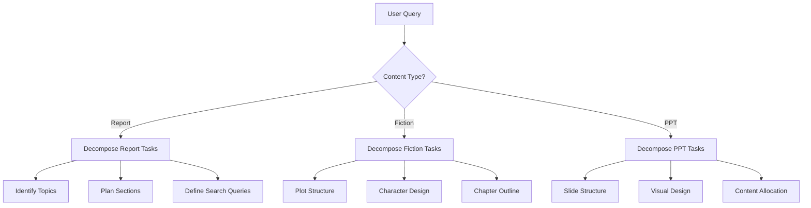
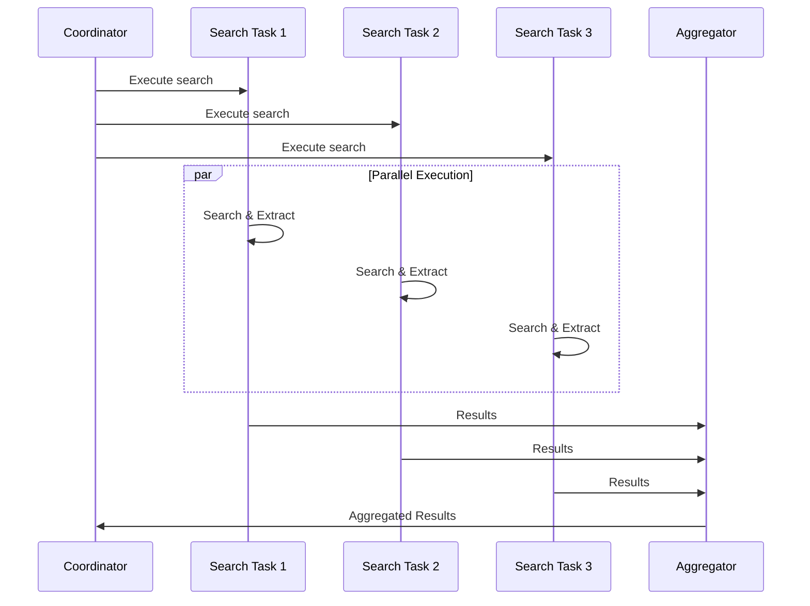
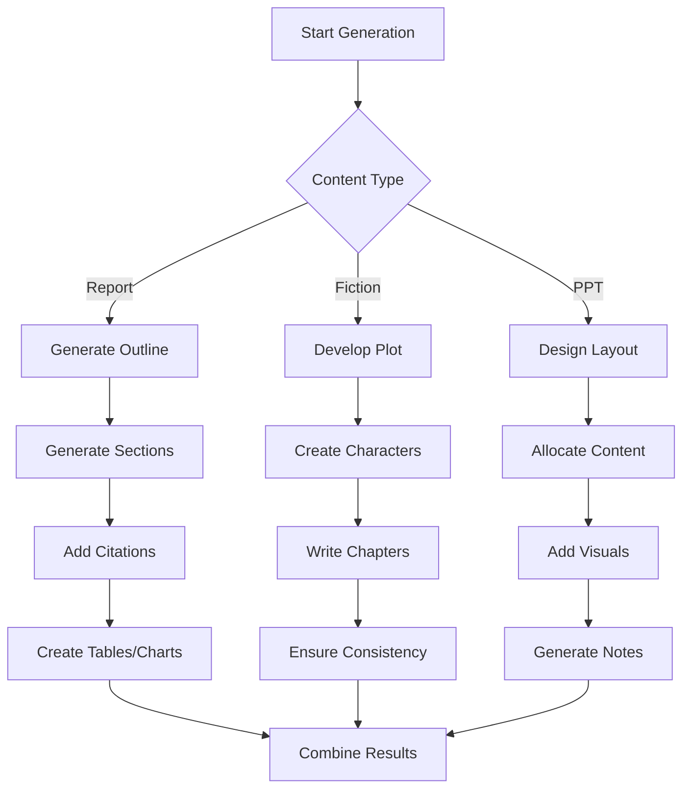
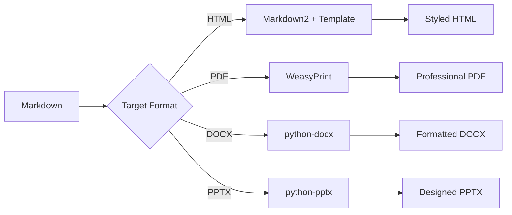
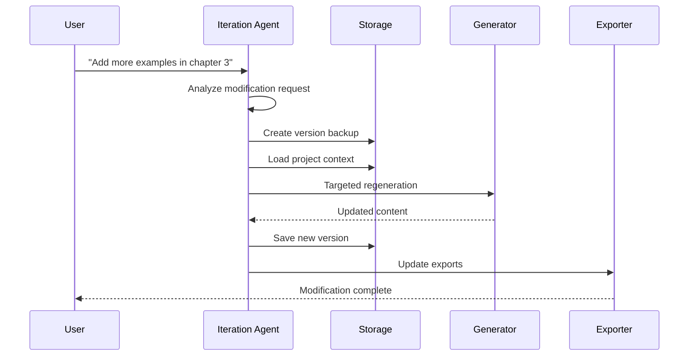

# Workflow

Understanding XunLong's workflow helps you optimize your content generation process and troubleshoot issues effectively.

## High-Level Workflow


## Detailed Workflow Stages

### Stage 1: Requirement Analysis 🔍

**Goal:** Understand user intent and prepare for execution.

**Activities:**
1. Parse command-line arguments
2. Identify content type (report/fiction/ppt)
3. Extract parameters (style, depth, chapters, etc.)
4. Validate configuration
5. Initialize project structure

**Output:**
```python
{
    "content_type": "report",
    "query": "AI Industry Trends 2025",
    "style": "business",
    "depth": "comprehensive",
    "project_id": "20251005_143022"
}
```

**Duration:** ~1 second

### Stage 2: Task Decomposition 📋

**Goal:** Break down complex request into manageable subtasks.

**Process:**


**Example Decomposition:**

::: tabs

== Report
```json
{
  "tasks": [
    {
      "type": "search",
      "queries": [
        "AI industry market size 2025",
        "Latest AI technology trends",
        "AI applications by sector"
      ]
    },
    {
      "type": "outline",
      "sections": [
        "Executive Summary",
        "Market Overview",
        "Technology Trends",
        "Applications",
        "Future Outlook"
      ]
    }
  ]
}
```

== Fiction
```json
{
  "tasks": [
    {
      "type": "plot",
      "structure": "three_act"
    },
    {
      "type": "characters",
      "count": 5,
      "depth": "detailed"
    },
    {
      "type": "chapters",
      "count": 12,
      "style": "mystery"
    }
  ]
}
```

== PPT
```json
{
  "tasks": [
    {
      "type": "outline",
      "slides": 15
    },
    {
      "type": "design",
      "style": "business",
      "colors": "professional"
    },
    {
      "type": "content",
      "distribution": "balanced"
    }
  ]
}
```

:::

**Duration:** ~2-3 seconds

### Stage 3: Parallel Search 🌐

**Goal:** Gather relevant information from the web.

**Execution Flow:**


**Search Process:**
1. **Execute Query** - Use Perplexity or Playwright
2. **Extract Content** - Parse HTML and extract text
3. **Filter Results** - Remove irrelevant content
4. **Summarize** - Create concise summaries
5. **Cite Sources** - Track URLs and dates

**Duration:** ~5-15 seconds (depends on query count)

### Stage 4: Content Integration 📦

**Goal:** Organize and structure collected information.

**Activities:**
1. Deduplicate information
2. Categorize by topic
3. Rank by relevance
4. Create knowledge graph
5. Prepare context for generation

**Data Structure:**
```python
{
    "topic": "AI Industry Trends",
    "sources": [
        {
            "url": "https://...",
            "date": "2025-09-15",
            "relevance": 0.95,
            "summary": "...",
            "key_points": [...]
        }
    ],
    "knowledge_graph": {
        "entities": [...],
        "relationships": [...]
    }
}
```

**Duration:** ~2-3 seconds

### Stage 5: Intelligent Generation ✨

**Goal:** Create high-quality content based on gathered materials.

**Generation Strategy:**



**LLM Usage Pattern:**
```python
# Sequential generation with context
for section in outline:
    prompt = build_prompt(
        section=section,
        context=search_results,
        previous_sections=generated_content
    )
    content = await llm.generate(prompt)
    generated_content.append(content)
```

**Quality Metrics:**
- Coherence score
- Factual accuracy
- Citation coverage
- Readability index

**Duration:** ~30-120 seconds (varies by length)

### Stage 6: Quality Review ✅

**Goal:** Ensure content meets quality standards.

**Review Checklist:**

| Category | Checks | Auto-Fix |
|----------|--------|----------|
| **Structure** | Heading hierarchy, section balance | ✅ |
| **Content** | Fact-checking, completeness | ⚠️ Manual |
| **Style** | Tone consistency, grammar | ✅ |
| **Format** | Markdown syntax, citations | ✅ |
| **Logic** | Flow, transitions, coherence | ⚠️ Manual |

**Review Process:**
1. **Automated Checks** - Run syntax and format validators
2. **LLM Review** - Quality assessment by reviewer agent
3. **Score Calculation** - Compute overall quality score
4. **Feedback Generation** - Create improvement suggestions
5. **Revision** (if needed) - Regenerate low-quality sections

**Threshold:**
- Score ≥ 0.85: Approve
- Score < 0.85: Request revision

**Duration:** ~5-10 seconds

### Stage 7: Format Conversion 🔄

**Goal:** Transform Markdown to desired output formats.

**Conversion Pipeline:**



**HTML Conversion:**
```python
import markdown2

html = markdown2.markdown(
    content,
    extras=[
        'tables',
        'fenced-code-blocks',
        'header-ids',
        'toc',
        'metadata'
    ]
)
```

**Template Application:**
```html
<!DOCTYPE html>
<html>
<head>
    <style>
        /* Custom styles for professional look */
    </style>
</head>
<body>
    {{ content }}
</body>
</html>
```

**Duration:** ~2-5 seconds per format

### Stage 8: Export Output 📤

**Goal:** Save and deliver final output to user.

**Export Structure:**
```
storage/20251005_143022_AI_Industry_Trends/
├── metadata.json
├── intermediate/
│   ├── 01_task_decomposition.json
│   ├── 02_search_results.json
│   └── 03_content_outline.json
├── reports/
│   ├── FINAL_REPORT.md
│   └── FINAL_REPORT.html
└── exports/
    ├── report.pdf
    └── report.docx
```

**Completion Summary:**
```
✅ Generation Complete!

📊 Statistics:
   - Duration: 2m 34s
   - Searches: 8 queries
   - Content: 5,432 words
   - Citations: 15 sources
   - Quality Score: 0.92

📁 Output Files:
   - Markdown: storage/.../FINAL_REPORT.md
   - HTML: storage/.../FINAL_REPORT.html
   - PDF: storage/.../exports/report.pdf

🔗 Project ID: 20251005_143022
```

**Duration:** ~1-2 seconds

## Total Timeline

| Stage | Duration | Percentage |
|-------|----------|------------|
| Requirement Analysis | 1s | 1% |
| Task Decomposition | 3s | 2% |
| Parallel Search | 10s | 7% |
| Content Integration | 3s | 2% |
| Intelligent Generation | 90s | 60% |
| Quality Review | 8s | 5% |
| Format Conversion | 4s | 3% |
| Export Output | 1s | <1% |
| **Total** | **~120s** | **100%** |

::: tip Performance Tip
Most time is spent on content generation (LLM calls). Use faster models like GPT-3.5 for drafts, then iterate with GPT-4 for quality.
:::

## Iteration Workflow

When you request modifications:



**Key Differences from Initial Generation:**
- ✅ Preserves context
- ✅ Targets specific sections
- ✅ Maintains version history
- ✅ Faster execution (~30-60s)

## Monitoring & Observability

### Real-Time Progress

During execution, XunLong displays:

```
🐉 XunLong - Content Generation

📋 Task Analysis
✅ Identified: Report Generation
✅ Style: Business
✅ Depth: Comprehensive

🔍 Searching Information
[████████████████████████████████] 100% (8/8 queries)
✅ Found 42 relevant sources

✨ Generating Content
[████████████████░░░░░░░░░░░░░░░░] 60% (3/5 sections)
⏱️  Elapsed: 1m 24s | Estimated: 48s remaining

```

### LangFuse Tracking

All operations are logged to LangFuse:

**Trace View:**
```
Trace: report_generation_20251005_143022
├─ analyze_requirement (1.2s)
├─ decompose_tasks (2.8s)
├─ parallel_search (9.4s)
│  ├─ search_query_1 (3.2s)
│  ├─ search_query_2 (4.1s)
│  └─ search_query_3 (5.3s)
├─ generate_content (89.3s)
│  ├─ section_1 (15.2s, 1,234 tokens)
│  ├─ section_2 (18.7s, 1,567 tokens)
│  ├─ section_3 (22.1s, 1,892 tokens)
│  ├─ section_4 (16.8s, 1,345 tokens)
│  └─ section_5 (14.2s, 1,123 tokens)
├─ review_quality (7.9s)
└─ export_formats (3.4s)
```

## Error Recovery

### Automatic Retry

Failed steps are automatically retried:

```python
@retry(max_attempts=3, backoff=exponential)
async def execute_search(query):
    try:
        return await search_engine.search(query)
    except NetworkError:
        # Will retry with backoff
        raise
```

### Checkpointing

Progress is checkpointed at each stage:

```
intermediate/
├── 01_task_decomposition.json  ✅ Saved
├── 02_search_results.json      ✅ Saved
├── 03_content_outline.json     ✅ Saved
└── 04_generated_sections.json  ⏸️  In Progress
```

If generation fails, you can resume:

```bash
python xunlong.py resume 20251005_143022
```

## Best Practices

### 1. Optimize Search Queries
- Be specific in your requests
- Include relevant keywords
- Specify time ranges if needed

### 2. Choose Appropriate Depth
- **Overview**: Quick 5-minute generation
- **Standard**: Balanced 10-minute generation
- **Comprehensive**: Detailed 20-minute generation

### 3. Monitor Token Usage
```bash
# Check token consumption
python xunlong.py stats 20251005_143022
```

### 4. Iterate Incrementally
- Start with standard depth
- Review output
- Request targeted improvements

## Next Steps

- Learn about [Report Generation](/guide/features/report)
- Explore [Fiction Writing](/guide/features/fiction)
- Try [PPT Creation](/guide/features/ppt)
- Understand [Iteration](/guide/features/iteration)
