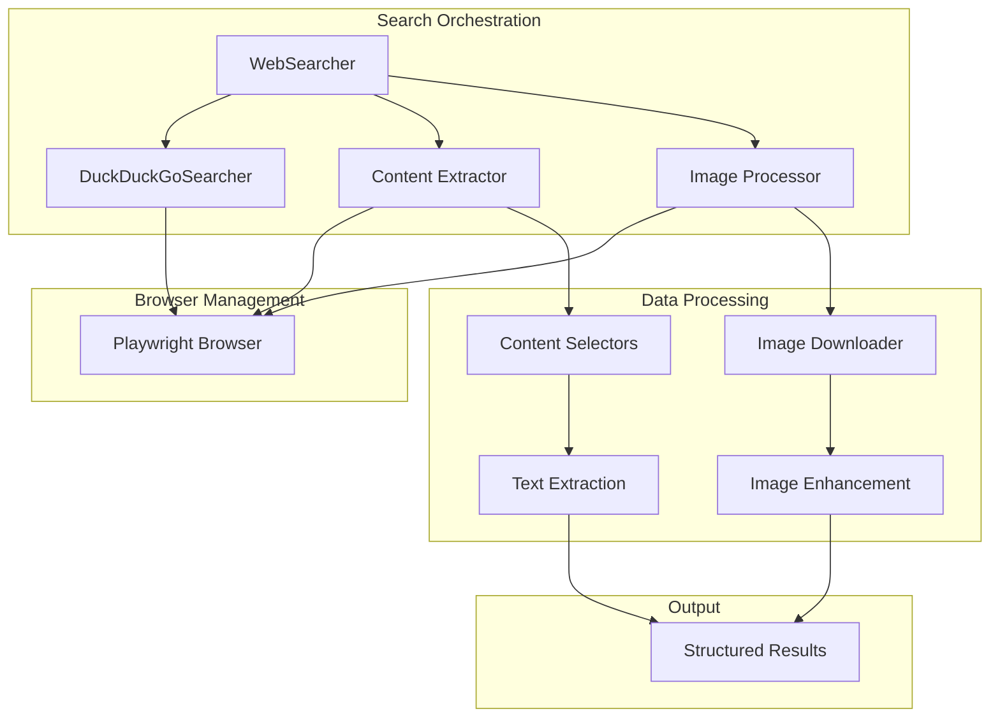

# Chapter 1 · Driving DuckDuckGo with Playwright

This chapter opens the "XunLong Internals" tutorial series. We unpack how the project performs web search today and why it orchestrates a full browser instead of using crawler APIs.

---

## 1. Why a Headless Browser?

XunLong's search stack is built around Playwright (see `src/tools/web_searcher.py`). The coordinator spins up a Chromium instance and automates DuckDuckGo, then reuses the same runtime to visit each result.

We take the browser-driven path for several compelling reasons:

### 1.1 Dynamic Content Everywhere
Modern websites heavily rely on JavaScript for content rendering. Many sources load text after the initial request or hide copy behind scripts. A headless browser waits for the network to become idle and scrolls the page, guaranteeing the DOM contains what the writer agents need.

**Technical Implementation:**
- Uses `wait_until="domcontentloaded"` for initial page load
- Implements a 1.5-second timeout for JavaScript execution
- Employs smart content selectors to extract meaningful text

### 1.2 Consistent Extraction & Screenshots
The HTML we gather is later converted to Markdown/HTML/PDF and sometimes needs screenshots. Driving the same Chromium instance for search and content extraction gives us predictable rendering and pixel-perfect captures.

**Key Benefits:**
- Unified User-Agent across all requests
- Consistent cookie and session state
- Reliable screenshot capabilities for visual content
- Proper handling of CSS-rendered content

### 1.3 Rate Limits & Coverage
API aggregators such as Firecrawl are fantastic, but they:
- Only expose a subset of the public web
- Add an extra vendor dependency with per-request quotas
- Often omit embedded media or paywalled previews that Playwright can see with human-like interaction
- May have different rate limiting policies

### 1.4 Anti-Detection & Reliability
By handling DuckDuckGo in-house we keep control of:
- **Throttling**: Custom delays between requests
- **Caching**: Local storage of search results
- **Fallback logic**: Multiple selector strategies
- **API-key agnostic**: No external dependencies
- **Anti-bot measures**: Realistic browser fingerprinting

---

## 2. How Search Works in XunLong

The search pipeline is a sophisticated chain of specialized modules that work together to deliver high-quality search results:

| Step | File | Responsibility | Key Features |
| ---- | ---- | -------------- | ------------ |
| **1. Task planning** | `src/agents/task_decomposer.py` | Breaks the user query into focused sub-tasks (possibly constrained by uploaded documents). | Query optimization, context awareness |
| **2. Browser orchestration** | `src/tools/web_searcher.py` | Starts Playwright, configures headless/headful mode, handles anti-bot tweaks. | Session management, proxy support |
| **3. DuckDuckGo automation** | `src/searcher/duckduckgo.py` | Submits the query, applies date filters, scrapes result cards, and optionally captures screenshots. | Multiple selector strategies, error recovery |
| **4. Full-page extraction** | `src/tools/web_searcher.py::_fetch_full_content_with_browser` | Visits each URL, waits for JS, collects main text, images, metadata. | Content prioritization, image extraction |
| **5. Ranking & deduplication** | `src/agents/deep_searcher.py` | Merges results, prioritises user-uploaded documents, removes duplicates, ranks by relevance/time. | Smart ranking algorithms |
| **6. Storage & reuse** | `src/storage/search_storage.py` | Persists intermediate JSON, human-readable summaries, and screenshots for iteration/export. | Caching, incremental updates |

### 2.1 Architecture Deep Dive



### 2.2 Session Consistency
Because the same Playwright session feeds all later stages, we guarantee:
- **Consistent user-agent headers** across all requests
- **Preserved cookie and session state** for authenticated content
- **Unified locale and language settings** for localized results
- **Shared browser cache** for improved performance

---

## 3. Code Implementation Deep Dive

### 3.1 WebSearcher Class Architecture

The `WebSearcher` class in `src/tools/web_searcher.py` is the main orchestrator for web search operations:

```python
class WebSearcher:
    """Web searcher with MCP integration and content extraction capabilities"""

    def __init__(
        self,
        prefer_mcp: bool = False,
        extract_content: bool = True,
        extract_images: bool = True,
        image_insert_mode: str = "smart"
    ):
        self.duckduckgo_searcher = DuckDuckGoSearcher()
        self.extract_content = extract_content
        self.extract_images = extract_images
        self.image_insert_mode = image_insert_mode
        
        if extract_images:
            self.image_downloader = ImageDownloader()
```

**Key Configuration Options:**
- `prefer_mcp`: Enable MCP (Model Context Protocol) integration
- `extract_content`: Whether to fetch full page content
- `extract_images`: Enable image extraction and processing
- `image_insert_mode`: How to integrate images ("smart", "top", "bottom", "distribute", "none")

### 3.2 DuckDuckGo Search Implementation

The `DuckDuckGoSearcher` class handles the actual search automation:

```python
async def search(
    self,
    page: Page,
    query: str,
    time_filter: Optional[str] = None,
    region: str = "cn-zh"
) -> List[SearchLink]:
    """
    Perform DuckDuckGo search with advanced filtering
    
    Args:
        page: Playwright page instance
        query: Search query string
        time_filter: Time filter ("day", "week", "month", "year")
        region: Search region (default: "cn-zh")
    """
    # Build search URL with parameters
    filter_map = {"day": "d", "week": "w", "month": "m", "year": "y"}
    mapped_filter = filter_map.get(time_filter.lower()) if time_filter else None
    
    params = f"?q={quote_plus(query)}&ia=web&kl={region}"
    if mapped_filter:
        params += f"&df={mapped_filter}"
    
    search_url = f"https://duckduckgo.com/{params}"
    
    # Navigate and wait for results
    await page.goto(search_url, wait_until="domcontentloaded")
    await asyncio.sleep(4)  # Allow dynamic content to load
```

### 3.3 Robust Content Extraction

The content extraction system uses multiple fallback strategies:

```python
async def _extract_content_from_page(self, page) -> str:
    """Extract main content using prioritized selectors"""
    content_selectors = [
        "article",           # Semantic article content
        "main",             # Main content area
        "[role='main']",    # ARIA main role
        ".content",         # Common content class
        ".article-content", # Article-specific content
        ".post-content",    # Blog post content
        "#content",         # Content ID
        ".main-content"     # Main content class
    ]
    
    content = ""
    # Try each selector and keep the longest content
    for selector in content_selectors:
        try:
            element = await page.query_selector(selector)
            if element:
                text = await element.inner_text()
                if len(text) > len(content):
                    content = text
        except:
            continue
    
    # Fallback to body text if no specific content found
    if not content:
        content = await page.evaluate("document.body.innerText")
    
    return content.strip()
```

### 3.4 Minimal Demo (`chapter1_playwright_duckduckgo.py`)

The tutorial includes a self-contained example at:

```
examples/tutorial/chapter1_playwright_duckduckgo.py
```

**Complete Example Code:**

```python
"""
Chapter 1 demo: minimal Playwright automation for DuckDuckGo.
"""
import asyncio
import sys
from typing import List
from playwright.async_api import async_playwright

async def search_duckduckgo(query: str, max_results: int = 5) -> List[dict]:
    """Perform a basic DuckDuckGo search"""
    async with async_playwright() as p:
        # Launch browser with realistic settings
        browser = await p.chromium.launch(
            headless=False,  # Set to True for production
            args=['--no-sandbox', '--disable-setuid-sandbox']
        )
        page = await browser.new_page()
        
        # Set realistic User-Agent
        await page.set_extra_http_headers({
            'User-Agent': 'Mozilla/5.0 (Windows NT 10.0; Win64; x64) AppleWebKit/537.36'
        })

        # Navigate to DuckDuckGo and perform search
        await page.goto("https://duckduckgo.com/", wait_until="domcontentloaded")
        await page.fill("input[name='q']", query)
        await page.keyboard.press("Enter")
        await page.wait_for_timeout(3000)  # Allow results to load

        # Extract search results
        results = []
        items = await page.locator("[data-testid='result']").all()
        
        for item in items[:max_results]:
            try:
                title = await item.locator("[data-testid='result-title-a']").inner_text()
                url = await item.locator("a[data-testid='result-title-a']").get_attribute("href")
                snippet_loc = item.locator("[data-testid='result-snippet']")
                snippet = await snippet_loc.inner_text() if await snippet_loc.count() else ""
                
                results.append({
                    "title": title.strip(),
                    "url": url,
                    "snippet": snippet.strip()
                })
            except Exception as e:
                print(f"Error extracting result: {e}")
                continue

        await browser.close()
        return results

async def main():
    if len(sys.argv) < 2:
        print("Usage: python chapter1_playwright_duckduckgo.py \"your query\"")
        sys.exit(1)

    query = sys.argv[1]
    print(f"Searching DuckDuckGo for: {query}\n")
    results = await search_duckduckgo(query)

    for idx, result in enumerate(results, start=1):
        print(f"{idx}. {result['title']}")
        print(f"   {result['url']}")
        if result['snippet']:
            print(f"   {result['snippet']}")
        print()

if __name__ == "__main__":
    asyncio.run(main())
```

### Prerequisites

```bash
# Install dependencies
pip install playwright

# Install browser binaries
playwright install chromium

# Optional: Install additional browsers
playwright install firefox webkit
```

### Run the demo

```bash
# Basic usage
python examples/tutorial/chapter1_playwright_duckduckgo.py "AI industry trends"

# With different queries
python examples/tutorial/chapter1_playwright_duckduckgo.py "machine learning 2024"
python examples/tutorial/chapter1_playwright_duckduckgo.py "web scraping best practices"
```

You should see the top results printed to the console with titles, URLs, and snippets.

---

## 4. Configuration & Advanced Features

### 4.1 Environment Variables

XunLong supports various environment variables for configuring search behavior:

```bash
# Browser configuration
export BROWSER_HEADLESS=true          # true=headless, false=show browser
export BROWSER_TIMEOUT=30000          # Page timeout in milliseconds

# Search configuration  
export DEEPSEARCH_TOPK=5              # Default number of results to fetch
export DEEPSEARCH_SEARCH_ENGINE=duckduckgo  # Search engine selection
export DEEPSEARCH_SHOTS_DIR=./shots   # Screenshot save directory

# Performance tuning
export SEARCH_CONCURRENT_LIMIT=3      # Max concurrent page extractions
export SEARCH_RETRY_ATTEMPTS=3        # Number of retry attempts
export SEARCH_DELAY_MS=1500           # Delay between requests
```

### 4.2 Advanced WebSearcher Usage

```python
from src.tools.web_searcher import WebSearcher

# Initialize with custom configuration
searcher = WebSearcher(
    extract_content=True,
    extract_images=True,
    image_insert_mode="smart"  # "smart", "top", "bottom", "distribute", "none"
)

# Perform search with advanced options
results = await searcher.search(
    query="artificial intelligence trends 2024",
    max_results=10,
    region="us-en",              # Region-specific results
    time_filter="month",         # "day", "week", "month", "year"
    fetch_full_content=True      # Extract full page content
)

# Results structure
for result in results:
    print(f"Title: {result['title']}")
    print(f"URL: {result['url']}")
    print(f"Snippet: {result['snippet']}")
    print(f"Full Content: {result.get('full_content', 'N/A')}")
    print(f"Images: {len(result.get('images', []))}")
    print(f"Has Full Content: {result.get('has_full_content', False)}")
    print("---")
```

### 4.3 Error Handling & Debugging

#### Common Issues and Solutions

**1. Selector Not Found**
```python
# The system uses multiple fallback selectors
possible_selectors = [
    '[data-testid="result"]',
    'article[data-testid="result"]', 
    '.result',
    '.web-result',
    '[data-layout="organic"]',
    'article',
    '.result__body',
    'div[data-domain]',
    'h3 a[href]'
]
```

**2. Timeout Issues**
```python
# Configure timeouts appropriately
page.set_default_timeout(30000)  # 30 seconds
await page.goto(url, wait_until="domcontentloaded")
await page.wait_for_timeout(1500)  # Allow JS to execute
```

**3. Anti-Bot Detection**
```python
# Use realistic browser settings
browser = await p.chromium.launch(
    headless=True,
    args=[
        '--no-sandbox',
        '--disable-setuid-sandbox',
        '--disable-dev-shm-usage',
        '--disable-blink-features=AutomationControlled'
    ]
)

# Set realistic headers
await page.set_extra_http_headers({
    'User-Agent': 'Mozilla/5.0 (Windows NT 10.0; Win64; x64) AppleWebKit/537.36 '
                 '(KHTML, like Gecko) Chrome/91.0.4472.124 Safari/537.36'
})
```

#### Debug Mode

Enable debug logging for troubleshooting:

```python
import logging
from loguru import logger

# Enable debug logging
logger.add("debug.log", level="DEBUG")

# The system will log:
# - Search URL construction
# - Selector attempts and results
# - Content extraction details
# - Error messages with context
```

### 4.4 Performance Optimization

#### Concurrent Processing

The system processes multiple URLs concurrently for better performance:

```python
async def _fetch_full_content_with_browser(self, search_results):
    """Process multiple URLs concurrently"""
    tasks = [
        self._fetch_single_url(browser, i, result, len(search_results))
        for i, result in enumerate(search_results)
    ]
    
    # Process with error handling
    enriched_results = await asyncio.gather(*tasks, return_exceptions=True)
```

#### Caching Strategy

- **Search results**: Cached locally to avoid repeated searches
- **Page content**: Stored with timestamps for freshness checks
- **Images**: Downloaded once and reused across sessions

#### Memory Management

```python
# Proper resource cleanup
try:
    page = await browser.new_page()
    # ... perform operations
finally:
    await page.close()  # Always close pages
    await browser.close()  # Always close browser
```

### 4.5 Integration with XunLong Components

#### Storage Integration

```python
from src.storage.search_storage import SearchStorage

storage = SearchStorage()

# Store search results
await storage.save_search_results(
    query="AI trends",
    results=search_results,
    metadata={
        "timestamp": datetime.now(),
        "region": "us-en",
        "total_results": len(search_results)
    }
)

# Retrieve cached results
cached_results = await storage.get_cached_results("AI trends")
```

#### Agent Integration

```python
from src.agents.deep_searcher import DeepSearcher

# Initialize deep searcher with web searcher
deep_searcher = DeepSearcher(web_searcher=searcher)

# Perform enhanced search with ranking
enhanced_results = await deep_searcher.search(
    query="machine learning applications",
    uploaded_documents=user_docs,  # Context from uploaded files
    max_results=15
)
```

## 5. Troubleshooting Guide

### 5.1 Common Error Messages

| Error | Cause | Solution |
|-------|-------|----------|
| `TimeoutError: Timeout 30000ms exceeded` | Page loading too slow | Increase timeout or check network |
| `Error: No results found` | Selectors changed or blocked | Update selectors or check anti-bot measures |
| `playwright._impl._api_types.Error: Browser closed` | Browser crashed | Add error recovery and restart logic |
| `ConnectionError: Connection refused` | Network issues | Implement retry logic with exponential backoff |

### 5.2 Performance Issues

**Slow Search Performance:**
1. Reduce `max_results` parameter
2. Disable image extraction if not needed
3. Use headless mode (`BROWSER_HEADLESS=true`)
4. Implement result caching

**High Memory Usage:**
1. Ensure proper page/browser cleanup
2. Limit concurrent extractions
3. Process results in batches
4. Clear browser cache periodically

### 5.3 Debugging Steps

1. **Enable verbose logging**:
   ```bash
   export LOG_LEVEL=DEBUG
   python your_script.py
   ```

2. **Run in headful mode** to observe browser behavior:
   ```bash
   export BROWSER_HEADLESS=false
   python your_script.py
   ```

3. **Check selector validity** in browser DevTools:
   - Open DuckDuckGo manually
   - Inspect result elements
   - Test selectors in console

4. **Monitor network requests**:
   ```python
   page.on("request", lambda request: print(f"Request: {request.url}"))
   page.on("response", lambda response: print(f"Response: {response.status}"))
   ```

## 6. Best Practices

### 6.1 Production Deployment

- Always use headless mode in production
- Implement proper error handling and retries
- Set reasonable timeouts and rate limits
- Monitor resource usage and performance
- Use proxy rotation for large-scale scraping

### 6.2 Ethical Considerations

- Respect robots.txt files
- Implement reasonable delays between requests
- Don't overload target servers
- Cache results to minimize repeated requests
- Consider using official APIs when available

---

## 7. What's Next?

Chapter 2 will dive deeper into:
- Advanced content extraction techniques
- Handling lazy-loaded content and SPAs
- Image processing and enhancement
- Integration with XunLong's storage layer
- Building custom extractors for specific sites

Stay tuned for more advanced web scraping techniques!

