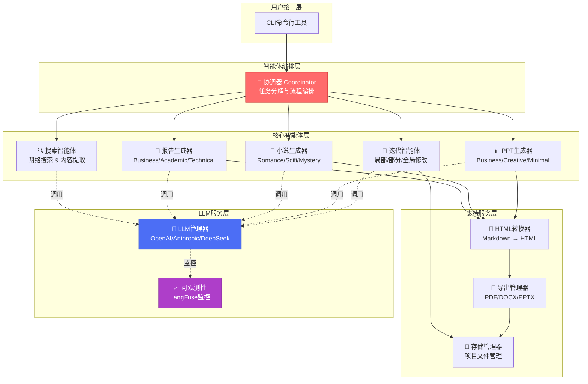

# 系统架构

XunLong采用精心设计的多智能体架构，通过LangGraph编排实现高质量的内容生成。

## 架构总览

## 分层详解

### 1. 用户接口层

**CLI工具** - 命令行界面提供：
- 简洁直观的命令
- 实时进度显示
- 详细日志模式
- 错误处理与恢复

### 2. 智能体编排层

**协调器** - 主控编排器，负责：
- 分析用户需求
- 将复杂任务分解为子任务
- 管理智能体状态和工作流
- 协调并行执行
- 汇总结果

### 3. 核心智能体层

多个专业智能体并行工作：

- **搜索智能体** - 执行网络搜索、提取内容、评估相关性
- **报告生成器** - 创建结构化研究报告，包含引用
- **小说生成器** - 创作具有一致人物和情节的故事
- **PPT生成器** - 设计专业演示文稿，包含布局和配色
- **迭代智能体** - 处理内容优化请求

### 4. 支持服务层

内容处理的支撑服务：

- **HTML转换器** - 将Markdown转换为样式化HTML
- **导出管理器** - 生成PDF、DOCX、PPTX文件
- **存储管理器** - 管理项目文件和版本

### 5. LLM服务层

驱动所有智能的基础层：

- **LLM管理器** - 管理多个LLM提供商，处理API调用
- **可观测性** - 通过LangFuse追踪所有LLM交互

## 核心设计原则

### 关注点分离

每个智能体都有单一明确的职责：
- 搜索智能体只负责搜索
- 生成智能体只负责生成
- 导出管理器只负责导出

这种模块化使系统：
- **可维护** - 易于更新单个组件
- **可测试** - 每个智能体可以独立测试
- **可扩展** - 新智能体可以无缝添加

### 状态机工作流

基于LangGraph的状态机范式：
- **确定性** - 可预测的执行流程
- **可恢复** - 可以从故障中恢复
- **可观测** - 每个状态转换都被追踪

### 并行执行

XunLong通过并行化最大化吞吐量：
- 多个搜索查询同时执行
- 独立内容章节并行生成
- 导出操作不阻塞生成

## 技术栈

| 层级 | 技术 |
|-----|------|
| 工作流编排 | LangGraph |
| LLM集成 | LangChain |
| LLM提供商 | OpenAI, Anthropic, DeepSeek |
| 网页自动化 | Playwright |
| PDF生成 | WeasyPrint |
| Office导出 | python-pptx, python-docx |
| 可观测性 | LangFuse |

## 下一步

- 深入了解[多智能体系统](/zh/guide/multi-agent)
- 理解[工作流程](/zh/guide/workflow)
- 探索[LLM集成](/zh/guide/llm-integration)
