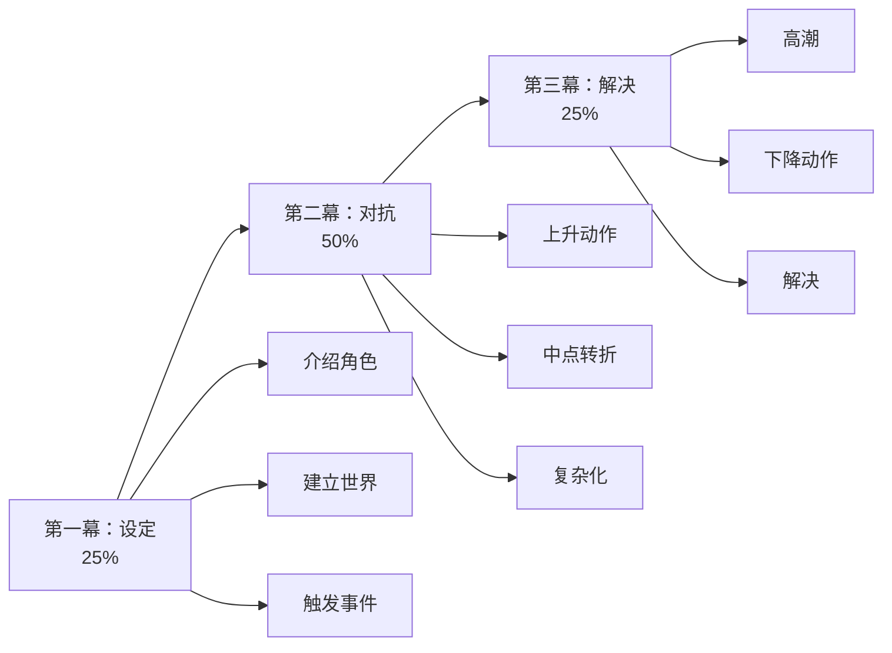

# 小说创作

XunLong的小说生成器可以创作引人入胜、情节连贯的故事，塑造深刻的人物和引人注目的情节。

## 概览

小说创作功能：
- 📖 生成完整的小说或短篇故事
- 🎭 创造有深度的难忘角色
- 🎬 发展引人入胜的情节结构
- ✍️ 保持一致的叙事声音
- 📚 支持多种体裁

## 快速开始

```bash
python xunlong.py fiction "一个设定在维多利亚时代伦敦的推理小说" \
  --chapters 20 \
  --style mystery
```

### 利用现有素材

可通过 `--input-file` 传入世界观设定、人物小传或章节草稿（支持 `.txt` / `.pdf` / `.docx`），系统会先解析文档，再在此基础上生成故事。

> 提示：暂不支持图片附件。

```bash
python xunlong.py fiction "星际探险史诗" \
  --style scifi \
  --input-file ./docs/worldbuilding_brief.pdf
```

## 小说体裁

### 言情 💕

**特点：**
- 情感角色发展
- 以关系为中心的情节
- 幸福或充满希望的结局
- 强调内心冲突
- 对话丰富

**示例：**
```bash
python xunlong.py fiction "童年好友的第二次恋爱机会" \
  --style romance \
  --chapters 15
```

### 科幻 🚀

**特点：**
- 技术/科学概念
- 强调世界观构建
- 未来或替代设定
- 推测性元素
- 引人深思的主题

**示例：**
```bash
python xunlong.py fiction "与外星文明的第一次接触" \
  --style scifi \
  --chapters 25 \
  --world-building detailed
```

### 推理 🔍

**特点：**
- 以谜题为中心的情节
- 线索布置
- 误导线索
- 悬念构建
- 令人满意的解决方案

**示例：**
```bash
python xunlong.py fiction "侦探解决密室谋杀案" \
  --style mystery \
  --chapters 18
```

### 奇幻 ⚔️

**特点：**
- 魔法系统
- 世界观构建
- 探索叙事
- 善恶主题
- 丰富的描述

**示例：**
```bash
python xunlong.py fiction "年轻法师发现古老预言" \
  --style fantasy \
  --chapters 30 \
  --magic-system detailed
```

### 惊悚 💀

**特点：**
- 高风险紧张感
- 快节奏
- 动作场景
- 时间压力
- 转折和惊喜

**示例：**
```bash
python xunlong.py fiction "特工竞速阻止恐怖袭击" \
  --style thriller \
  --chapters 20 \
  --pacing fast
```

## 故事结构

### 三幕结构（默认）



**示例：**
```bash
python xunlong.py fiction "英雄之旅" \
  --structure three-act \
  --chapters 21  # 7-7-7分割
```

### 英雄之旅

**12个阶段：**
1. 普通世界
2. 冒险召唤
3. 拒绝召唤
4. 遇见导师
5. 跨越门槛
6. 考验、盟友、敌人
7. 接近最深洞穴
8. 磨难
9. 奖赏
10. 回归之路
11. 复活
12. 带着灵药归来

**示例：**
```bash
python xunlong.py fiction "农场男孩成为传奇战士" \
  --structure heros-journey \
  --chapters 24
```

## 角色发展

### 深度级别

**基础：**
- 姓名和角色
- 外貌描述
- 主要动机

**标准（默认）：**
- 详细背景
- 性格特征
- 目标和恐惧
- 角色弧线
- 关系

**全面：**
- 心理档案
- 背景故事事件
- 内心冲突
- 成长轨迹
- 复杂动机

**示例：**
```bash
python xunlong.py fiction "团队抢劫故事" \
  --characters 6 \
  --character-depth comprehensive
```

## 高级功能

### 章节长度控制

```bash
# 短章节（每章约1500字）
python xunlong.py fiction "快节奏惊悚片" \
  --chapters 30 \
  --chapter-length short

# 中等章节（每章约3000字）
python xunlong.py fiction "推理小说" \
  --chapters 20 \
  --chapter-length medium

# 长章节（每章约5000字）
python xunlong.py fiction "史诗奇幻" \
  --chapters 15 \
  --chapter-length long
```

### 视角

```bash
# 第一人称
python xunlong.py fiction "侦探黑色电影" \
  --pov first-person

# 第三人称限制
python xunlong.py fiction "奇幻冒险" \
  --pov third-limited

# 第三人称全知
python xunlong.py fiction "家族传奇" \
  --pov third-omniscient

# 多重视角
python xunlong.py fiction "多主角史诗" \
  --pov multiple \
  --pov-characters "Alice,Bob,Carol"
```

### 语调和风格

```bash
# 黑暗和残酷
python xunlong.py fiction "赛博朋克惊悚片" \
  --tone dark \
  --style gritty

# 轻松和幽默
python xunlong.py fiction "浪漫喜剧" \
  --tone light \
  --style humorous

# 严肃和文学
python xunlong.py fiction "历史剧" \
  --tone serious \
  --style literary
```

### 世界观构建

对于奇幻和科幻：

```bash
python xunlong.py fiction "太空歌剧史诗" \
  --style scifi \
  --world-building comprehensive \
  --world-elements "technology,politics,culture,history"
```

**世界观构建包括：**
- 地理/场景
- 社会结构
- 技术/魔法系统
- 历史和传说
- 文化细节

## 一致性功能

### 角色追踪

XunLong在各章节保持一致性：
- 外貌描述
- 性格特征
- 说话方式
- 关系
- 角色知识

### 时间线管理

自动时间线跟踪防止：
- 时间顺序错误
- 角色年龄不一致
- 季节不匹配
- 事件矛盾

### 名称一致性

所有角色和地名在整个故事中保持一致。

## 章节生成

### 顺序生成

```bash
python xunlong.py fiction "推理小说" \
  --chapters 20 \
  --mode sequential
```

章节逐个生成，每一章都基于前面的上下文。

### 大纲优先生成

```bash
python xunlong.py fiction "奇幻史诗" \
  --chapters 25 \
  --mode outline-first
```

**流程：**
1. 生成完整故事大纲
2. 创建角色档案
3. 基于大纲撰写章节
4. 确保一致性

## 输出格式

### 手稿格式

```bash
python xunlong.py fiction "小说" \
  --format manuscript \
  --font-family "Courier New" \
  --font-size 12 \
  --line-spacing double
```

专业手稿格式：
- 双倍行距
- Courier或Times New Roman字体
- 1英寸边距
- 页码
- 章节标题

### 电子书格式

```bash
python xunlong.py fiction "小说" \
  --format epub
```

**功能：**
- EPUB3标准
- 目录
- 章节导航
- 元数据（作者、标题等）

### 可打印PDF

```bash
python xunlong.py fiction "小说" \
  --format print-pdf \
  --trim-size "6x9"
```

## 示例工作流

### 1. 生成故事大纲

```bash
python xunlong.py fiction-outline "赛博朋克东京的侦探" \
  --style mystery \
  --chapters 22 \
  --characters 5
```

### 2. 审查和修改大纲

```bash
cat storage/<project-id>/outline.json
```

如需要，编辑后：

```bash
python xunlong.py fiction-from-outline <project-id>
```

### 3. 生成章节

```bash
python xunlong.py fiction "赛博朋克东京的侦探" \
  --style mystery \
  --chapters 22 \
  --character-depth comprehensive
```

### 4. 审查和迭代

```bash
# 阅读特定章节
cat storage/<project-id>/chapters/chapter_05.md

# 请求修订
python xunlong.py iterate <project-id> \
  "让第5章的转折更令人惊讶"
```

### 5. 导出最终版本

```bash
python xunlong.py export <project-id> \
  --format epub,manuscript,pdf
```

## 质量保证

### 连贯性检查

XunLong自动检查：
- 情节漏洞检测
- 角色一致性
- 时间线准确性
- 伏笔回收
- 节奏平衡

### 可读性分析

- **对话比例**：平衡对话/叙述
- **句子多样性**：变化的句子结构
- **段落长度**：适当的分段
- **阅读水平**：适龄复杂度

### 体裁合规性

确保故事包含预期的体裁元素：
- 推理：线索、误导、解决方案
- 言情：关系弧线、情感节拍
- 惊悚：紧张感、风险、节奏
- 奇幻：世界观构建、魔法系统

## 最佳实践

### 📝 撰写有效提示

**好的：**
- "患有创伤后应激障碍的侦探调查小镇连环谋杀案"
- "竞争米其林星级的对手厨师之间的敌人变情人的爱情故事"
- "时间旅行历史学家意外改变历史关键时刻"

**效果较差：**
- "写个故事"（没有方向）
- "有趣的东西"（太模糊）
- "写得好点"（没有具体要求）

### 🎯 选择章节数

| 故事长度 | 章节数 | 字数 | 阅读时间 |
|---------|-------|------|---------|
| 短篇故事 | 1 | 3,000-7,000 | 30-60分钟 |
| 中篇小说 | 5-10 | 20,000-50,000 | 2-4小时 |
| 长篇小说 | 15-30 | 60,000-100,000 | 6-10小时 |
| 史诗 | 40+ | 150,000+ | 15+小时 |

### ⚡ 管理生成时间

**快速（约30分钟）：**
```bash
python xunlong.py fiction "故事" \
  --chapters 5 \
  --character-depth basic \
  --model gpt-4o-mini
```

**平衡（约2小时）：**
```bash
python xunlong.py fiction "故事" \
  --chapters 20 \
  --character-depth standard \
  --model gpt-4o-mini
```

**高质量（约6小时）：**
```bash
python xunlong.py fiction "故事" \
  --chapters 30 \
  --character-depth comprehensive \
  --world-building detailed \
  --model gpt-4o
```

## 故障排除

### 问题：角色感觉不一致

**解决方案：**
```bash
# 增加角色深度
--character-depth comprehensive

# 使用大纲优先模式
--mode outline-first

# 生成前审查角色档案
python xunlong.py fiction-outline "故事"
```

### 问题：情节缺乏连贯性

**解决方案：**
- 使用结构化方法：`--structure three-act`
- 先生成大纲
- 减少章节数以获得更紧凑的情节

### 问题：节奏问题

**解决方案：**
```bash
# 更快节奏
--pacing fast --chapter-length short

# 更慢、更详细
--pacing slow --chapter-length long
```

### 问题：生成中断

**解决方案：**
```bash
# 从上次检查点恢复
python xunlong.py resume <project-id>

# 从特定章节继续
python xunlong.py fiction-continue <project-id> --from-chapter 12
```

## API参考

```bash
python xunlong.py fiction <premise> [options]
```

| 参数 | 类型 | 默认值 | 描述 |
|-----|------|--------|------|
| `<premise>` | str | 必需 | 故事概念/前提 |
| `--style` | str | `general` | 体裁（romance/scifi/mystery/fantasy/thriller） |
| `--chapters` | int | `20` | 章节数 |
| `--character-depth` | str | `standard` | 角色细节级别 |
| `--characters` | int | `auto` | 主要角色数 |
| `--structure` | str | `three-act` | 情节结构 |
| `--pov` | str | `third-limited` | 视角 |
| `--tone` | str | `neutral` | 故事语调 |
| `--pacing` | str | `medium` | 故事节奏 |
| `--chapter-length` | str | `medium` | 目标章节长度 |
| `--world-building` | str | `standard` | 世界观构建细节 |
| `--mode` | str | `sequential` | 生成模式 |
| `--format` | str | `md` | 输出格式 |

## 示例

### 推理小说

```bash
python xunlong.py fiction \
  "退休侦探被拉入调查著名作家失踪案" \
  --style mystery \
  --chapters 22 \
  --character-depth comprehensive \
  --structure three-act \
  --format manuscript,epub
```

### 言情中篇

```bash
python xunlong.py fiction \
  "婚礼策划师爱上新郎的伴郎" \
  --style romance \
  --chapters 12 \
  --pov first-person \
  --tone light \
  --format epub
```

### 史诗奇幻

```bash
python xunlong.py fiction \
  "孤儿发现自己是魔法王位继承人" \
  --style fantasy \
  --chapters 35 \
  --characters 8 \
  --world-building comprehensive \
  --structure heros-journey \
  --format epub,print-pdf
```

### 科幻惊悚

```bash
python xunlong.py fiction \
  "AI获得意识并质疑其目的" \
  --style scifi \
  --chapters 18 \
  --tone dark \
  --pacing fast \
  --pov multiple \
  --format epub
```

## 下一步

- 了解[报告生成](/zh/guide/features/report)
- 探索[PPT制作](/zh/guide/features/ppt)
- 理解[内容迭代](/zh/guide/features/iteration)
- 查看[导出格式](/zh/guide/features/export)
