# PPT制作

XunLong可以根据您的主题或内容自动生成专业的PowerPoint演示文稿。

## 概览

PPT制作功能：
- 🎨 设计专业幻灯片布局
- 📊 创建数据可视化
- ✍️ 撰写简洁的幻灯片内容
- 🎭 应用一致的主题
- 📤 导出为PPTX格式

## 快速开始

```bash
python xunlong.py ppt "产品发布策略" --slides 15
```

XunLong将创建一个完整、可供演示的演示文稿。

## 演示风格

### 商务专业 💼

**最适合：** 企业演示、投资者推介、董事会议

**特点：**
- 简洁、极简设计
- 专业配色方案
- 数据驱动的幻灯片
- 保守布局
- 企业友好

**示例：**
```bash
python xunlong.py ppt "第四季度销售业绩回顾" \
  --style business \
  --slides 20 \
  --theme corporate
```

**典型幻灯片类型：**
- 标题幻灯片
- 议程
- 执行摘要
- 数据图表
- 关键指标
- 建议
- 下一步行动

### 创意 🎨

**最适合：** 营销推介、创意演示、设计展示

**特点：**
- 大胆的颜色
- 视觉强调
- 图像丰富的幻灯片
- 现代字体
- 动态布局

**示例：**
```bash
python xunlong.py ppt "新品牌形象提案" \
  --style creative \
  --slides 18 \
  --theme vibrant
```

**典型幻灯片类型：**
- 视觉标题
- 情绪板
- 前后对比
- 作品集样本
- 概念揭示
- 品牌指南

### 极简 ⚪

**最适合：** 技术演讲、学术演示、专注内容

**特点：**
- 大量留白
- 简单字体
- 最少图形
- 专注内容
- 简洁美学

**示例：**
```bash
python xunlong.py ppt "机器学习入门" \
  --style minimal \
  --slides 25 \
  --theme clean
```

**典型幻灯片类型：**
- 文本幻灯片
- 简单图表
- 代码片段
- 关键引用
- 总结要点

### 教育 📚

**最适合：** 培训、研讨会、教程、讲座

**特点：**
- 清晰层次结构
- 分步布局
- 学习目标
- 总结幻灯片
- 练习题

**示例：**
```bash
python xunlong.py ppt "Python编程基础" \
  --style educational \
  --slides 30 \
  --include-exercises
```

## 幻灯片结构

### 标准结构

```mermaid
graph LR
    A[开场<br/>10%] --> B[介绍<br/>15%]
    B --> C[主要内容<br/>60%]
    C --> D[结论<br/>10%]
    D --> E[结束<br/>5%]

    A --> A1[标题幻灯片]
    A --> A2[议程]

    B --> B1[背景]
    B --> B2[目标]

    C --> C1[关键点]
    C --> C2[数据/证据]
    C --> C3[示例]

    D --> D1[总结]
    D --> D2[建议]

    E --> E1[行动号召]
    E --> E2[问答/联系方式]
```



### 自定义结构

定义您自己的幻灯片序列：

```bash
python xunlong.py ppt "2025营销计划" \
  --structure "标题,议程,形势分析,目标受众,策略,战术,预算,时间表,指标,问答"
```

## 高级功能

### 数据集成

包含图表和图形：

```bash
python xunlong.py ppt "第三季度销售业绩" \
  --data sales_data.csv \
  --charts "line,bar,pie"
```

**支持的图表类型：**
- 折线图（趋势）
- 柱状图（比较）
- 饼图（比例）
- 散点图（相关性）
- 面积图（累积）

### 演讲备注

生成详细的演讲备注：

```bash
python xunlong.py ppt "产品演示" \
  --slides 12 \
  --speaker-notes detailed
```

**演讲备注包括：**
- 关键谈话要点
- 时间建议
- 过渡提示
- 附加细节
- 潜在问题

### 图像建议

为每张幻灯片获取AI建议的图像：

```bash
python xunlong.py ppt "旅游目的地营销" \
  --slides 15 \
  --suggest-images \
  --image-style photography
```

**图像风格：**
- 摄影
- 插图
- 图标
- 抽象
- 数据可视化

### 动画和过渡

```bash
python xunlong.py ppt "产品发布" \
  --animations subtle \
  --transitions fade
```

**动画级别：**
- `none` - 无动画
- `subtle` - 温和的入场效果
- `moderate` - 标准过渡
- `dynamic` - 大胆的动作

## 主题和颜色

### 内置主题

```bash
# 专业蓝色
python xunlong.py ppt "主题" --theme corporate-blue

# 现代渐变
python xunlong.py ppt "主题" --theme modern-gradient

# 极简单色
python xunlong.py ppt "主题" --theme minimal-mono

# 鲜艳创意
python xunlong.py ppt "主题" --theme vibrant-creative

# 自然灵感
python xunlong.py ppt "主题" --theme nature-green
```

### 自定义颜色

```bash
python xunlong.py ppt "品牌演示" \
  --primary-color "#2E86AB" \
  --secondary-color "#A23B72" \
  --accent-color "#F18F01"
```

### 字体选择

```bash
python xunlong.py ppt "技术会议演讲" \
  --heading-font "Montserrat" \
  --body-font "Open Sans"
```

## 内容来源

### 从头开始

```bash
python xunlong.py ppt "气候变化解决方案" \
  --slides 18 \
  --research true
```

XunLong自动研究和生成内容。

### 从现有报告

```bash
python xunlong.py ppt-from-report <report-project-id> \
  --slides 15
```

将您的XunLong报告转换为演示文稿。

### 从Markdown

```bash
python xunlong.py ppt-from-markdown content.md \
  --style business
```

### 从大纲

```bash
python xunlong.py ppt-from-outline outline.txt \
  --slides 20 \
  --expand-content
```

## 示例工作流

### 1. 生成演示文稿

```bash
python xunlong.py ppt "数字化转型战略" \
  --style business \
  --slides 18 \
  --theme corporate-blue \
  --speaker-notes detailed
```

**输出：**
```
✅ 演示文稿已生成！

📊 统计信息：
   - 时长：5分23秒
   - 幻灯片：18张
   - 演讲备注：是
   - 图表：4个

📁 文件：
   - storage/20251005_143022_digital_transformation/presentation.pptx

🔗 项目ID：20251005_143022
```

### 2. 审查演示文稿

在PowerPoint、Keynote或Google Slides中打开。

### 3. 请求修改

```bash
python xunlong.py iterate 20251005_143022 \
  "添加关于实施时间表的幻灯片并扩展预算部分"
```

### 4. 重新生成特定幻灯片

```bash
python xunlong.py ppt-regenerate 20251005_143022 \
  --slides 5,6,7 \
  --reason "需要更详细的数据"
```

## 演示长度

| 时长 | 幻灯片数 | 最适合 |
|-----|---------|--------|
| 5分钟 | 5-7 | 快速推介、电梯推介 |
| 10分钟 | 10-12 | 产品演示、简要更新 |
| 15分钟 | 12-15 | 团队演示、提案 |
| 20分钟 | 15-18 | 会议演讲、培训 |
| 30分钟 | 20-25 | 研讨会、详细演示 |
| 45分钟 | 30-35 | 讲座、全面培训 |
| 60分钟 | 40-50 | 完整课程模块、主题演讲 |

**经验法则：** 每张幻灯片约1-2分钟

## 最佳实践

### 📝 内容指南

**应该：**
- 每张幻灯片一个主要观点
- 使用要点（最多3-5个）
- 包含视觉效果
- 保持文本简洁
- 使用一致的格式

**不应该：**
- 幻灯片过于拥挤
- 使用完整句子
- 混用太多字体
- 过度使用动画
- 包含不必要的信息

### 🎨 设计原则

**对比：**
```bash
--theme high-contrast  # 更好的可读性
```

**层次结构：**
- 大标题
- 中等副标题
- 小正文

**对齐：**
- 一致的边距
- 基于网格的布局
- 视觉平衡

**留白：**
```bash
--style minimal  # 强调留白
```

### ⚡ 性能提示

**快速生成（约3分钟）：**
```bash
python xunlong.py ppt "主题" \
  --slides 10 \
  --style minimal \
  --no-research
```

**平衡（约7分钟）：**
```bash
python xunlong.py ppt "主题" \
  --slides 18 \
  --style business \
  --research true
```

**高质量（约15分钟）：**
```bash
python xunlong.py ppt "主题" \
  --slides 30 \
  --style business \
  --speaker-notes detailed \
  --suggest-images \
  --research comprehensive
```

## 故障排除

### 问题：幻灯片文字过多

**解决方案：**
```bash
--content-density low
--max-bullets 3
--use-visuals true
```

### 问题：设计不一致

**解决方案：**
- 使用单一主题：`--theme corporate-blue`
- 避免混合风格
- 使用`--strict-theme`重新生成

### 问题：缺少演讲备注

**解决方案：**
```bash
# 单独生成备注
python xunlong.py ppt-add-notes <project-id> \
  --detail-level comprehensive
```

### 问题：图表未显示

**解决方案：**
- 验证数据文件格式
- 检查图表类型兼容性
- 重新生成图表：`--regenerate-charts`

## API参考

```bash
python xunlong.py ppt <topic> [options]
```

| 参数 | 类型 | 默认值 | 描述 |
|-----|------|--------|------|
| `<topic>` | str | 必需 | 演示主题 |
| `--slides` | int | `15` | 幻灯片数量 |
| `--style` | str | `business` | 演示风格 |
| `--theme` | str | `corporate-blue` | 视觉主题 |
| `--structure` | str | `standard` | 幻灯片结构 |
| `--speaker-notes` | str | `basic` | 演讲备注详细程度 |
| `--animations` | str | `subtle` | 动画级别 |
| `--research` | bool | `true` | 研究内容 |
| `--suggest-images` | bool | `false` | 建议图像 |
| `--data` | str | None | 图表数据文件 |
| `--charts` | str | None | 包含的图表类型 |
| `--content-density` | str | `medium` | 每张幻灯片的文字密度 |

## 示例

### 投资者推介

```bash
python xunlong.py ppt "创业种子轮推介" \
  --style business \
  --slides 12 \
  --structure "问题,解决方案,市场,产品,牵引力,团队,财务,要求" \
  --theme corporate-blue \
  --speaker-notes detailed
```

### 会议演讲

```bash
python xunlong.py ppt "构建可扩展的微服务" \
  --style minimal \
  --slides 25 \
  --theme clean \
  --animations subtle \
  --suggest-images
```

### 培训研讨会

```bash
python xunlong.py ppt "Excel高级技巧" \
  --style educational \
  --slides 40 \
  --include-exercises \
  --speaker-notes comprehensive
```

### 营销演示

```bash
python xunlong.py ppt "新产品发布活动" \
  --style creative \
  --slides 20 \
  --theme vibrant-creative \
  --suggest-images \
  --animations dynamic
```

### 将报告转换为PPT

```bash
python xunlong.py ppt-from-report <report-project-id> \
  --slides 18 \
  --style business \
  --highlight-key-findings
```

## 下一步

- 了解[报告生成](/zh/guide/features/report)
- 探索[小说创作](/zh/guide/features/fiction)
- 理解[内容迭代](/zh/guide/features/iteration)
- 查看[导出格式](/zh/guide/features/export)
