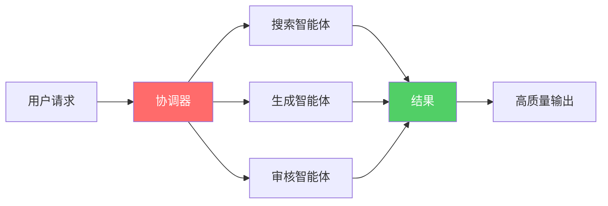
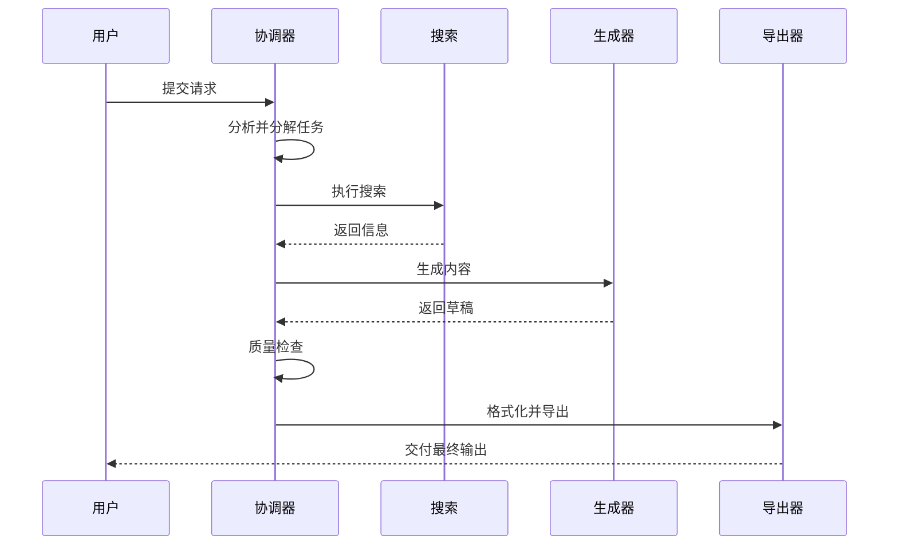

# 什么是XunLong？

**XunLong**（寻龙）是一个AI驱动的多模态内容生成系统，能够自动创建研究报告、创意小说和专业演示文稿。

## 愿景

在当今信息时代，内容创作既至关重要又耗费时间。无论你是汇总研究成果的研究员、创作故事的作家，还是准备演示的专业人士，这个过程通常包括：

- 🔍 **数小时的研究** - 搜索、阅读和提取相关信息
- ✍️ **手动写作** - 组织思路并撰写连贯的叙述
- 🎨 **格式排版** - 设计布局并确保视觉吸引力
- 🔄 **反复修改** - 修订和完善直到满意

**XunLong自动化了整个工作流程**，让你能够在几分钟而不是几小时内生成专业品质的内容。

## XunLong的独特之处

### 1. 多模态生成

与单一用途的AI工具不同，XunLong支持**三种不同的内容类型**：

| 模式 | 用途 | 输出格式 |
|------|------|----------|
| **报告** | 研究报告、分析文档、白皮书 | MD、HTML、PDF、DOCX |
| **小说** | 长篇小说、短篇故事、创意写作 | MD、HTML、PDF、DOCX |
| **PPT** | 商业演示、产品发布、幻灯片 | JSON、HTML、PPTX |

### 2. 多智能体架构的智能

XunLong不依赖单一的AI提示。相反，它编排**多个专业智能体**协同工作：



- **协调器** - 分解复杂任务
- **搜索智能体** - 收集相关信息
- **生成智能体** - 创建内容
- **审核智能体** - 确保质量
- **迭代智能体** - 基于反馈优化

### 3. 真实网络搜索

XunLong不会凭空捏造事实。它使用Playwright和Perplexity执行**真实的网络搜索**，在生成内容前收集当前的事实信息。

### 4. 迭代优化

对初始输出不满意？XunLong支持**智能迭代**：

```bash
# 初始生成
python xunlong.py report "2025年AI行业"

# 迭代优化
python xunlong.py iterate <项目ID> "在第3章添加更多案例研究"
```

系统理解上下文并进行针对性修改，而无需重新生成所有内容。

### 5. 完全可观测性

每次LLM调用、搜索查询和生成步骤都通过**LangFuse集成**进行追踪，让你完全了解内容是如何创建的。

## 使用场景

### 📊 研究人员和分析师

生成全面的研究报告：
- 行业分析
- 市场研究
- 技术文档
- 文献综述

**示例：**
```bash
python xunlong.py report "量子计算在金融领域的应用" \
  --style academic \
  --depth comprehensive
```

### ✍️ 作家和内容创作者

创作引人入胜的小说：
- 长篇和中篇小说
- 短篇故事
- 创意叙事
- 角色驱动的情节

**示例：**
```bash
python xunlong.py fiction "一个发生在赛博朋克东京的侦探故事" \
  --style mystery \
  --chapters 15
```

### 📈 商务专业人士

制作专业演示文稿：
- 商业提案
- 产品发布
- 季度总结
- 培训材料

**示例：**
```bash
python xunlong.py ppt "2025年Q4销售回顾" \
  --slides 20 \
  --style business \
  --speech-notes "高管演讲"
```

## 工作原理

### 简单的3步流程

1. **输入你的请求**
   ```bash
   python xunlong.py report "你的主题"
   ```

2. **让XunLong工作**
   - 分析你的请求
   - 搜索信息
   - 生成结构化内容
   - 创建格式化输出

3. **审核和迭代**
   - 检查生成的内容
   - 如需要可请求修改
   - 导出为所需格式

### 幕后流程



## 技术栈

XunLong基于经过验证的行业标准技术构建：

- **LangGraph** - 工作流编排
- **LangChain** - LLM集成框架
- **OpenAI / Anthropic / DeepSeek** - 语言模型
- **Playwright** - 网页自动化
- **WeasyPrint** - PDF生成
- **python-pptx** - PowerPoint创建
- **LangFuse** - 可观测性和监控

## 核心特性

### 🔍 智能搜索
- 实时网络搜索
- 内容提取和摘要
- 来源引用和验证

### ✨ 智能生成
- 上下文感知写作
- 风格适配
- 一致的格式
- 适当的结构

### 🎨 专业导出
- 多格式支持
- 模板自定义
- 高质量PDF渲染
- 带布局和样式的PPTX

### 🔄 迭代改进
- 针对性修改
- 版本管理
- 上下文保留
- 增量优化

### 📈 完全透明
- LLM调用追踪
- Token使用监控
- 性能指标
- 错误日志

## 对比

| 功能 | XunLong | ChatGPT | 传统工具 |
|------|---------|---------|----------|
| 多模态 | ✅ 报告、小说、PPT | ❌ 仅文本 | ❌ 专门化 |
| 真实搜索 | ✅ 实时网络搜索 | ⚠️ 有限 | ❌ 手动 |
| 导出 | ✅ PDF、DOCX、PPTX | ❌ 复制粘贴 | ✅ 原生 |
| 迭代 | ✅ 上下文感知 | ⚠️ 新对话 | ❌ 手动编辑 |
| 可观测性 | ✅ 完整追踪 | ❌ 黑盒 | N/A |
| 离线 | ❌ 需要API | ❌ 需要网络 | ✅ 离线 |
| 成本 | 💰 API费用 | 💰 订阅 | 💰 许可证 |

## 局限性

**XunLong专为内容生成设计，而不是：**
- ❌ 实时聊天界面
- ❌ 代码执行环境
- ❌ 数据分析平台
- ❌ 图像生成工具

**当前限制：**
- 需要稳定的互联网连接
- 产生LLM API费用
- 生成时间：每个项目5-20分钟
- 质量取决于选择的LLM模型

## 设计理念

XunLong遵循这些核心原则：

1. **质量优于速度** - 花时间正确地研究和生成
2. **透明性** - 每个步骤都可见和可追踪
3. **灵活性** - 支持多种模型并可自定义
4. **迭代性** - 内容可以优化，而不仅仅是重新生成
5. **开源** - MIT许可证下的社区驱动开发

## 下一步

准备好开始了吗？

- 📦 [安装XunLong](/zh/guide/installation)
- 🚀 [快速开始指南](/zh/guide/getting-started)
- 🏗️ [理解架构](/zh/guide/architecture)
- 📚 [探索功能](/zh/guide/features/report)

## 社区与支持

- 🐛 [报告问题](https://github.com/jaguarliuu/xunlong/issues)
- 💬 [讨论区](https://github.com/jaguarliuu/xunlong/discussions)
- 📖 [贡献指南](/zh/community/contributing)
- 📰 [更新日志](/zh/community/changelog)

---

**XunLong** - 用AI赋能内容创作者
