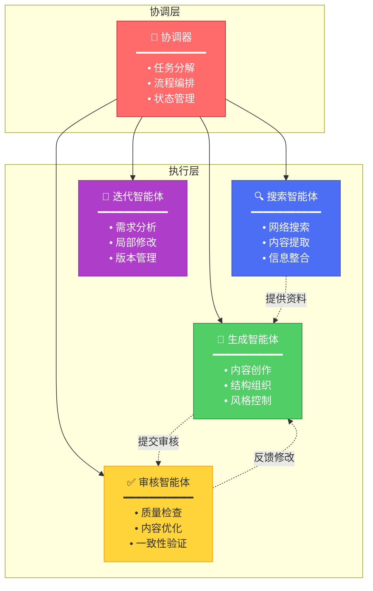
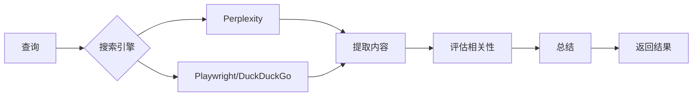
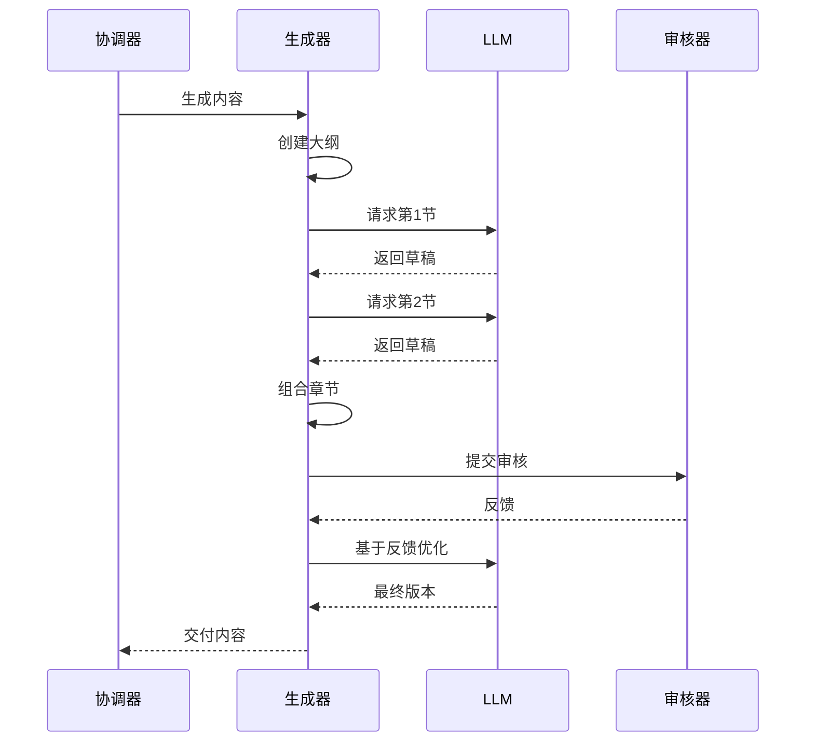

# 多智能体系统

XunLong的强大之处在于其精密的多智能体架构。系统不依赖单一的AI提示，而是由多个专业智能体协同工作，交付高质量的内容。

## 系统概览



## 核心智能体

### 1. 协调器 🎯

**角色：** 总控编排器，管理整个工作流。

**职责：**
- 分析用户需求
- 将复杂任务分解为子任务
- 将任务路由到合适的智能体
- 管理状态转换
- 汇总结果

**核心特性：**
- 基于LangGraph状态机构建
- 处理并行执行
- 管理错误恢复
- 维护项目上下文

**示例流程：**
```python
# 用户请求："生成一份关于AI趋势的报告"
协调器:
  1. 解析请求 → 识别内容类型（报告）
  2. 分解 → [搜索AI趋势, 分析数据, 生成大纲, 撰写章节]
  3. 路由 → 分配任务给搜索智能体和生成智能体
  4. 监控 → 跟踪进度并处理失败
  5. 汇总 → 将结果组合成最终报告
```

### 2. 搜索智能体 🔍

**角色：** 从网络收集信息。

**职责：**
- 执行网络搜索
- 提取相关内容
- 评估来源可信度
- 总结发现
- 引用来源

**技术栈：**
- **Playwright** - 浏览器自动化
- **Perplexity API** - 高级搜索
- **Trafilatura** - 内容提取
- **BeautifulSoup** - HTML解析

**搜索策略：**


**质量检查：**
- 来源日期验证
- 内容相关性评分
- 去重过滤
- 语言检测

### 3. 生成智能体 📝

**角色：** 基于收集的资料创建内容。

**专业化子智能体：**

#### 报告生成器
- 结构化研究发现
- 维持学术语调
- 添加引用
- 创建表格和图表

#### 小说生成器
- 发展角色和情节
- 保持叙事一致性
- 适配写作风格
- 创建章节大纲

#### PPT生成器
- 设计幻灯片布局
- 选择配色方案
- 创建视觉层次
- 生成演讲稿

**生成过程：**


### 4. 审核智能体 ✅

**角色：** 确保质量和一致性。

**质量检查：**

| 方面 | 检查项 |
|------|--------|
| **内容** | 事实准确性、完整性、相关性 |
| **结构** | 逻辑流程、适当层级、连贯性 |
| **风格** | 语调一致性、语法、可读性 |
| **格式** | Markdown语法、标题层级、引用 |

**审核流程：**
1. **结构审核** - 检查组织和流程
2. **内容审核** - 验证准确性和相关性
3. **风格审核** - 确保一致性
4. **格式审核** - 验证标记

**反馈循环：**
```python
if quality_score < threshold:
    provide_specific_feedback()
    request_revision()
else:
    approve_content()
```

### 5. 迭代智能体 🔄

**角色：** 处理内容优化请求。

**能力：**
- 分析修改请求
- 识别范围（局部/部分/全局）
- 保留上下文
- 管理版本

**修改范围：**

::: tabs

== 局部
**目标：** 单个章节或段落

**使用场景：**
- 修复第3章的错别字
- 更新表2中的数据
- 重写结论段落

**策略：** 精确替换并保留上下文

== 部分
**目标：** 多个章节

**使用场景：**
- 添加3个新案例研究
- 重组第5-7章
- 扩展方法论部分

**策略：** 选择性重新生成并进行连贯性检查

== 全局
**目标：** 整个文档

**使用场景：**
- 改变整体语调
- 重构整个报告
- 在全文添加新主题

**策略：** 完全重新生成并保留原始上下文

:::

**版本管理：**
```
project/
├── versions/
│   ├── 20251005_101234/  # 迭代前的备份
│   ├── 20251005_143022/
│   └── 20251005_165530/
└── reports/
    └── FINAL_REPORT.md    # 当前版本
```

## 智能体通信

### 消息传递

智能体通过结构化消息进行通信：

```python
{
    "agent": "search_agent",
    "task": "search_ai_trends",
    "status": "completed",
    "results": {
        "sources": [...],
        "summary": "...",
        "citations": [...]
    },
    "metadata": {
        "duration": 12.5,
        "token_usage": 1250
    }
}
```

### 状态管理

LangGraph维护所有智能体可访问的共享状态：

```python
class WorkflowState(TypedDict):
    query: str
    content_type: str
    search_results: List[SearchResult]
    outline: OutlineStructure
    generated_sections: Dict[str, str]
    review_feedback: Optional[Feedback]
    final_content: Optional[str]
```

## 并行执行

XunLong通过并行化最大化效率：

```mermaid
gantt
    title 内容生成时间线
    dateFormat  X
    axisFormat %S

    section 串行执行
    搜索          :0, 10
    生成          :10, 20
    审核          :20, 5
    导出          :25, 3

    section 并行执行
    搜索任务1     :0, 5
    搜索任务2     :0, 5
    搜索任务3     :0, 5
    生成章节1     :5, 7
    生成章节2     :5, 7
    生成章节3     :5, 7
    审核全部      :12, 3
    导出          :15, 2
```



**性能提升：**
- 串行执行：约28秒
- 并行执行：约17秒
- **加速比：1.65x**

## 错误处理

每个智能体实现健壮的错误处理：

```python
class AgentErrorHandler:
    def handle_error(self, error, context):
        if error.is_retryable():
            return self.retry_with_backoff()
        elif error.is_recoverable():
            return self.fallback_strategy()
        else:
            return self.graceful_degradation()
```

**错误分类：**
- **瞬时错误** - 网络超时（重试）
- **可恢复错误** - API速率限制（退避）
- **永久错误** - 无效输入（优雅失败）

## 可观测性

所有智能体活动通过LangFuse追踪：

**追踪指标：**
- 智能体调用次数
- 任务持续时间
- LLM token使用量
- 错误率
- 质量分数

**可视化：**
```
仪表板
├── 智能体性能
│   ├── 搜索智能体: 95%成功率
│   ├── 生成器: 12.3秒平均耗时
│   └── 审核器: 3.2质量分数
├── Token使用
│   ├── 总计: 125K tokens
│   ├── 搜索: 25K
│   └── 生成: 100K
└── 错误追踪
    └── 最近24小时: 3个错误（全部已恢复）
```

## 扩展系统

### 添加自定义智能体

XunLong的架构支持自定义智能体：

```python
from xunlong.agents.base import BaseAgent

class CustomAgent(BaseAgent):
    def __init__(self):
        super().__init__(name="custom_agent")
    
    async def execute(self, task):
        # 你的自定义逻辑
        result = await self.process(task)
        return result
```

### 注册智能体

```python
# 在 coordinator.py 中
coordinator.register_agent(
    agent=CustomAgent(),
    triggers=["custom_task"]
)
```

## 最佳实践

### 1. 智能体设计
- ✅ 单一职责原则
- ✅ 尽可能无状态
- ✅ 幂等操作
- ✅ 清晰的输入/输出契约

### 2. 通信
- ✅ 使用结构化消息
- ✅ 包含元数据
- ✅ 优雅处理失败
- ✅ 记录所有交互

### 3. 性能
- ✅ 并行化独立任务
- ✅ 缓存昂贵操作
- ✅ 实现超时
- ✅ 监控资源使用

## 下一步

- 了解[工作流程](/zh/guide/workflow)
- 探索[LLM集成](/zh/guide/llm-integration)
- 理解[状态管理](/zh/guide/state-management)
- 尝试[自定义智能体](/zh/advanced/custom-agents)
