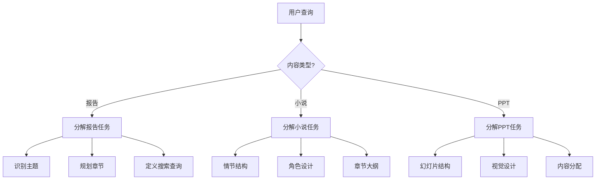
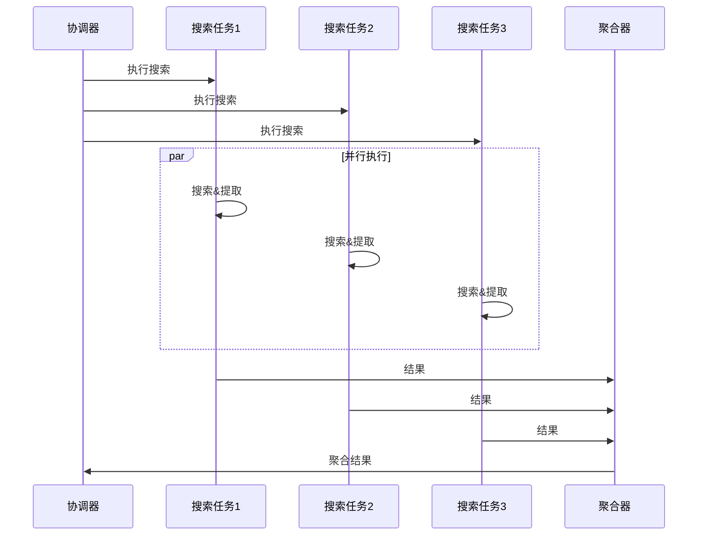
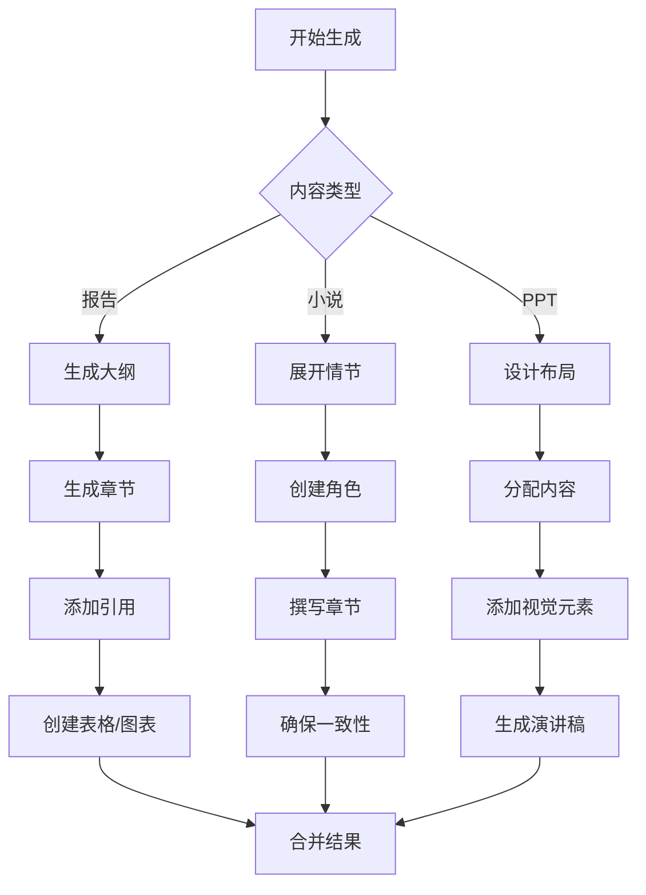
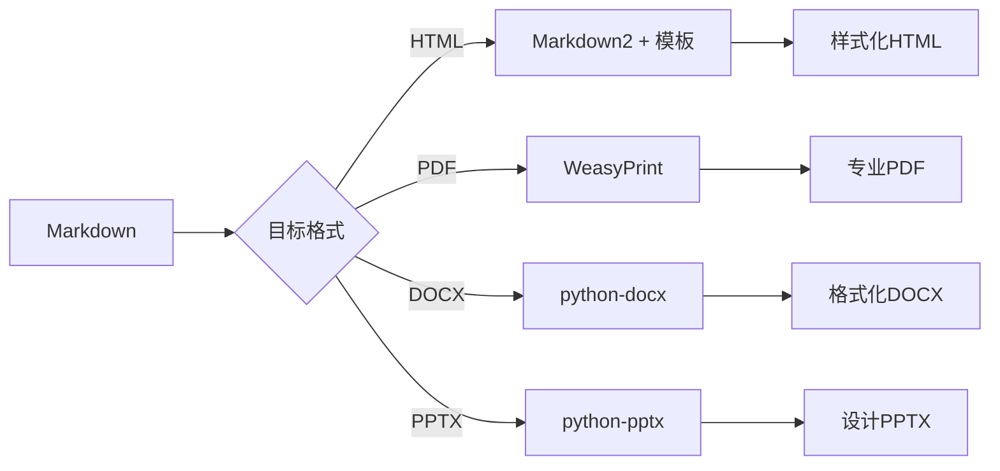
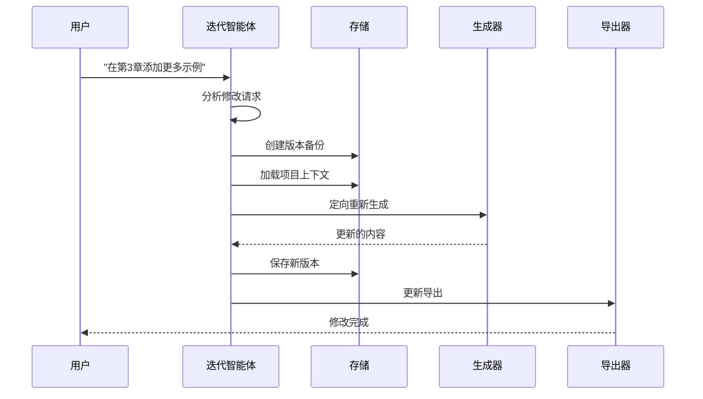

# 工作流程

理解XunLong的工作流程有助于您优化内容生成过程并有效排查问题。

## 高层级工作流

```mermaid
graph LR
    A[👤 用户输入] --> B[🔍 需求分析]
    B --> C[📋 任务分解]
    C --> D[🌐 并行搜索]
    D --> E[📦 内容整合]
    E --> F[✨ 智能生成]
    F --> G[✅ 质量审核]
    G --> H[🔄 格式转换]
    H --> I[📤 导出输出]

    style A fill:#e3f2fd,stroke:#1976d2
    style B fill:#f3e5f5,stroke:#7b1fa2
    style C fill:#f3e5f5,stroke:#7b1fa2
    style D fill:#fff3e0,stroke:#f57c00
    style E fill:#fff3e0,stroke:#f57c00
    style F fill:#e8f5e9,stroke:#388e3c
    style G fill:#e8f5e9,stroke:#388e3c
    style H fill:#fce4ec,stroke:#c2185b
    style I fill:#fce4ec,stroke:#c2185b
```



## 详细工作流程阶段

### 阶段 1: 需求分析 🔍

**目标：** 理解用户意图并准备执行。

**活动：**
1. 解析命令行参数
2. 识别内容类型（报告/小说/PPT）
3. 提取参数（风格、深度、章节数等）
4. 验证配置
5. 初始化项目结构

**输出：**
```python
{
    "content_type": "report",
    "query": "2025年AI行业趋势",
    "style": "business",
    "depth": "comprehensive",
    "project_id": "20251005_143022"
}
```

**耗时：** 约1秒

### 阶段 2: 任务分解 📋

**目标：** 将复杂请求分解为可管理的子任务。

**过程：**


**分解示例：**

::: tabs

== 报告
```json
{
  "tasks": [
    {
      "type": "search",
      "queries": [
        "AI行业市场规模2025",
        "最新AI技术趋势",
        "各行业AI应用"
      ]
    },
    {
      "type": "outline",
      "sections": [
        "执行摘要",
        "市场概览",
        "技术趋势",
        "应用案例",
        "未来展望"
      ]
    }
  ]
}
```

== 小说
```json
{
  "tasks": [
    {
      "type": "plot",
      "structure": "three_act"
    },
    {
      "type": "characters",
      "count": 5,
      "depth": "detailed"
    },
    {
      "type": "chapters",
      "count": 12,
      "style": "mystery"
    }
  ]
}
```

== PPT
```json
{
  "tasks": [
    {
      "type": "outline",
      "slides": 15
    },
    {
      "type": "design",
      "style": "business",
      "colors": "professional"
    },
    {
      "type": "content",
      "distribution": "balanced"
    }
  ]
}
```

:::

**耗时：** 约2-3秒

### 阶段 3: 并行搜索 🌐

**目标：** 从网络收集相关信息。

**执行流程：**


**搜索过程：**
1. **执行查询** - 使用Perplexity或Playwright
2. **提取内容** - 解析HTML并提取文本
3. **过滤结果** - 移除不相关内容
4. **摘要总结** - 创建简洁摘要
5. **引用来源** - 追踪URL和日期

**耗时：** 约5-15秒（取决于查询数量）

### 阶段 4: 内容整合 📦

**目标：** 组织和结构化收集到的信息。

**活动：**
1. 去重信息
2. 按主题分类
3. 按相关性排序
4. 创建知识图谱
5. 为生成准备上下文

**数据结构：**
```python
{
    "topic": "AI行业趋势",
    "sources": [
        {
            "url": "https://...",
            "date": "2025-09-15",
            "relevance": 0.95,
            "summary": "...",
            "key_points": [...]
        }
    ],
    "knowledge_graph": {
        "entities": [...],
        "relationships": [...]
    }
}
```

**耗时：** 约2-3秒

### 阶段 5: 智能生成 ✨

**目标：** 基于收集的材料创建高质量内容。

**生成策略：**



**LLM使用模式：**
```python
# 带上下文的顺序生成
for section in outline:
    prompt = build_prompt(
        section=section,
        context=search_results,
        previous_sections=generated_content
    )
    content = await llm.generate(prompt)
    generated_content.append(content)
```

**质量指标：**
- 连贯性得分
- 事实准确性
- 引用覆盖率
- 可读性指数

**耗时：** 约30-120秒（根据长度变化）

### 阶段 6: 质量审核 ✅

**目标：** 确保内容符合质量标准。

**审核清单：**

| 类别 | 检查项 | 自动修复 |
|------|--------|----------|
| **结构** | 标题层级、章节平衡 | ✅ |
| **内容** | 事实核查、完整性 | ⚠️ 人工 |
| **风格** | 语调一致性、语法 | ✅ |
| **格式** | Markdown语法、引用 | ✅ |
| **逻辑** | 流畅性、过渡、连贯性 | ⚠️ 人工 |

**审核流程：**
1. **自动检查** - 运行语法和格式验证器
2. **LLM审核** - 审核智能体进行质量评估
3. **分数计算** - 计算总体质量分数
4. **反馈生成** - 创建改进建议
5. **修订**（如需要）- 重新生成低质量章节

**阈值：**
- 分数 ≥ 0.85: 批准
- 分数 < 0.85: 请求修订

**耗时：** 约5-10秒

### 阶段 7: 格式转换 🔄

**目标：** 将Markdown转换为所需的输出格式。

**转换管道：**



**HTML转换：**
```python
import markdown2

html = markdown2.markdown(
    content,
    extras=[
        'tables',
        'fenced-code-blocks',
        'header-ids',
        'toc',
        'metadata'
    ]
)
```

**模板应用：**
```html
<!DOCTYPE html>
<html>
<head>
    <style>
        /* 专业外观的自定义样式 */
    </style>
</head>
<body>
    {{ content }}
</body>
</html>
```

**耗时：** 每种格式约2-5秒

### 阶段 8: 导出输出 📤

**目标：** 保存并交付最终输出给用户。

**导出结构：**
```
storage/20251005_143022_AI行业趋势/
├── metadata.json
├── intermediate/
│   ├── 01_task_decomposition.json
│   ├── 02_search_results.json
│   └── 03_content_outline.json
├── reports/
│   ├── FINAL_REPORT.md
│   └── FINAL_REPORT.html
└── exports/
    ├── report.pdf
    └── report.docx
```

**完成摘要：**
```
✅ 生成完成！

📊 统计信息：
   - 耗时: 2分34秒
   - 搜索: 8个查询
   - 内容: 5,432字
   - 引用: 15个来源
   - 质量分数: 0.92

📁 输出文件：
   - Markdown: storage/.../FINAL_REPORT.md
   - HTML: storage/.../FINAL_REPORT.html
   - PDF: storage/.../exports/report.pdf

🔗 项目ID: 20251005_143022
```

**耗时：** 约1-2秒

## 总时间线

| 阶段 | 耗时 | 占比 |
|------|------|------|
| 需求分析 | 1秒 | 1% |
| 任务分解 | 3秒 | 2% |
| 并行搜索 | 10秒 | 7% |
| 内容整合 | 3秒 | 2% |
| 智能生成 | 90秒 | 60% |
| 质量审核 | 8秒 | 5% |
| 格式转换 | 4秒 | 3% |
| 导出输出 | 1秒 | <1% |
| **总计** | **约120秒** | **100%** |

::: tip 性能提示
大部分时间花在内容生成（LLM调用）上。使用更快的模型如GPT-3.5进行草稿，然后用GPT-4迭代以提升质量。
:::

## 迭代工作流

当您请求修改时：



**与初始生成的关键区别：**
- ✅ 保留上下文
- ✅ 定向特定章节
- ✅ 维护版本历史
- ✅ 更快执行（约30-60秒）

## 监控与可观测性

### 实时进度

执行期间，XunLong显示：

```
🐉 XunLong - 内容生成

📋 任务分析
✅ 已识别: 报告生成
✅ 风格: 商务
✅ 深度: 全面

🔍 搜索信息
[████████████████████████████████] 100% (8/8个查询)
✅ 发现42个相关来源

✨ 生成内容
[████████████████░░░░░░░░░░░░░░░░] 60% (3/5章节)
⏱️  已用: 1分24秒 | 预计剩余: 48秒

```

### LangFuse追踪

所有操作都记录到LangFuse：

**追踪视图：**
```
Trace: report_generation_20251005_143022
├─ analyze_requirement (1.2s)
├─ decompose_tasks (2.8s)
├─ parallel_search (9.4s)
│  ├─ search_query_1 (3.2s)
│  ├─ search_query_2 (4.1s)
│  └─ search_query_3 (5.3s)
├─ generate_content (89.3s)
│  ├─ section_1 (15.2s, 1,234 tokens)
│  ├─ section_2 (18.7s, 1,567 tokens)
│  ├─ section_3 (22.1s, 1,892 tokens)
│  ├─ section_4 (16.8s, 1,345 tokens)
│  └─ section_5 (14.2s, 1,123 tokens)
├─ review_quality (7.9s)
└─ export_formats (3.4s)
```

## 错误恢复

### 自动重试

失败的步骤会自动重试：

```python
@retry(max_attempts=3, backoff=exponential)
async def execute_search(query):
    try:
        return await search_engine.search(query)
    except NetworkError:
        # 将使用退避策略重试
        raise
```

### 检查点

每个阶段都会保存进度检查点：

```
intermediate/
├── 01_task_decomposition.json  ✅ 已保存
├── 02_search_results.json      ✅ 已保存
├── 03_content_outline.json     ✅ 已保存
└── 04_generated_sections.json  ⏸️  进行中
```

如果生成失败，您可以恢复：

```bash
python xunlong.py resume 20251005_143022
```

## 最佳实践

### 1. 优化搜索查询
- 在请求中明确具体
- 包含相关关键词
- 如需要指定时间范围

### 2. 选择适当深度
- **概览**: 快速5分钟生成
- **标准**: 平衡的10分钟生成
- **全面**: 详细的20分钟生成

### 3. 监控Token使用
```bash
# 检查token消耗
python xunlong.py stats 20251005_143022
```

### 4. 增量迭代
- 从标准深度开始
- 审核输出
- 请求定向改进

## 下一步

- 了解[报告生成](/zh/guide/features/report)
- 探索[小说创作](/zh/guide/features/fiction)
- 尝试[PPT制作](/zh/guide/features/ppt)
- 理解[内容迭代](/zh/guide/features/iteration)
