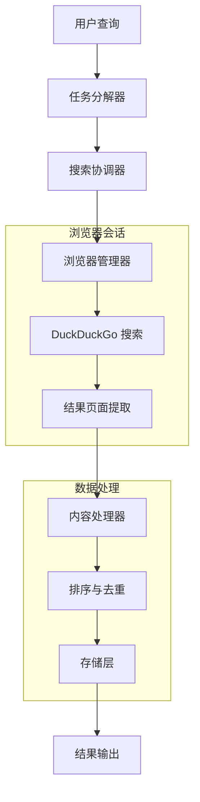

# 第 1 章 · 使用 Playwright 驱动 DuckDuckGo

本章开启"XunLong 内部拆解"系列教程，主要讲解项目目前的搜索流程，以及为什么选择控制浏览器而不是调用爬虫类 API。

---

## 1. 为什么选择无头浏览器？

XunLong 的搜索栈基于 Playwright（参考 `src/tools/web_searcher.py`）。协调器会通过 `src/browser.py` 启动 Chromium，自动化 DuckDuckGo 搜索，再复用同一浏览器访问每个结果页面。

### 1.1 动态内容无处不在

现代网站大量使用 JavaScript 动态加载内容，传统的 HTTP 请求无法获取完整信息：

**技术实现细节：**
```python
# 等待页面完全加载
await page.goto(url, wait_until="domcontentloaded")
await page.wait_for_timeout(1500)  # 等待 JS 执行

# 滚动页面触发懒加载
await page.evaluate("window.scrollTo(0, document.body.scrollHeight)")
await page.wait_for_timeout(1000)
```

**关键优势：**
- 自动处理 AJAX 请求和动态内容
- 支持单页应用（SPA）的内容提取
- 等待网络空闲确保内容完整性
- 模拟真实用户行为避免反爬检测

### 1.2 一致的提取与截图体验

使用同一个浏览器实例确保渲染环境的一致性：

**关键优势：**
- 统一的字体渲染和样式处理
- 一致的 JavaScript 执行环境
- 高质量截图生成（`browser.py:take_screenshot`）
- 保持会话状态和 Cookie 信息

### 1.3 速率限制与覆盖范围

相比第三方 API，自主控制具有更大灵活性：

**技术优势：**
- 自定义请求间隔和并发控制
- 灵活的缓存和降级策略
- 无需额外的 API Key 依赖
- 支持内嵌媒体和轻度付费墙内容

### 1.4 反检测与可靠性

实现多层反检测机制确保稳定运行：

**节流控制：**
```python
# 智能延迟机制
await asyncio.sleep(random.uniform(1.0, 2.5))
```

**缓存策略：**
- 本地结果缓存避免重复搜索
- 页面内容缓存提高响应速度
- 图片资源缓存减少网络请求

**降级逻辑：**
- 多重选择器确保内容提取成功
- 自动重试机制处理临时失败
- 优雅降级保证基本功能可用

**API Key 无关性：**
- 完全自主的搜索实现
- 不依赖第三方服务配额
- 降低运营成本和复杂度

**反机器人措施：**
- 真实的浏览器指纹
- 随机化的用户行为模式
- 动态的请求头设置

---

## 2. XunLong 的搜索流程概览

整体搜索流程由多个专门模块串联而成：

| 步骤 | 代码位置 | 职责 | 关键特性 |
| ---- | ---- | -------------- | -------- |
| **1. 任务规划** | `src/agents/task_decomposer.py` | 将用户查询（包含上传的文档上下文）拆解为更聚焦的子任务 | 智能查询分解、上下文感知 |
| **2. 浏览器管控** | `src/browser.py` | 启动 Playwright，配置有头/无头模式，并加入常用反检测设置 | 反检测、会话管理 |
| **3. DuckDuckGo 自动化** | `src/tools/web_searcher.py` | 提交查询、应用日期过滤、抓取结果卡片，并按需截图 | 多重选择器、错误恢复 |
| **4. 页面内容提取** | `src/pipeline.py` + `src/tools/web_searcher.py::_fetch_full_content_with_browser` | 访问每个结果，等待脚本加载，提取正文、图片和元数据 | 并发处理、智能提取 |
| **5. 排序与去重** | `src/agents/deep_searcher.py` | 合并结果、优先考虑用户上传的文档、去重并按相关度/时间排序 | 相关性排序、去重算法 |
| **6. 存储与复用** | `src/storage/search_storage.py` | 持久化中间 JSON、可读摘要及截图，供迭代与导出使用 | 缓存机制、增量更新 |

### 2.1 架构深度解析



### 2.2 会话一致性

由于整个流程复用同一个 Playwright 会话，确保了以下一致性：

**统一的用户代理头：**
```python
user_agent = "Mozilla/5.0 (Windows NT 10.0; Win64; x64) AppleWebKit/537.36"
await page.set_extra_http_headers({"User-Agent": user_agent})
```

**保持的 Cookie/会话状态：**
- 搜索偏好设置保持一致
- 地理位置信息统一
- 语言设置持续有效

**统一的区域设置：**
- 搜索结果的地理相关性
- 时间格式和货币单位
- 语言偏好和内容过滤

**共享的浏览器缓存：**
- 减少重复资源下载
- 提高页面加载速度
- 保持渲染一致性

---

## 3. 代码实现深度解析

### 3.1 WebSearcher 类架构

`WebSearcher` 是搜索功能的核心类，整合了 DuckDuckGo 搜索和内容提取：

```python
from src.tools.web_searcher import WebSearcher

class WebSearcher:
    def __init__(self, extract_content=True, extract_images=True, image_insert_mode="smart"):
        self.extract_content = extract_content
        self.extract_images = extract_images
        self.image_insert_mode = image_insert_mode
        self.duckduckgo_searcher = DuckDuckGoSearcher()
        
    async def search(self, query, max_results=5, region="us-en", time_filter=None):
        """执行搜索并返回丰富的结果"""
        # 1. 获取搜索结果
        search_results = await self._get_search_results(query, max_results, region, time_filter)
        
        # 2. 提取完整内容
        if self.extract_content:
            search_results = await self._fetch_full_content_with_browser(search_results)
            
        return search_results
```

### 3.2 DuckDuckGoSearcher 实现

专门处理 DuckDuckGo 搜索的核心逻辑：

```python
class DuckDuckGoSearcher:
    async def search(self, query, max_results=5, region="us-en", time_filter=None):
        """使用 Playwright 执行 DuckDuckGo 搜索"""
        async with async_playwright() as p:
            browser = await p.chromium.launch(headless=True)
            page = await browser.new_page()
            
            # 设置真实的用户代理
            await page.set_extra_http_headers({
                'User-Agent': 'Mozilla/5.0 (Windows NT 10.0; Win64; x64) AppleWebKit/537.36'
            })
            
            # 构建搜索 URL
            search_url = self._build_search_url(query, region, time_filter)
            await page.goto(search_url)
            
            # 等待搜索结果加载
            await page.wait_for_timeout(2000)
            
            # 提取搜索结果
            results = await self._extract_search_results(page, max_results)
            
            await browser.close()
            return results
    
    def _build_search_url(self, query, region, time_filter):
        """构建 DuckDuckGo 搜索 URL"""
        base_url = "https://duckduckgo.com/"
        params = {"q": query, "kl": region}
        
        if time_filter:
            time_mapping = {
                "day": "d", "week": "w", 
                "month": "m", "year": "y"
            }
            params["df"] = time_mapping.get(time_filter, "")
            
        return f"{base_url}?{urlencode(params)}"
```

### 3.3 强大的内容提取策略

系统使用多重选择器确保内容提取的成功率：

```python
async def _extract_search_results(self, page, max_results):
    """使用多重选择器提取搜索结果"""
    possible_selectors = [
        '[data-testid="result"]',
        'article[data-testid="result"]', 
        '.result',
        '.web-result',
        '[data-layout="organic"]',
        'article',
        '.result__body',
        'div[data-domain]'
    ]
    
    results = []
    for selector in possible_selectors:
        try:
            elements = await page.query_selector_all(selector)
            if elements and len(elements) >= 3:  # 确保找到足够的结果
                logger.info(f"成功使用选择器: {selector}")
                
                for i, element in enumerate(elements[:max_results]):
                    result = await self._extract_single_result(element)
                    if result:
                        results.append(result)
                        
                break  # 找到有效选择器后退出
        except Exception as e:
            logger.debug(f"选择器 {selector} 失败: {e}")
            continue
    
    return results

async def _extract_single_result(self, element):
    """从单个结果元素提取信息"""
    try:
        # 提取标题
        title_element = await element.query_selector('h3 a, h2 a, .result__title a')
        title = await title_element.inner_text() if title_element else "无标题"
        
        # 提取 URL
        url = await title_element.get_attribute('href') if title_element else ""
        
        # 提取摘要
        snippet_element = await element.query_selector('.result__snippet, .snippet')
        snippet = await snippet_element.inner_text() if snippet_element else ""
        
        return {
            "title": title.strip(),
            "url": url,
            "snippet": snippet.strip()
        }
    except Exception as e:
        logger.error(f"提取结果失败: {e}")
        return None
```

### 3.4 完整的最小化示例

教程分支包含一个独立的示例：

```python
# examples/tutorial/chapter1_playwright_duckduckgo.py
import asyncio
from playwright.async_api import async_playwright

async def search_duckduckgo(query):
    """最小化的 DuckDuckGo 搜索示例"""
    async with async_playwright() as p:
        browser = await p.chromium.launch(headless=True)
        page = await browser.new_page()
        
        # 设置用户代理
        await page.set_extra_http_headers({
            'User-Agent': 'Mozilla/5.0 (Windows NT 10.0; Win64; x64) AppleWebKit/537.36'
        })
        
        # 访问 DuckDuckGo
        search_url = f"https://duckduckgo.com/?q={query}"
        await page.goto(search_url)
        await page.wait_for_timeout(2000)
        
        # 提取结果
        results = []
        elements = await page.query_selector_all('[data-testid="result"]')
        
        for element in elements[:5]:
            try:
                title_element = await element.query_selector('h3 a')
                title = await title_element.inner_text()
                url = await title_element.get_attribute('href')
                
                snippet_element = await element.query_selector('.snippet')
                snippet = await snippet_element.inner_text() if snippet_element else ""
                
                results.append({
                    "title": title,
                    "url": url,
                    "snippet": snippet
                })
            except:
                continue
        
        await browser.close()
        return results

# 运行示例
if __name__ == "__main__":
    results = asyncio.run(search_duckduckgo("人工智能发展趋势"))
    for i, result in enumerate(results, 1):
        print(f"{i}. {result['title']}")
        print(f"   URL: {result['url']}")
        print(f"   摘要: {result['snippet'][:100]}...")
        print()
```

### 前置条件

```bash
pip install playwright
playwright install chromium
```

### 运行演示

```bash
python examples/tutorial/chapter1_playwright_duckduckgo.py "AI行业趋势"
```

您应该能看到搜索结果打印到控制台。

---

## 4. 配置与高级功能

### 4.1 环境变量配置

XunLong 支持多种环境变量来配置搜索行为：

```bash
# 浏览器配置
export BROWSER_HEADLESS=true          # true=无头模式, false=显示浏览器
export BROWSER_TIMEOUT=30000          # 页面超时时间（毫秒）

# 搜索配置  
export DEEPSEARCH_TOPK=5              # 默认获取结果数量
export DEEPSEARCH_SEARCH_ENGINE=duckduckgo  # 搜索引擎选择
export DEEPSEARCH_SHOTS_DIR=./shots   # 截图保存目录

# 性能调优
export SEARCH_CONCURRENT_LIMIT=3      # 最大并发页面提取数
export SEARCH_RETRY_ATTEMPTS=3        # 重试次数
export SEARCH_DELAY_MS=1500           # 请求间隔延迟
```

### 4.2 高级 WebSearcher 用法

```python
from src.tools.web_searcher import WebSearcher

# 使用自定义配置初始化
searcher = WebSearcher(
    extract_content=True,
    extract_images=True,
    image_insert_mode="smart"  # "smart", "top", "bottom", "distribute", "none"
)

# 执行高级搜索
results = await searcher.search(
    query="人工智能发展趋势 2024",
    max_results=10,
    region="zh-cn",              # 地区特定结果
    time_filter="month",         # "day", "week", "month", "year"
    fetch_full_content=True      # 提取完整页面内容
)

# 结果结构
for result in results:
    print(f"标题: {result['title']}")
    print(f"URL: {result['url']}")
    print(f"摘要: {result['snippet']}")
    print(f"完整内容: {result.get('full_content', '无')}")
    print(f"图片数量: {len(result.get('images', []))}")
    print(f"包含完整内容: {result.get('has_full_content', False)}")
    print("---")
```

### 4.3 错误处理与调试

#### 常见问题及解决方案

**1. 选择器未找到**
```python
# 系统使用多重备用选择器
possible_selectors = [
    '[data-testid="result"]',
    'article[data-testid="result"]', 
    '.result',
    '.web-result',
    '[data-layout="organic"]',
    'article',
    '.result__body',
    'div[data-domain]',
    'h3 a[href]'
]
```

**2. 超时问题**
```python
# 适当配置超时时间
page.set_default_timeout(30000)  # 30 秒
await page.goto(url, wait_until="domcontentloaded")
await page.wait_for_timeout(1500)  # 允许 JS 执行
```

**3. 反机器人检测**
```python
# 使用真实的浏览器设置
browser = await p.chromium.launch(
    headless=True,
    args=[
        '--no-sandbox',
        '--disable-setuid-sandbox',
        '--disable-dev-shm-usage',
        '--disable-blink-features=AutomationControlled'
    ]
)

# 设置真实的请求头
await page.set_extra_http_headers({
    'User-Agent': 'Mozilla/5.0 (Windows NT 10.0; Win64; x64) AppleWebKit/537.36 '
                 '(KHTML, like Gecko) Chrome/91.0.4472.124 Safari/537.36'
})
```

#### 调试模式

启用调试日志进行故障排除：

```python
import logging
from loguru import logger

# 启用调试日志
logger.add("debug.log", level="DEBUG")

# 系统将记录：
# - 搜索 URL 构建过程
# - 选择器尝试和结果
# - 内容提取详情
# - 带上下文的错误信息
```

### 4.4 性能优化

#### 并发处理

系统并发处理多个 URL 以提高性能：

```python
async def _fetch_full_content_with_browser(self, search_results):
    """并发处理多个 URL"""
    tasks = [
        self._fetch_single_url(browser, i, result, len(search_results))
        for i, result in enumerate(search_results)
    ]
    
    # 带错误处理的并发处理
    enriched_results = await asyncio.gather(*tasks, return_exceptions=True)
```

#### 缓存策略

- **搜索结果**：本地缓存避免重复搜索
- **页面内容**：带时间戳存储用于新鲜度检查
- **图片资源**：一次下载，跨会话复用

#### 内存管理

```python
# 正确的资源清理
try:
    page = await browser.new_page()
    # ... 执行操作
finally:
    await page.close()  # 始终关闭页面
    await browser.close()  # 始终关闭浏览器
```

### 4.5 与 XunLong 组件集成

#### 存储集成

```python
from src.storage.search_storage import SearchStorage

storage = SearchStorage()

# 存储搜索结果
await storage.save_search_results(
    query="AI趋势",
    results=search_results,
    metadata={
        "timestamp": datetime.now(),
        "region": "zh-cn",
        "total_results": len(search_results)
    }
)

# 检索缓存结果
cached_results = await storage.get_cached_results("AI趋势")
```

#### 智能体集成

```python
from src.agents.deep_searcher import DeepSearcher

# 使用 web searcher 初始化深度搜索器
deep_searcher = DeepSearcher(web_searcher=searcher)

# 执行增强搜索和排序
enhanced_results = await deep_searcher.search(
    query="机器学习应用",
    uploaded_documents=user_docs,  # 来自上传文件的上下文
    max_results=15
)
```

## 5. 故障排除指南

### 5.1 常见错误信息

| 错误 | 原因 | 解决方案 |
|------|------|----------|
| `TimeoutError: Timeout 30000ms exceeded` | 页面加载过慢 | 增加超时时间或检查网络 |
| `Error: No results found` | 选择器变更或被阻止 | 更新选择器或检查反机器人措施 |
| `playwright._impl._api_types.Error: Browser closed` | 浏览器崩溃 | 添加错误恢复和重启逻辑 |
| `ConnectionError: Connection refused` | 网络问题 | 实现指数退避的重试逻辑 |

### 5.2 性能问题

**搜索性能慢：**
1. 减少 `max_results` 参数
2. 如不需要可禁用图片提取
3. 使用无头模式（`BROWSER_HEADLESS=true`）
4. 实现结果缓存

**内存使用过高：**
1. 确保正确的页面/浏览器清理
2. 限制并发提取数量
3. 批量处理结果
4. 定期清理浏览器缓存

### 5.3 调试步骤

1. **启用详细日志**：
   ```bash
   export LOG_LEVEL=DEBUG
   python your_script.py
   ```

2. **运行有头模式**观察浏览器行为：
   ```bash
   export BROWSER_HEADLESS=false
   python your_script.py
   ```

3. **在浏览器开发者工具中检查选择器有效性**：
   - 手动打开 DuckDuckGo
   - 检查结果元素
   - 在控制台中测试选择器

4. **监控网络请求**：
   ```python
   page.on("request", lambda request: print(f"请求: {request.url}"))
   page.on("response", lambda response: print(f"响应: {response.status}"))
   ```

## 6. 最佳实践

### 6.1 生产环境部署

- 生产环境始终使用无头模式
- 实现适当的错误处理和重试
- 设置合理的超时和速率限制
- 监控资源使用和性能
- 大规模爬取时使用代理轮换

### 6.2 道德考量

- 遵守 robots.txt 文件
- 在请求间实现合理延迟
- 不要过载目标服务器
- 缓存结果以减少重复请求
- 优先考虑使用官方 API

---

## 7. 下一步计划

第 2 章将深入探讨：
- 高级内容提取技术
- 处理懒加载内容和单页应用
- 图片处理和增强
- 与 XunLong 存储层的集成
- 为特定站点构建自定义提取器

敬请期待更多高级网页抓取技术！

